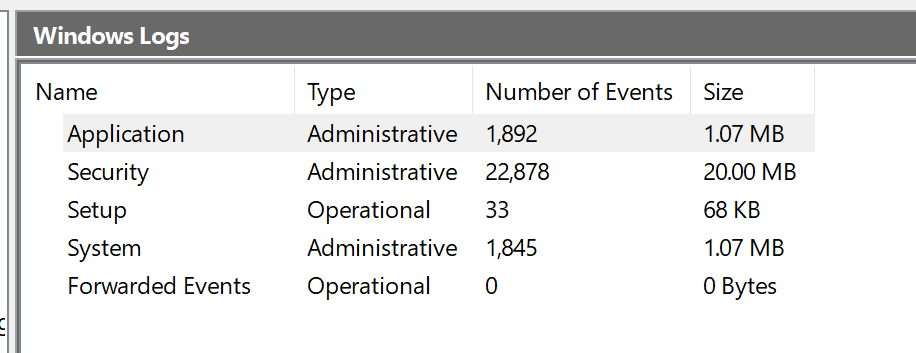

# Incident Handling (IH)

Incident handling (IH) has become an important part of an organization's defensive capability against cybercrime. While protective measures are constantly being implemented to prevent or lower the amount of security incidents, an incident handling capability is undeniably a necessity for any organization that cannot afford a compromise of its data confidentiality, integrity, or availability. Some organizations choose to implement this capability in-house, while others rely on third-party providers to support them, continuously or when needed.

Before we dive into the world of security incidents, let's define some terms and establish a common understanding of them.

## Event vs. Incident

### Event
An **event** is an action occurring in a system or network. Examples of events are:
- A user sending an email  
- A mouse click  
- A firewall allowing a connection request  

### Incident
An **incident** is an event with a negative consequence. Examples of incidents include:
- A system crash  
- Unauthorized access to sensitive data  
- Natural disasters, power failures, etc.  

There is no single definition for what an **IT security incident** is, and therefore it varies between organizations. We define an IT security incident as an event with a clear intent to cause harm that is performed against a computer system. Examples include:
- Data theft  
- Funds theft  
- Unauthorized access to data  
- Installation and usage of malware and remote access tools  

## What is Incident Handling?

**Incident handling** is a clearly defined set of procedures to manage and respond to security incidents in a computer or network environment. It is important to note that incident handling is not limited to intrusion incidents alone.

Other types of incidents, such as those caused by:
- Malicious insiders  
- Availability issues  
- Loss of intellectual property  

also fall within the scope of incident handling. A **comprehensive incident handling plan** should address various types of incidents and provide appropriate measures to:
1. Identify  
2. Contain  
3. Eradicate  
4. Recover  

This ensures that normal business operations are restored as quickly and efficiently as possible.

## Identifying Incidents

Bear in mind that it may not be immediately clear that an event is an incident until an initial investigation is performed. With that being said, there are some **suspicious events** that should be treated as incidents unless proven otherwise.

---

# Incident Handling's Value & Generic Notes

IT security incidents frequently involve the compromise of personal and business data, making it crucial to respond quickly and effectively. In some incidents, the impact may be limited to a few devices, while in others, a large part of the environment can be compromised.

## Importance of an Incident Handling Team

A significant benefit of having an **incident handling team** (often referred to as an **incident response team**) is that a trained workforce will respond systematically, ensuring that appropriate actions are taken. The primary objective of such teams is to:
- Minimize the **theft of information**  
- Reduce the **disruption of services**  

This is achieved by performing **investigations and remediation steps**, which will be discussed in more depth later. The decisions taken **before, during, and after an incident** directly affect its impact.

## Prioritization of Incidents

Since different incidents will have varying impacts on an organization, **prioritization** is essential:
- **High-severity incidents** require immediate attention and resources.  
- **Lower-rated incidents** may still require an initial investigation to determine whether they qualify as IT security incidents.  

## Role of the Incident Manager

The **incident handling team** is led by an **incident manager**, who is typically:
- A **SOC Manager**, **CISO/CIO**, or  
- A **trusted third-party vendor**  

The **incident manager** plays a critical role in:
- Directing **other business units**  
- Ensuring timely responses from employees when required  
- Acting as the **single point of communication**, tracking activities taken during the investigation and their completion status  

## NIST's Computer Security Incident Handling Guide

One of the most widely used resources on **incident handling** is **NIST's Computer Security Incident Handling Guide**. This document assists organizations in:
- **Mitigating risks** from computer security incidents  
- **Providing practical guidelines** for responding to incidents **effectively** and **efficiently**  

---

# Cyber Kill Chain  

## What Is The Cyber Kill Chain?  

Before we start discussing incident handling, we need to understand the **attack lifecycle** (also known as the **cyber kill chain**). This lifecycle describes how cyberattacks unfold. Understanding it provides valuable insights into:  
- How far an attacker has penetrated a network  
- What they may have access to during an **incident investigation**  

The **cyber kill chain** consists of **seven (7) stages**, which are outlined below.  

> Seven stages of the cyber kill chain

## 🔎 1. Reconnaissance  

This is the **initial stage** where an attacker:  
- **Chooses a target**  
- **Gathers information** to understand the target's environment  

### Attack Techniques:  
✅ Passive recon: Collecting data from open sources (e.g., **LinkedIn, Instagram, company websites**)  
✅ Job postings & partner lists: Reveal **technologies used** (e.g., antivirus, OS, networking tools)  
✅ Active recon: Scanning external **IP addresses & web applications** of the target organization  

## ⚔️ 2. Weaponization  

At this stage, **malware is developed** and embedded into an **exploit or payload**.  

### Attack Techniques:  
✅ Crafting **lightweight, undetectable** malware  
✅ Tailoring malware to evade specific **antivirus or EDR tools**  
✅ Ensuring **persistence** (surviving reboots) & **remote access**  

## 📦 3. Delivery  

The attacker delivers the exploit or payload to the victim.  

### Common Delivery Methods:  
✅ **Phishing emails** (attachments or malicious links)  
✅ Fake web pages mimicking **legit websites** (credential theft)  
✅ **Social engineering** (phone calls convincing victims to execute payloads)  
✅ **USB drops** (malicious USB drives left for employees to find & use)  

## 💥 4. Exploitation  

At this stage, the **exploit or payload is triggered**, allowing the attacker to execute code on the victim’s system.  

## 🏴‍☠️ 5. Installation  

The attacker establishes a **foothold** on the compromised system.  

### Common Techniques:  
- **Droppers**: Small pieces of code that install & execute malware  
- **Backdoors**: Malware granting **persistent access**  
- **Rootkits**: Hiding malware from **antivirus & security tools**  

## 🔌 6. Command and Control (C2)  

The attacker establishes **remote access** to the compromised machine.  

### Attack Techniques:  
✅ Using **modular payloads** that fetch additional tools dynamically  
✅ Deploying **multiple malware variants** to ensure persistence  

## 🎯 7. Action on Objectives  

At this stage, the attacker executes their **final objective**, which may include:  
- **Data exfiltration** (stealing confidential files)  
- **Privilege escalation** (gaining admin-level access)  
- **Ransomware deployment** (encrypting data for ransom)  

## 🔄 Cyber Kill Chain Is Not Always Linear  

Attackers **don't follow a strict step-by-step process**. They may **repeat previous stages** to:  
- **Reinforce their foothold** (e.g., installing more malware)  
- **Discover new targets** within the network  

For example, after successfully installing malware, an attacker may return to the **reconnaissance stage** to identify additional vulnerabilities and **move deeper into the network**.  

## 🛑 How to Stop an Attack?  

Our goal is to **halt an attacker’s progress** as early as possible in the kill chain. **The earlier we detect and block an attack, the less damage it can cause.**  

---

# 📌 Incident Handling Process Overview  

Now that we understand the **Cyber Kill Chain**, we can better predict **attack progressions** and recommend **defensive measures**.  

Similar to the **Cyber Kill Chain**, incident response follows a structured process known as the **Incident Handling Process**.  

## 🔍 What is the Incident Handling Process?  

The **Incident Handling Process** defines a framework that enables organizations to **prepare for, detect, and respond to** cybersecurity incidents.  

⚠️ **Note:**  
While this process helps in handling IT security events, **it does not map directly to the Cyber Kill Chain stages** in a one-to-one manner.  

## 🔹 The Four (4) Stages of Incident Handling (NIST)  

According to **NIST**, the **Incident Handling Process** consists of **four (4) key stages**:  

1️⃣ **Preparation**  
2️⃣ **Detection & Analysis**  
3️⃣ **Containment, Eradication & Recovery**  
4️⃣ **Post-Incident Activity**  

📌 **Incident handlers spend most of their time in the first two stages:**
- **Preparation**: Strengthening security defenses  
- **Detection & Analysis**: Identifying malicious activity  

🚨 When an incident is detected, **we transition into response mode**, but we must **ensure ongoing preparation and detection efforts** to avoid gaps in security.  

## 🔄 Incident Handling is a Cyclic Process  

The **Incident Handling Process is NOT linear**—it is **cyclic**.  

- As **new evidence** is discovered, **next steps may change**.  
- Skipping steps or **partially handling an incident** (e.g., only containing half of the infected machines) can **alert the attacker** and lead to **unpredictable consequences**.  

## 🔎 Two (2) Main Activities in Incident Handling  

Incident handling consists of two primary activities:  

1️⃣ **Investigating**  
   - Identify the **'patient zero'** (the initial victim)  
   - Build a **timeline of events** (ongoing if the attack is still active)  
   - Determine **malware & attack tools** used  
   - Document **compromised systems** and attacker actions  

2️⃣ **Recovering**  
   - Develop and execute a **recovery plan**  
   - Resume **normal business operations**  
   - Conduct **post-incident analysis** (e.g., lessons learned)  

📜 Once an incident is fully handled, a **detailed report** is issued, including:  
- **Root cause analysis**  
- **Incident impact & cost**  
- **Recommendations to prevent future incidents**  

---
# Preparation Stage (Part 1) 

In the preparation stage, we have two separate objectives. The first one is the establishment of incident handling capability within the organization. The second is the ability to protect against and prevent IT security incidents by implementing appropriate protective measures. Such measures include endpoint and server hardening, active directory tiering, multi-factor authentication, privileged access management, and so on and so forth. While protecting against incidents is not the responsibility of the incident handling team, this activity is fundamental to the overall success of that team.

## Preparation Prerequisites

During the preparation, we need to ensure that we have:

- Skilled incident handling team members (incident handling team members can be outsourced, but a basic capability and understanding of incident handling are necessary in-house regardless)
- Trained workforce (as much as possible, through security awareness activities or other means of training)
- Clear policies and documentation
- Tools (software and hardware)

## Clear Policies & Documentation

Some of the written policies and documentation should contain an up-to-date version of the following information:

- Contact information and roles of the incident handling team members
- Contact information for the legal and compliance department, management team, IT support, communications and media relations department, law enforcement, internet service providers, facility management, and external incident response team
- Incident response policy, plan, and procedures
- Incident information sharing policy and procedures
- Baselines of systems and networks, out of a golden image and a clean state environment
- Network diagrams
- Organization-wide asset management database
- User accounts with excessive privileges that can be used on-demand by the team when necessary (also to business-critical systems, which are handled with the skills needed to administer that specific system). These user accounts are normally enabled when an incident is confirmed during the initial investigation and then disabled once it is over. A mandatory password reset is also performed when disabling the users.
- Ability to acquire hardware, software, or an external resource without a complete procurement process (urgent purchase of up to a certain amount). The last thing you need during an incident is to wait for weeks for the approval of a $500 tool.
- Forensic/Investigative cheat sheets

Some of the non-severe cases may be handled relatively quickly and without too much friction within the organization or outside of it. Other cases may require law enforcement notification and external communication to customers and third-party vendors, especially in cases of legal concerns arising from the incident. For example, a data breach involving customer data has to be reported to law enforcement within a certain time threshold in accordance with GDPR. There may be many compliance requirements depending on the location and/or branches where the incident has occurred, so the best way to understand these is to discuss them with your legal and compliance teams on a per-incident basis (or proactively).

While having documentation in place is vital, it is also important to document the incident as you investigate. Therefore, during this stage, you will also have to establish an effective reporting capability. Incidents can be extremely stressful, and it becomes easy to forget this part as the incident unfolds itself, especially when you are focused and going extremely fast in order to solve it as soon as possible. Try to remain calm, take notes, and ensure that these notes contain timestamps, the activity performed, the result of it, and who did it. Overall, you should seek answers to who, what, when, where, why, and how.

## Tools (Software & Hardware)

Moving forward, we also need to ensure that we have the right tools to perform the job. These include, but are not limited to:

- Additional laptop or a forensic workstation for each incident handling team member to preserve disk images and log files, perform data analysis, and investigate without any restrictions (we know malware will be tested here, so tools such as antivirus should be disabled). These devices should be handled appropriately and not in a way that introduces risks to the organization.
- Digital forensic image acquisition and analysis tools
- Memory capture and analysis tools
- Live response capture and analysis
- Log analysis tools
- Network capture and analysis tools
- Network cables and switches
- Write blockers
- Hard drives for forensic imaging
- Power cables
- Screwdrivers, tweezers, and other relevant tools to repair or disassemble hardware devices if needed
- Indicator of Compromise (IOC) creator and the ability to search for IOCs across the organization
- Chain of custody forms
- Encryption software
- Ticket tracking system
- Secure facility for storage and investigation
- Incident handling system independent of your organization's infrastructure
- Jump bag - always

Many of the tools mentioned above will be part of what is known as a **jump bag**, ready with the necessary tools to be picked up and leave immediately. Without this prepared bag, gathering all necessary tools on the fly may take days or weeks before you are ready to respond.

Finally, we want to stress the importance of having your documentation system completely independent from your organization's infrastructure and properly secured. Assume from the beginning that your entire domain is compromised and that all systems can become unavailable. In a similar fashion, communications about an incident should be conducted through channels that are not part of the organization's systems; assume that adversaries have control over everything and can read communication channels such as email.

---

# Preparation Stage (Part 2)

Another part of the preparation stage is to protect against incidents. While protection is not necessarily the responsibility of an incident handling team, any protection-related activities should be known to them to better understand the type and sophistication of an incident and know where to look for artifacts/evidence, that could aid the investigation. Let us now look at some of the highly recommended protective measures, which have a high mitigation impact against the majority of threats.

## DMARC

DMARC is an email protection against phishing built on top of the already existing SPF and DKIM. The idea behind DMARC is to reject emails that 'pretend' to originate from your organization. Therefore, if an adversary is spoofing an email pretending to be an employee asking for an invoice to be paid, the system will reject the email before it reaches the intended recipient. DMARC is easy and inexpensive to implement, however, I cannot stress enough that thorough testing is mandatory; otherwise (and this is oftentimes the case), you risk blocking legitimate emails with no ability to recover them.

With email filtering rules, you may be able to take DMARC to the 'next' level and apply additional protection against emails failing DMARC from domains you do not own. This is possible because some email systems will perform a DMARC check and include a header stating whether DMARC passed or failed in the message headers. While this can be incredibly powerful to detect phishing emails from any domain, it requires extensive testing before it can be introduced in a production environment. High false-positives here are emails that are sent 'on behalf of' via some email sending service, since they tend to fail DMARC due to domain mismatch.

## Endpoint Hardening (& EDR)

Endpoint devices (workstations, laptops, etc.) are the entry points for most of the attacks that we are facing on a daily basis. If we consider the fact that most threats will originate from the internet and will target users who are browsing websites, opening attachments, or running malicious executables, a percentage of this activity will occur from their corporate endpoints.

There are a few widely recognized endpoint hardening standards by now, with CIS and Microsoft baselines being the most popular, and these should really be the building blocks for your organization's hardening baselines. Some highly important actions (that actually work) to note and do something about are:

- Disable LLMNR/NetBIOS
- Implement LAPS and remove administrative privileges from regular users
- Disable or configure PowerShell in "ConstrainedLanguage" mode
- Enable Attack Surface Reduction (ASR) rules if using Microsoft Defender
- Implement whitelisting. We know this is nearly impossible to implement. Consider at least blocking execution from user-writable folders (Downloads, Desktop, AppData, etc.). These are the locations where exploits and malicious payloads will initially find themselves. Remember to also block script types such as .hta, .vbs, .cmd, .bat, .js, and similar. Please pay attention to LOLBin files while implementing whitelisting. Do not overlook them; they are really used in the wild as initial access to bypass whitelisting.
- Utilize host-based firewalls. As a bare minimum, block workstation-to-workstation communication and block outbound traffic to LOLBins
- Deploy an EDR product. At this point in time, AMSI provides great visibility into obfuscated scripts for antimalware products to inspect the content before it gets executed. It is highly recommended that you only choose products that integrate with AMSI.

When it comes to hardening, **Don't let perfect be the enemy of good**.

## Network Protection

Network segmentation is a powerful technique to avoid having a breach spread across the entire organization. Business-critical systems must be isolated, and connections should be allowed only as the business requires. Internal resources should really not be facing the Internet directly (unless placed in a DMZ).

Additionally, when speaking of network protection you should consider IDS/IPS systems. Their power really shines when SSL/TLS interception is performed so that they can identify malicious traffic based on content on the wire and not based on reputation of IP addresses, which is a traditional and very inefficient way of detecting malicious traffic.

Additionally, ensure that only organization-approved devices can get on the network. Solutions such as 802.1x can be utilized to reduce the risk of bring your own device (BYOD) or malicious devices connecting to the corporate network. If you are a cloud-only company using, for example, Azure/Azure AD, then you can achieve similar protection with Conditional Access policies that will allow access to organization resources only if you are connecting from a company-managed device.

## Privilege Identity Management / MFA / Passwords

At this point in time, stealing privileged user credentials is the most common escalation path in Active Directory environments. Additionally, a common mistake is that admin users either have a weak (but often complex) password or a shared password with their regular user account (which can be obtained via multiple attack vectors such as keylogging).

For reference, a weak but complex password is "Password1!". It includes uppercase, lowercase, numerical, and special characters, but despite this, it's easily predictable and can be found in many password lists that adversaries employ in their attacks. It is recommended to teach employees to use pass phrases because they are harder to guess and difficult to brute force.

An example of a password phrase that is easy to remember yet long and complex is "i LIK3 my coffeE warm". If one knows a second language, they can mix up words from multiple languages for additional protection.

Multi-factor authentication (MFA) is another identity-protecting solution that should be implemented at least for any type of administrative access to ALL applications and devices.

## Vulnerability Scanning

Perform continuous vulnerability scans of your environment and remediate at least the "high" and "critical" vulnerabilities that are discovered. While the scanning can be automated, the fixes usually require manual involvement. If you can't apply patches for some reason, definitely segment the systems that are vulnerable!

## User Awareness Training

Training users to recognize suspicious behavior and report it when discovered is a big win for us. While it is unlikely to reach 100% success on this task, these trainings are known to significantly reduce the number of successful compromises. Periodic "surprise" testing should also be part of this training, including, for example, monthly phishing emails, dropped USB sticks in the office building, etc.

## Active Directory Security Assessment

The best way to detect security misconfigurations or exposed critical vulnerabilities is by looking for them from the perspective of an attacker. Doing your own reviews (or hiring a third party if the skillset is missing from the organization) will ensure that when an endpoint device is compromised, the attacker will not have a one-step escalation possibility to high privileges on the network.

The more additional tools and activity an attacker is generating, the higher the likelihood of you detecting them, so try to eliminate easy wins and low-hanging fruits as much as possible.

Active Directory has a few known and unique escalation paths/bugs. New ones are quite often discovered too. Active Directory security assessments are crucial for the security posture of the environment as a whole. Don't assume that your system administrators are aware of all discovered or published bugs, because in reality they probably aren't.

## Purple Team Exercises

We need to train incident handlers and keep them engaged. There is no question about that, and the best place to do it is inside an organization's own environment. Purple team exercises are essentially security assessments by a red team that either continuously or eventually inform the blue team about their actions, findings, any visibility/security shortcomings, etc. Such exercises will help in identifying vulnerabilities in an organization while testing the blue team's defensive capability in terms of logging, monitoring, detection, and responsiveness.

If a threat goes unnoticed, there is an opportunity to improve. For those that are detected, the blue team can test any playbooks and incident handling procedures to ensure they are robust and the expected result has been achieved.

---

# Detection & Analysis Stage (Part 1)

## Overview
At this point, we have created processes and procedures, and we have guidelines on how to act upon security incidents.

The detection & analysis phase involves all aspects of detecting an incident, such as utilizing sensors, logs, and trained personnel. It also includes information and knowledge sharing, as well as utilizing context-based threat intelligence. Segmentation of the architecture and having a clear understanding of and visibility within the network are also important factors.

Threats are introduced to the organization via an infinite number of attack vectors, and their detection can come from sources such as:
- An employee that notices abnormal behavior
- An alert from one of our tools (EDR, IDS, Firewall, SIEM, etc.)
- Threat hunting activities
- A third-party notification informing us that they discovered signs of our organization being compromised

It is highly recommended to create levels of detection by logically categorizing our network as follows:
- Detection at the network perimeter (using firewalls, internet-facing network intrusion detection/prevention systems, demilitarized zone, etc.)
- Detection at the internal network level (using local firewalls, host intrusion detection/prevention systems, etc.)
- Detection at the endpoint level (using antivirus systems, endpoint detection & response systems, etc.)
- Detection at the application level (using application logs, service logs, etc.)

## Initial Investigation
When a security incident is detected, you should conduct some initial investigation and establish context before assembling the team and calling an organization-wide incident response. Think about how information is presented in the event of an administrative account connecting to an IP address at HH:MM:SS. Without knowing what system is on that IP address and which time zone the time refers to, we may easily jump to a wrong conclusion about what this event is about.

To sum up, we should aim to collect as much information as possible at this stage about the following:
- Date/Time when the incident was reported. Additionally, who detected the incident and/or who reported it?
- How was the incident detected?
- What was the incident? Phishing? System unavailability? etc.
- Assemble a list of impacted systems (if relevant)
- Document who has accessed the impacted systems and what actions have been taken.
- Make a note of whether this is an ongoing incident or the suspicious activity has been stopped.
- Physical location, operating systems, IP addresses and hostnames, system owner, system's purpose, current state of the system
- (If malware is involved) List of IP addresses, time and date of detection, type of malware, systems impacted, export of malicious files with forensic information on them (such as hashes, copies of the files, etc.)

With that information at hand, we can make decisions based on the knowledge we have gathered. For example, we would likely take different actions if we knew that the CEO's laptop was compromised as opposed to an intern's one.

With the initially gathered information, we can start building an incident timeline. This timeline will keep us organized throughout the event and provide an overall picture of what happened. The events in the timeline are time-sorted based on when they occurred. Note that during the investigative process later on, we will not necessarily uncover evidence in this time-sorted order. However, when we sort the evidence based on when it occurred, we will get context from the separate events that took place. The timeline can also shed some light on whether newly discovered evidence is part of the current incident.

The timeline should contain the following columns:
- Date
- Time of the event
- Hostname
- Event description
- Data source

### Example Timeline Entry:
| Date         | Time of the event | Hostname    | Event description            | Data source     |
|--------------|-------------------|-------------|------------------------------|-----------------|
| 09/09/2021   | 13:31 CET         | SQLServer01 | Hacker tool 'Mimikatz' was detected | Antivirus Software |

The timeline focuses primarily on attacker behavior, so activities that are recorded depict when the attack occurred, when a network connection was established to access a system, when files were downloaded, etc. It is important to ensure that you capture from where the activity was detected/discovered and the systems associated with it.

## Incident Severity & Extent Questions
When handling a security incident, we should also try to answer the following questions to get an idea of the incident's severity and extent:
- What is the exploitation impact?
- What are the exploitation requirements?
- Can any business-critical systems be affected by the incident?
- Are there any suggested remediation steps?
- How many systems have been impacted?
- Is the exploit being used in the wild?
- Does the exploit have any worm-like capabilities?

The last two questions can possibly indicate the level of sophistication of an adversary. As you can imagine, high-impact incidents will be handled promptly, and incidents with a high number of impacted systems will have to be escalated.

## Incident Confidentiality & Communication
Incidents are very confidential topics, and as such, all of the information gathered should be kept on a need-to-know basis, unless applicable laws or a management decision instruct us otherwise. There are multiple reasons for this. The adversary may be, for example, an employee of the company, or if a breach has occurred, the communication to internal and external parties should be handled by the appointed person in accordance with the legal department.

When an investigation is launched, we will set some expectations and goals. These often include the type of incident that occurred, the sources of evidence that we have available, and a rough estimation of how much time the team needs for the investigation. Also, based on the incident, we will set expectations on whether we will be able to uncover the adversary or not. Of course, a lot of the above may change as the investigation evolves and new leads are discovered. It is important to keep everyone involved and the management informed about any advancements and expectations.

## Step-by-step Solutions for All Questions
- True or False: Can a third-party vendor be a source of detecting a compromise?

---

# Detection & Analysis Stage (Part 2)

## Investigation Overview
When an investigation is started, we aim to understand what and how it happened. To analyze the incident-related data properly and efficiently, the incident handling team members need deep technical knowledge and experience in the field. 

Why do we care about how an incident happened? Why don't we simply rebuild the impacted systems and forget it ever happened?  
If we don't know how an incident happened or what was impacted, then any remediative steps we take will not ensure that the attacker cannot repeat his actions to regain access. However, if we know exactly how the adversary got in, what tools they used, and which systems were impacted, we can plan our remediation to ensure that this attack path cannot be replicated.

## The Investigation Process
The investigation starts based on the initially gathered (and limited) information that contains what we know about the incident so far. With this initial data, we will begin a 3-step cyclic process that will iterate over and over again as the investigation evolves. This process includes:
1. Creation and usage of indicators of compromise (IOC)
2. Identification of new leads and impacted systems
3. Data collection and analysis from the new leads and impacted systems

## Initial Investigation Data
An investigation should be based on valid leads discovered throughout the entire investigation process. The incident handling team should bring up new leads constantly and not focus solely on a specific finding, such as a known malicious tool. Narrowing an investigation down to a specific activity often results in limited findings, premature conclusions, and an incomplete understanding of the overall impact.

## Creation & Usage Of IOCs
An indicator of compromise (IOC) is a sign that an incident has occurred. IOCs are documented in a structured manner, which represents the artifacts of the compromise. Examples of IOCs can be IP addresses, hash values of files, and file names. 

Special languages such as OpenIOC and Yara have been developed to document and share IOCs in a standardized manner. These IOCs can be obtained from third parties if the adversary or the attack is known.

To leverage IOCs, we will have to deploy an IOC-obtaining/IOC-searching tool (native or third party and possibly at scale). A common approach is to utilize WMI or PowerShell for IOC-related operations in Windows environments.

### Caution:
During an investigation, we have to be extra careful to prevent the credentials of highly privileged users from being cached when connecting to potentially compromised systems. Ensure that only connection protocols and tools that don’t cache credentials upon a successful login are used (e.g., WinRM).

## Identification of New Leads & Impacted Systems
After searching for IOCs, we may find systems with the same signs of compromise. These may not be directly associated with the incident we are investigating. We need to identify and eliminate false positives, and prioritize the hits that provide new leads after potential forensic analysis.

## Data Collection & Analysis From New Leads & Impacted Systems
Once we identify systems containing IOCs, we will want to collect and preserve the state of those systems for further analysis. Depending on the system, we may either perform a live response (collecting data from a running system) or shut down the system and then perform the analysis.

Regardless of the collection approach, it is vital to ensure minimal interaction with the system to avoid altering any evidence or artifacts. After data collection, we will analyze it. This is often the most time-consuming process, involving malware analysis and disk forensics. Any newly discovered leads will be added to the timeline, which is continuously updated.

Remember to track the chain of custody during the data collection process to ensure that the examined data is court-admissible if legal action is taken.

---
# Containment, Eradication, & Recovery Stage

When the investigation is complete and we have understood the type of incident and the impact on the business (based on all the leads gathered and the information assembled in the timeline), it is time to enter the containment stage to prevent the incident from causing more damage.

## Containment

In this stage, we take action to prevent the spread of the incident. We divide the actions into **short-term containment** and **long-term containment**. It is important that containment actions are coordinated and executed across all systems simultaneously. Otherwise, we risk notifying attackers that we are after them, in which case they might change their techniques and tools to persist in the environment.

### Short-Term Containment

In short-term containment, the actions taken leave a minimal footprint on the systems on which they occur. Some of these actions can include:
- Placing a system in a separate/isolated VLAN
- Pulling the network cable out of the system(s)
- Modifying the attacker's C2 DNS name to a system under our control or to a non-existing one

These actions contain the damage and provide time to develop a more concrete remediation strategy. Additionally, since we keep the systems unaltered (as much as possible), we have the opportunity to take forensic images and preserve evidence if this wasn't already done during the investigation (this is also known as the **backup substage** of the containment stage). If a short-term containment action requires shutting down a system, we have to ensure that this is communicated to the business and appropriate permissions are granted.

### Long-Term Containment

In long-term containment actions, we focus on persistent actions and changes. These can include:
- Changing user passwords
- Applying firewall rules
- Inserting a host intrusion detection system
- Applying a system patch
- Shutting down systems

While doing these activities, we should keep the business and the relevant stakeholders updated. Bear in mind that just because a system is now patched does not mean that the incident is over. Eradication, recovery, and post-incident activities are still pending.

## Eradication

Once the incident is contained, eradication is necessary to eliminate both the root cause of the incident and what is left of it to ensure that the adversary is out of the systems and network. Some of the activities in this stage include:
- Removing the detected malware from systems
- Rebuilding some systems
- Restoring others from backup

During the eradication stage, we may extend the previously performed containment activities by applying additional patches, which were not immediately required. Additional system-hardening activities are often performed during the eradication stage (not only on the impacted system but across the network in some cases).

## Recovery

In the recovery stage, we bring systems back to normal operation. Of course, the business needs to verify that a system is in fact working as expected and that it contains all the necessary data. When everything is verified, these systems are brought into the production environment.

All restored systems will be subject to heavy logging and monitoring after an incident, as compromised systems tend to be targets again if the adversary regains access to the environment in a short period of time. Typical suspicious events to monitor for are:
- Unusual logons (e.g., user or service accounts that have never logged in there before)
- Unusual processes
- Changes to the registry in locations that are usually modified by malware

The recovery stage in some large incidents may take months, since it is often approached in phases. During the early phases, the focus is on increasing overall security to prevent future incidents through quick wins and the elimination of low-hanging fruits. The later phases focus on permanent, long-term changes to keep the organization as secure as possible.

--- 

# Post-Incident Activity Stage

In this stage, our objective is to document the incident and improve our capabilities based on lessons learned from it. This stage gives us an opportunity to reflect on the threat by understanding what occurred, what we did, and how our actions and activities worked out.

This information is best gathered and analyzed in a meeting with all stakeholders that were involved during the incident. It generally takes place within a few days after the incident, when the incident report has been finalized.

## Reporting

The final report is a crucial part of the entire process. A complete report will contain answers to questions such as:

- **What happened and when?**
- **Performance of the team dealing with the incident** in regard to plans, playbooks, policies, and procedures
- **Did the business provide the necessary information** and respond promptly to aid in handling the incident in an efficient manner? What can be improved?
- **What actions have been implemented** to contain and eradicate the incident?
- **What preventive measures should be put in place** to prevent similar incidents in the future?
- **What tools and resources are needed** to detect and analyze similar incidents in the future?

Such reports can eventually provide us with measurable results. For example, they can provide us with knowledge around:
- How many incidents have been handled
- How much time the team spends per incident
- The different actions that were performed during the handling process

Additionally, incident reports also provide a reference for handling future events of similar nature. In situations where legal action is to be taken, an incident report will also be used in court and as a source for identifying the costs and impact of incidents.

This stage is also a great place to train new team members by showing them how the incident was handled by more experienced colleagues. The team should also evaluate whether updating plans, playbooks, policies, and procedures is necessary.

During the post-incident activity stage, it is important that we reevaluate the tools, training, and readiness of the team, as well as the overall team structure, and not focus only on the documentation and process front.

We will explore the reporting part of the Incident Handling Process in more detail in the **Security Incident Reporting module** of the **SOC Analyst** job role path.

