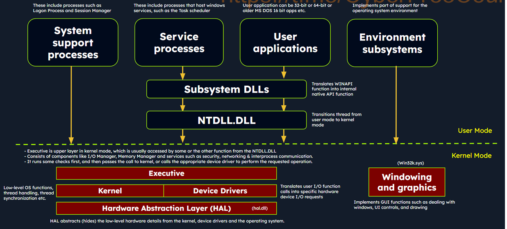
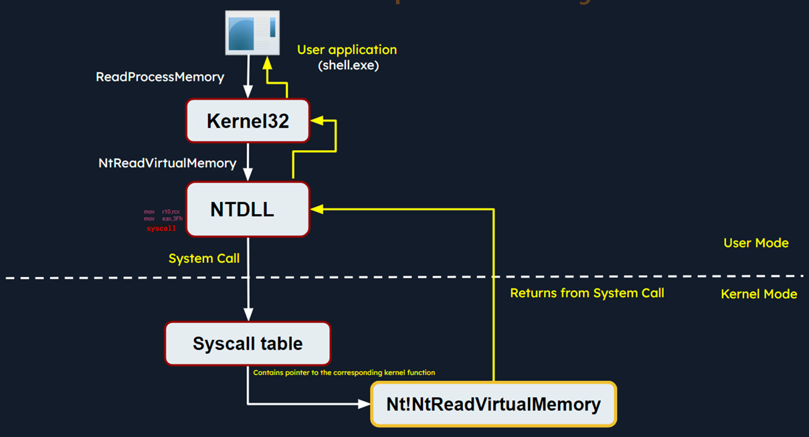
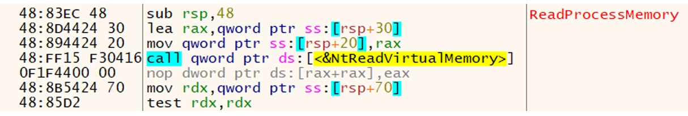
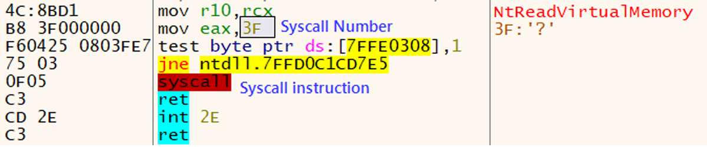
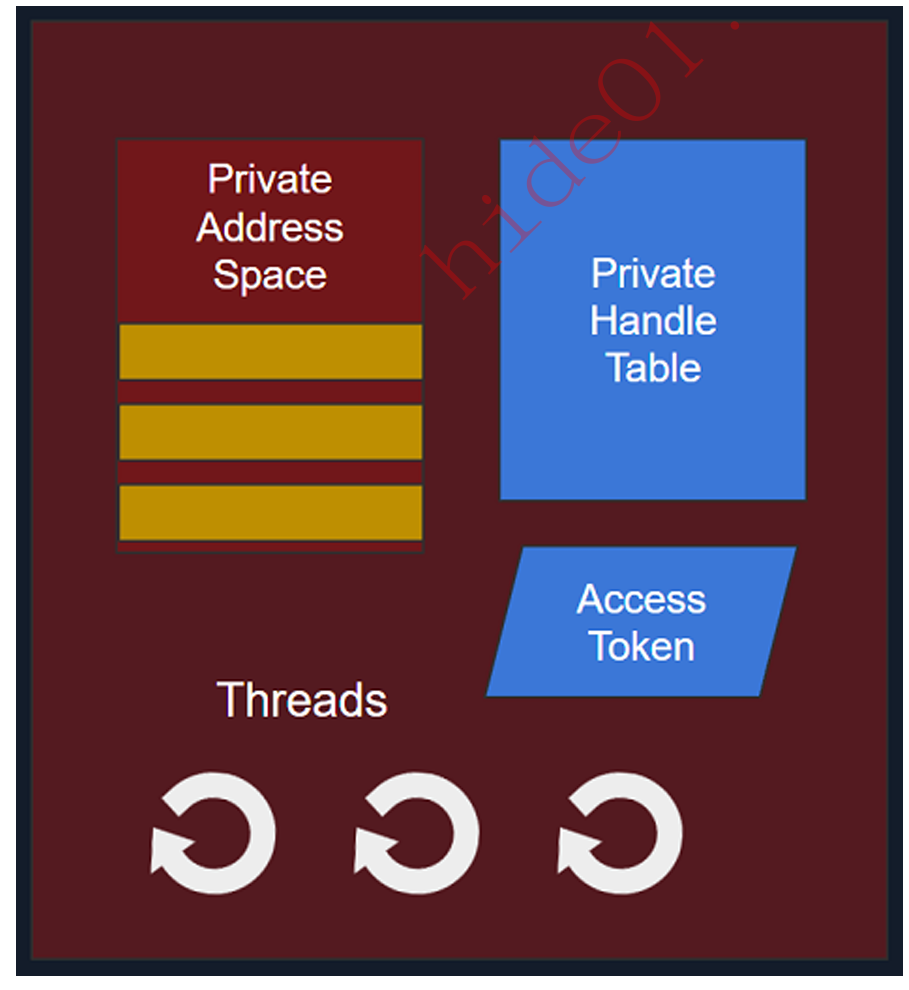
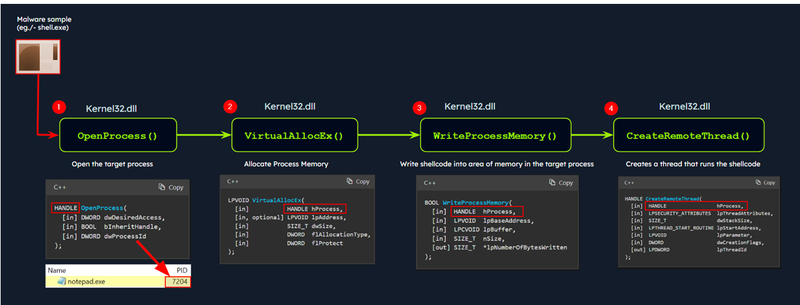
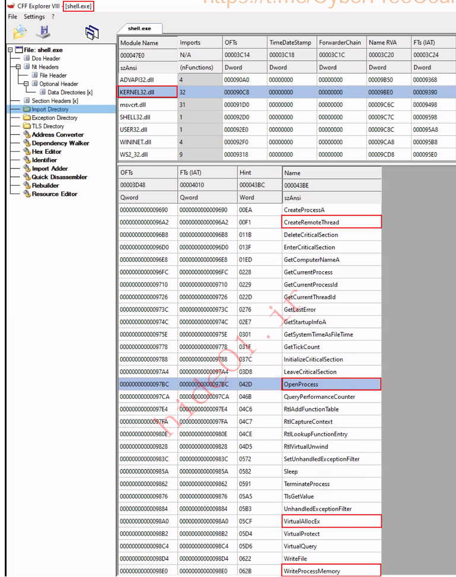
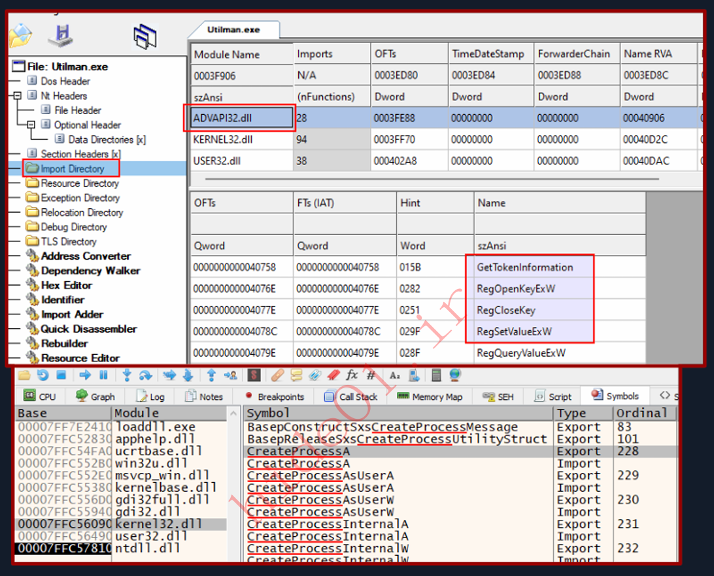

## Table of Contents
- [Table of Contents](#table-of-contents)
- [Introduction to Malware Analysis](#introduction-to-malware-analysis)
  - [🦠 **Definition of Malware**](#-definition-of-malware)
  - [🧬 **Common Types of Malware**](#-common-types-of-malware)
  - [🧪 **Sources for Malware Samples**](#-sources-for-malware-samples)
  - [🕵️ **Malware Evidence Collection**](#️-malware-evidence-collection)
    - [📀 **Disk Imaging Tools**](#-disk-imaging-tools)
    - [🧠 **RAM Collection Tools**](#-ram-collection-tools)
    - [🔍 **Other Artifact Collection Tools**](#-other-artifact-collection-tools)
- [Windows Internals](#windows-internals)
    - [⚙️ Windows Runs in Two Main Modes:](#️-windows-runs-in-two-main-modes)
  - [🧱 **High-Level Windows Architecture**](#-high-level-windows-architecture)
    - [🧍 **User-Mode Components:**](#-user-mode-components)
    - [🧠 **Kernel-Mode Components:**](#-kernel-mode-components)
  - [🔄 **Windows API Call Flow**](#-windows-api-call-flow)
    - [🧪 Example: `ReadProcessMemory`](#-example-readprocessmemory)
    - [🔍 Internal Flow:](#-internal-flow)
  - [🔒 Why This Is Important for Malware Analysis](#-why-this-is-important-for-malware-analysis)
  - [📦 **What is a Portable Executable (PE)?**](#-what-is-a-portable-executable-pe)
  - [📁 **Main Structure of a PE File**](#-main-structure-of-a-pe-file)
  - [🧠 **What is a Process?**](#-what-is-a-process)
  - [🧩 **Dynamic Link Libraries (DLLs)**](#-dynamic-link-libraries-dlls)
  - [📥 **Import and Export Functions in PE/DLLs**](#-import-and-export-functions-in-pedlls)
    - [🛠 **Import Functions**:](#-import-functions)
    - [📤 **Export Functions**:](#-export-functions)
  - [📊 **Application in Malware Analysis**](#-application-in-malware-analysis)
- [Static Analysis On Linux](#static-analysis-on-linux)
- [Static Analysis On Windows](#static-analysis-on-windows)
- [Dynamic Analysis](#dynamic-analysis)
- [Code Analysis](#code-analysis)
- [Debugging](#debugging)
- [Creating Detection Rules](#creating-detection-rules)

## Introduction to Malware Analysis

This section **is not intended to be a comprehensive course**, but rather to provide a **solid foundation** for **SOC analysts** (Security Operation Center professionals).\
The main focus is on **malware analysis in Windows operating systems**.

### 🦠 **Definition of Malware**

**Malware** (short for **malicious software**) refers to software designed to:

- Infiltrate, exploit, or damage computer systems, networks, and data.
- While the overall goal is malicious, the **specific objectives** may vary depending on the attacker.

**Some common goals of malware include:**

- Disrupting system operations  
- Stealing personal and financial data  
- Gaining unauthorized access to systems  
- Espionage  
- Sending spam  
- Launching DDoS (Distributed Denial-of-Service) attacks  
- Encrypting data and demanding ransom (ransomware)

### 🧬 **Common Types of Malware**

| Malware Type              | Description                                                                                       |
| ------------------------- | ------------------------------------------------------------------------------------------------- |
| **Virus**                 | Attaches to legitimate files and activates when the file is opened. Can corrupt data, spread via network. |
| **Worms**                 | Self-replicating malware that spreads across networks without user interaction. May cripple systems. |
| **Trojans**               | Disguised as legitimate software. Creates a backdoor for attackers to control the system.         |
| **Ransomware**            | Encrypts data and demands ransom for decryption. Causes significant damage.                       |
| **Spyware**               | Monitors user activity and collects data like account credentials and passwords.                  |
| **Adware**                | Displays annoying ads and sometimes tracks user behavior for targeted advertising.                |
| **Botnet**                | A network of compromised devices (bots) used for DDoS, spam, or malware distribution.             |
| **Rootkits**              | Deeply embedded in the OS to hide the presence of other malware. Difficult to detect.             |
| **Backdoor / RATs**       | Provides remote access to the infected machine, often used to extract data.                       |
| **Droppers**              | Don’t cause harm directly but are used to download and install more dangerous malware.            |
| **Information Stealers**  | Specifically designed to steal sensitive information like passwords, accounts, and personal data. |

### 🧪 **Sources for Malware Samples**

For learning and research, it's sometimes necessary to obtain real malware samples. **Always work in a secure environment (sandbox or virtual machine).**

Some common sources include:

- **VirusShare**: A repository with over 30 million malware samples.
- **Hybrid Analysis**: Offers file analysis and access to public samples.
- **TheZoo (GitHub)**: Contains real malware with detailed information for each sample.
- **Malware-Traffic-Analysis.net**: Provides PCAP files for studying malware network traffic.
- **VirusTotal**: File analysis service that uses 70+ antivirus engines.
- **ANY.RUN**: Interactive sandbox for analyzing malware behavior.
- **Contagio Malware Dump**: Archive of samples, documents, and malware-related reports.
- **VX Underground**: Collection of malware source code, technical writeups, and hacker-related materials.

### 🕵️ **Malware Evidence Collection**

For digital forensics, it’s important to collect **disk images** and **RAM memory dumps**.

#### 📀 **Disk Imaging Tools**

- **FTK Imager**: Most popular, creates disk images and allows file browsing.
- **OSFClone**: Open-source, supports multiple file systems.
- **DD / DCFLDD**: Unix/Linux commands for creating disk images.

#### 🧠 **RAM Collection Tools**

- **DumpIt**: Quickly dumps physical memory.
- **MemDump**: Simple tool for RAM collection.
- **Belkasoft RAM Capturer**: Captures RAM even with anti-debugging mechanisms.
- **Magnet RAM Capture**: User-friendly and effective.
- **LiME**: Linux memory extractor, stealthy and effective.

#### 🔍 **Other Artifact Collection Tools**

- **KAPE**: Free, fast artifact collection and analysis tool.
- **Velociraptor**: Open-source tool capable of collecting data from multiple endpoints using VQL (Velociraptor Query Language).

## Windows Internals

To perform effective malware analysis, it's crucial to understand how the Windows operating system works at a low level — this is known as **Windows Internals**.

#### ⚙️ Windows Runs in Two Main Modes:

1. **User Mode**:
   - This is where **most user applications and processes** run.
   - Processes in user mode **cannot directly access hardware or critical system resources**.
   - They interact with the OS through **APIs**.
   - Each process is **isolated**, meaning one app can’t directly access another app’s memory or system-level data.
   - However, malware running in user mode can still:
     - Modify files
     - Change registry settings
     - Open network connections
     - And attempt to **escalate privileges** to gain deeper control.

2. **Kernel Mode**:
   - This is the most privileged mode, where the **Windows kernel** and **device drivers** run.
   - Code in kernel mode has **unrestricted access** to hardware and system memory.
   - Malware that runs in kernel mode can:
     - **Hide its presence**
     - **Intercept system calls**
     - **Modify security mechanisms**
     - **Manipulate system behavior at a low level**

### 🧱 **High-Level Windows Architecture**



Windows architecture is divided into two main layers:

#### 🧍 **User-Mode Components:**

- **System Support Processes**: These are critical processes such as:
  - `winlogon.exe` (logon process)
  - `smss.exe` (session manager)
  - `services.exe` (Service Control Manager)

- **Service Processes**: These run background services like:
  - Windows Update
  - Task Scheduler
  - Print Spooler

- **User Applications**: These are regular programs run by users (32-bit or 64-bit). When they use Windows APIs, the API call passes through:
  - **Subsystem DLLs** (e.g., `kernel32.dll`)
  - Then goes to `NTDLL.DLL`
  - A transition from **user mode to kernel mode** occurs for system-level execution

- **Environment Subsystems**: These provide execution environments for different types of apps, such as:
  - **Win32**
  - **POSIX**
  - **OS/2**

- **Subsystem DLLs**: These are dynamic-link libraries (DLLs) that translate high-level API calls into native system calls. Examples:
  - `kernelbase.dll`
  - `user32.dll`
  - `wininet.dll`
  - `advapi32.dll`

#### 🧠 **Kernel-Mode Components:**

- **Executive**: The upper layer of kernel mode, accessed via functions in `NTDLL.DLL`. Includes:
  - **I/O Manager**
  - **Object Manager**
  - **Security Reference Monitor**
  - **Process Manager**
  
  These components handle core OS operations like file I/O, object creation, security checks, and process control.

- **Kernel**: Manages:
  - **Thread scheduling**
  - **Interrupt handling**
  - **Multiprocessor synchronization**

- **Device Drivers**: Bridge the OS with hardware (keyboard, disk, network, etc.).

- **HAL (Hardware Abstraction Layer)**: Provides a consistent interface for hardware, allowing OS and apps to work across different hardware platforms.

- **Win32k.sys**: Manages GUI rendering and user interaction (e.g., windows, buttons, mouse/keyboard input).

### 🔄 **Windows API Call Flow**



Malware often uses **Windows API calls** to interact with the system. Understanding how API calls flow internally helps in spotting suspicious behavior.

#### 🧪 Example: `ReadProcessMemory`

This function allows one process to read another process’s memory — often abused by malware to steal sensitive data.

**Function signature (simplified):**
```c
BOOL ReadProcessMemory(
  HANDLE  hProcess,
  LPCVOID lpBaseAddress,
  LPVOID  lpBuffer,
  SIZE_T  nSize,
  SIZE_T  *lpNumberOfBytesRead
);
```

#### 🔍 Internal Flow:

1. A user-mode application calls `ReadProcessMemory()` — this resides in `kernel32.dll`.

2. `kernel32.dll` calls a lower-level API in `ntdll.dll`.

3. `ntdll.dll` triggers the **native system call**: `NtReadVirtualMemory`.



4. This uses a **`syscall` instruction** to switch to **kernel mode**.


5. Inside the kernel:
   - Parameters are validated.
   - Access permissions are checked.
   - The requested memory is read.

6. The kernel uses the **System Service Descriptor Table (SSDT)** (also known as the syscall table) to map the syscall to the correct kernel routine.

7. Once completed, the result is passed back to **user mode**, and the calling application receives the requested memory data.

### 🔒 Why This Is Important for Malware Analysis

- Malware frequently uses Windows APIs to perform malicious actions.
- Knowing **which API calls are being made**, and **how they’re executed**, helps identify:
  - Suspicious behavior (e.g., reading another process’s memory)
  - Privilege escalation attempts
  - Hooking and tampering of APIs


### 📦 **What is a Portable Executable (PE)?**

- The **Portable Executable (PE)** format is the file format used by Windows operating systems for executables such as `.exe`, dynamic link libraries `.dll`, drivers `.sys`, control panel files `.cpl`, and more.
- It serves as the “blueprint” that tells Windows how to **load** and **execute** a program.
- The PE file contains critical information like executable code, data sections, imported/exported functions, and resources.

> 🔍 In malware analysis, understanding the PE structure is crucial for detecting malicious behaviors hidden inside a file.

### 📁 **Main Structure of a PE File**


PE files are divided into **sections**, each serving a specific purpose.

| Section         | Purpose                                                                 |
|------------------|------------------------------------------------------------------------|
| `.text`          | Contains the program's executable code. Often analyzed for code injection. |
| `.data`          | Holds initialized global/static variables.                              |
| `.rdata`         | Read-only data like constants, strings, and initialized variables.       |
| `.bss`           | Uninitialized global/static data. Allocated during runtime.              |
| `.rsrc`          | Stores resources such as icons, images, version info.                   |
| `.idata`         | Information about imported functions from DLLs.                         |
| `.edata`         | Information about exported functions available to other programs.       |
| `.reloc`         | Relocation data for adjusting memory addresses if loaded elsewhere.     |

🛠 **Tools to visualize PE structure**: *PEStudio, CFF Explorer, x64dbg*.

### 🧠 **What is a Process?**



- A **process** is an instance of a running program. Each process has its own:
  - **PID (Process Identifier)**: A unique number for OS to manage it.
  - **Virtual Address Space (VAS)**: An isolated memory space including code, data, and stack.
  - **Image File**: The actual executable code loaded from disk.
  - **Handle Table**: References to system objects like files, registry keys, and more.
  - **Access Token**: Security context specifying user privileges.
  - **Threads**: One or more units of execution within the process.

### 🧩 **Dynamic Link Libraries (DLLs)**


- A DLL is a **shared library** used by Windows programs to reuse common functionality.
- Malware often uses DLLs to:
  - Inject code into other processes,
  - Access the file system,
  - Communicate over networks,
  - Manipulate the registry, etc.

### 📥 **Import and Export Functions in PE/DLLs**

#### 🛠 **Import Functions**:
- Functions that a program dynamically loads from other DLLs at runtime.
- Help analysts identify:
  - What APIs the malware depends on,
  - Its capabilities (e.g., file operations, networking, process manipulation),
  - Indicators of Compromise (IOCs) based on function names or hashes.

**Example - Process Injection using Import Functions:**



A malware sample (`shell.exe`) injects code into `notepad.exe` using functions from `kernel32.dll`:
  - `OpenProcess`: Gets a handle to the target process.
  - `VirtualAllocEx`: Allocates memory in the target process.
  - `WriteProcessMemory`: Writes malicious code into the allocated memory.
  - `CreateRemoteThread`: Executes the injected code inside the target process.



#### 📤 **Export Functions**:
- Functions that a DLL **exposes** for other programs to use.
- Example: `Kernel32.dll` exports functions like `CreateFile`, `ReadFile`, etc.

- These provide insight into how a binary interacts with the outside world.

### 📊 **Application in Malware Analysis**

Understanding PE files and DLL behavior allows analysts to:
- **Dissect malware structure and behavior**,
- Identify **IOCs** to detect similar threats,
- Perform effective **static and dynamic analysis**,
- Understand anti-analysis techniques and capabilities of the malware.

## Static Analysis On Linux


## Static Analysis On Windows
## Dynamic Analysis
## Code Analysis
## Debugging
## Creating Detection Rules