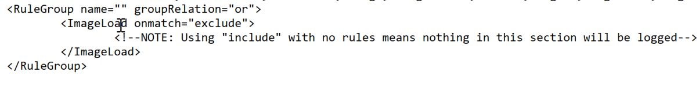

# SIEM Definition & Fundamentals

## What Is SIEM? 🔐

Crucial within the realm of computer protection, **Security Information and Event Management** (SIEM) encompasses the utilization of software offerings and solutions that merge the management of security data with the supervision of security events. These instruments facilitate real-time evaluations of alerts related to security, which are produced by network hardware and applications.

SIEM tools possess an extensive range of core functionalities, such as:
- The collection and administration of log events 📝
- The capacity to examine log events and supplementary data from various sources 🔎
- Operational features like incident handling, visual summaries, and documentation 📊

Employing SIEM innovations, IT personnel can detect cyberattacks at the time of or even prior to their occurrence, thereby enhancing the speed of their response during incident resolution. Consequently, SIEM plays an indispensable role in the effectiveness and ongoing supervision of a company's information security framework. It serves as the bedrock of an organization’s security tactics, offering a holistic method for identifying and managing potential threats.

## The Evolution Of SIEM Technology 🔄

The acronym "SIEM" emerged from the collaboration of two Gartner analysts who suggested a novel security information framework that integrated two preceding technologies: **Security Information Management** (SIM) and **Security Event Management** (SEM). This proposition appeared in a 2005 Gartner paper titled *"Enhance IT Security through Vulnerability Management."*

- **First-generation SIM** technology was developed upon conventional log collection management systems, allowing for extended storage, examination, and reporting of log data while incorporating logs with threat intelligence.
- **Second-generation SEM** technology tackled security events by delivering consolidation, correlation, and notification of events from various security apparatuses, such as antivirus software, firewalls, and Intrusion Detection Systems (IDS).

In the years that followed, vendors amalgamated the capabilities of SIM and SEM to devise the **SIEM**, leading to a fresh definition as per Gartner's investigation. This nascent technology gained widespread acceptance as it offered a comprehensive methodology for detecting and managing threats, including the ability to amass, preserve, and scrutinize logs and security events from various origins.

## How Does A SIEM Solution Work? ⚙️

SIEM systems function by gathering data from a variety of sources, including PCs, network devices, servers, and more. This data is then standardized and consolidated to facilitate ease of analysis.

SIEM platforms employ security experts who scrutinize the data in order to identify and detect potential threats. This procedure allows businesses to locate security breaches and examine alerts, offering crucial insights into the organization's security standing.

Alerts notify Security Operations/Monitoring personnel that they must look into a (possible) security event or incident. These notifications are usually concise and inform staff of a specific attack targeting the organization's information systems. Alerts can be conveyed through multiple channels, such as emails, console pop-up messages, text messages, or phone calls to smartphones 📱.

SIEM systems generate a vast number of alerts due to the substantial volume of events produced for each monitored platform. It is not unusual for an hourly log of events to range from hundreds to thousands. As a result, fine-tuning the SIEM for detecting and alerting on high-risk events is crucial.

## SIEM Business Requirements & Use Cases 📋

### Log Aggregation & Normalization 📂

The importance of threat visibility through log consolidation offered by SIEM systems cannot be overstated. In its absence, an organization's cybersecurity holds as much value as a mere paperweight. Log consolidation entails gathering terabytes of security information from vital firewalls, confidential databases, and essential applications. This process empowers the SOC team to examine the data and discern connections, significantly improving threat visibility.

### Threat Alerting ⚠️

Having a SIEM solution that can identify and notify IT security teams about possible threats within the vast volume of collected security event data is essential. This feature is critical as it allows the IT security team to carry out swifter, more targeted investigations and respond to potential security incidents in a timely and efficient manner.

### Contextualization & Response 🛡️

It is important to understand that merely generating alerts is not enough. If a SIEM solution sends alerts for every possible security event, the IT security team will soon be overwhelmed by the sheer volume of alerts, and false positives may become a frequent issue, particularly in older solutions. As a result, threat contextualization is crucial for sorting through alerts, determining the actors involved in the security event, the affected parts of the network, and the timing.

### Compliance 📑

SIEM solutions play a significant role in compliance by assisting organizations in meeting regulatory requirements through a comprehensive approach to threat detection and management. Regulations like PCI DSS, HIPAA, and GDPR mandate organizations to implement robust security measures, including real-time monitoring and analysis of network traffic.

## What Are The Benefits Of Using A SIEM Solution? 🎯

It is evident that the advantages of deploying a **Security Information and Event Management** (SIEM) system significantly outweigh the potential risks associated with not having one, assuming that the security control is safeguarding something of higher importance.

1. **Data Ingestion**: SIEM solutions ingest logs from various data sources. Each SIEM tool possesses unique capabilities for collecting logs from different sources. This process is known as data ingestion or data collection.
2. **Data Normalization**: The gathered data is processed and normalized to be understood by the SIEM correlation engine.
3. **Detection and Response**: SOC teams use the normalized data collected by the SIEM to create various detection rules, dashboards, visualizations, alerts, and incidents.

In the absence of a SIEM, IT personnel would not have a centralized perspective on all logs and events, which could result in overlooking crucial events and accumulating a large number of events awaiting investigation. Conversely, a properly calibrated SIEM bolsters the incident response process, improving efficiency and offering a centralized dashboard for notifications based on predetermined categories and event thresholds.

Contemporary SIEMs often include built-in intelligence capable of detecting configurable threshold limits and events within specific timeframes, as well as providing summaries and customizable reports. More sophisticated SIEMs are now integrating **AI** to notify based on behavioral and pattern analysis 🤖.

---

# Introduction To The Elastic Stack

## What Is The Elastic Stack?

The **Elastic Stack**, created by Elastic, is an open-source collection of mainly three applications (**Elasticsearch**, **Logstash**, and **Kibana**) that work in harmony to offer users comprehensive search and visualization capabilities for real-time analysis and exploration of log file sources. 


The high-level architecture of the Elastic Stack can be enhanced in resource-intensive environments with the addition of **Kafka**, **RabbitMQ**, and **Redis** for buffering and resiliency, and **nginx** for security.


Let's delve into each component of the Elastic Stack.

### Elasticsearch 🔍
**Elasticsearch** is a distributed and JSON-based search engine, designed with RESTful APIs. As the core component of the Elastic Stack, it handles indexing, storing, and querying. Elasticsearch empowers users to conduct sophisticated queries and perform analytics operations on the log file records processed by Logstash.

### Logstash 🚛
**Logstash** is responsible for collecting, transforming, and transporting log file records. Its strength lies in its ability to consolidate data from various sources and normalize them. Logstash operates in three main areas:
1. **Process Input**: Logstash ingests log file records from remote locations, converting them into a format that machines can understand. It can receive records through different input methods, such as reading from a flat file, a TCP socket, or directly from syslog messages.
2. **Transform and Enrich Log Records**: Logstash offers numerous ways to modify a log record's format and even content. Specifically, filter plugins can perform intermediary processing on an event, often based on a predefined condition. Once a log record is transformed, Logstash processes it further.
3. **Send Log Records to Elasticsearch**: Logstash utilizes output plugins to transmit log records to Elasticsearch.

### Kibana 📊
**Kibana** serves as the visualization tool for Elasticsearch documents. Users can view the data stored in Elasticsearch and execute queries through Kibana. Additionally, Kibana simplifies the comprehension of query results using tables, charts, and custom dashboards.

> **Note**: **Beats** is an additional component of the Elastic Stack. These lightweight, single-purpose data shippers are designed to be installed on remote machines to forward logs and metrics to either Logstash or Elasticsearch directly. Beats simplify the process of collecting data from various sources and ensure that the Elastic Stack receives the necessary information for analysis and visualization.

### Architecture Flow:
- **Beats → Logstash → Elasticsearch → Kibana**


- **Beats → Elasticsearch → Kibana**


## The Elastic Stack As A SIEM Solution

The Elastic Stack can be used as a **Security Information and Event Management (SIEM)** solution to collect, store, analyze, and visualize security-related data from various sources. To implement the Elastic Stack as a SIEM solution, security-related data from various sources such as **firewalls**, **IDS/IPS**, and **endpoints** should be ingested into the Elastic Stack using Logstash. Elasticsearch should be configured to store and index the security data, and Kibana should be used to create custom dashboards and visualizations to provide insights into security-related events.

To detect security-related incidents, Elasticsearch can be used to perform searches and correlations on the collected security data.

As **Security Operations Center (SOC)** analysts, we are likely to extensively use **Kibana** as our primary interface when working with the Elastic Stack. Therefore, it is essential to become proficient with its functionalities and features.


## Kibana Query Language (KQL) 🔍

**KQL** (Kibana Query Language) is a powerful and user-friendly query language designed specifically for searching and analyzing data in Kibana. It simplifies the process of extracting insights from your indexed Elasticsearch data, offering a more intuitive approach than Elasticsearch's Query DSL.

### Example KQL Queries:
1. **event.code:4625**: Filters data to show events that have the Windows event code 4625, which is associated with failed login attempts in Windows.
2. **event.code:4625 AND winlog.event_data.SubStatus:0xC0000072**: Filters data to show events with the Windows event code 4625 and SubStatus value of 0xC0000072 (indicating a disabled account).

### Basic Structure:
KQL queries are composed of **field:value** pairs:
- **event.code:4625**

### Free Text Search:
KQL supports free text search, allowing you to search for a specific term across multiple fields without specifying a field name:
- `"svc-sql1"`

### Logical Operators:
KQL supports logical operators **AND**, **OR**, and **NOT** for constructing more complex queries. Parentheses can be used to group expressions and control the order of evaluation:
- **event.code:4625 AND winlog.event_data.SubStatus:0xC0000072**

### Comparison Operators:
KQL supports various comparison operators such as `:`, `:>`, `:>=`, `:<`, `:<=`, and `:!`. These operators help define precise conditions for matching field values:
- **event.code:4625 AND winlog.event_data.SubStatus:0xC0000072 AND @timestamp >= "2023-03-03T00:00:00.000Z" AND @timestamp <= "2023-03-06T23:59:59.999Z"**

### Wildcards and Regular Expressions:
KQL supports wildcards and regular expressions to search for patterns in field values:
- **event.code:4625 AND user.name: admin***

## Identifying Available Data

"How can I identify the available fields and values?", you may ask. Let's see how we could have identified the available fields and values that we used in this section.

**Example**: Identify failed login attempts against disabled accounts that took place between March 3rd 2023 and March 6th 2023
KQL:
```kql
event.code:4625 AND winlog.event_data.SubStatus:0xC0000072 AND @timestamp>= "2023-03-03T00:00:00.000Z" AND @timestamp <= "2023-03-06T23:59:59.999Z"
```

### Approach 1: Leverage KQL's Free Text Search
Using the **Discover** feature, we can effortlessly explore and sift through the available data, as well as gain insights into the architecture of the available fields, before we start constructing KQL queries.
- By using a search engine for the Windows event logs that are associated with failed login attempts, we will come across resources such as https://www.ultimatewindowssecurity.com/securitylog/encyclopedia/event.aspx?ventid=4625
- Using KQL's free text search we can search for **"4625"** . In the returned records we notice **event.code:4625** , **winlog.event_id:4625** , and **@timestamp**
  
    - **event.code** is related to the Elastic Common Schema (ECS)
    - **winlog.event_id** is related to Winlogbeat
    - If the organization we work for is using the Elastic stack across all offices and security departments, it is preferred that we use the ECS fields in our queries for reasons that we will cover at the end of this section.
    - **@timestamp** typically contains the time extracted from the original event and it is different from event.created
  
- When it comes to disabled accounts, the aforementioned resource informs us that a SubStatus value of 0xC0000072 inside a 4625 Windows event log indicates that the account is currently disabled. Again using KQL's free text search we can search for "0xC0000072" . By expanding the returned record we notice winlog.event_data.SubStatus that is related to Winlogbeat


### Approach 2: Leverage Elastic's Documentation
It could be a good idea to first familiarize ourselves with Elastic's comprehensive documentation before delving into the "Discover" feature. The documentation provides a wealth of information on the different types of fields we may encounter. Some good resources to start with are:

- [Elastic Common Schema (ECS)](https://www.elastic.co/guide/en/ecs/current/index.html)
- [Elastic Common Schema (ECS) event fields](https://www.elastic.co/guide/en/ecs/current/ecs-field-reference.html)
- [Winlogbeat fields](https://www.elastic.co/guide/en/beats/winlogbeat/current/winlogbeat-overview.html)
- [Winlogbeat ECS fields](https://www.elastic.co/guide/en/beats/winlogbeat/current/winlogbeat-overview.html#_ecs_fields)
- [Winlogbeat security module fields](https://www.elastic.co/guide/en/beats/winlogbeat/current/winlogbeat-module-security.html#_fields)
- [Filebeat fields](https://www.elastic.co/guide/en/beats/filebeat/current/filebeat-overview.html)
- [Filebeat ECS fields](https://www.elastic.co/guide/en/beats/filebeat/current/filebeat-overview.html#_ecs_fields)


## Elastic Common Schema (ECS) 📐

**Elastic Common Schema (ECS)** is a shared and extensible vocabulary for events and logs across the Elastic Stack, ensuring consistent field formats across different data sources. Using ECS fields in KQL queries provides several key advantages:

- **Unified Data View**: ECS allows for a unified view across multiple data sources, enabling correlation between data from Windows logs, network traffic, endpoint events, and more.
- **Improved Search Efficiency**: ECS simplifies writing KQL queries by standardizing field names.
- **Enhanced Correlation**: ECS makes it easier to correlate events across different sources, crucial for cybersecurity investigations.
- **Better Visualizations**: ECS improves the efficacy of Kibana visualizations by adhering to consistent field naming conventions.
- **Interoperability with Elastic Solutions**: ECS ensures compatibility with Elastic Security, Elastic Observability, and Elastic Machine Learning for advanced threat hunting and anomaly detection.

By adopting ECS, you ensure future compatibility with enhancements and new features introduced in the Elastic ecosystem.

---

# SOC Definition & Fundamentals

## What Is A SOC? 🛡️

A **Security Operations Center (SOC)** is an essential facility that houses a team of information security experts responsible for continuously monitoring and evaluating an organization's security status. The main objective of a SOC team is to identify, examine, and address cybersecurity incidents by employing a mix of technology solutions and a comprehensive set of procedures.

The SOC team usually consists of proficient security analysts, engineers, and managers overseeing security operations. They collaborate closely with organizational incident response teams to guarantee security concerns are promptly detected and resolved.

Various technology solutions, such as **Security Information and Event Management (SIEM)** systems, **Intrusion Detection and Prevention Systems (IDS/IPS)**, and **Endpoint Detection and Response (EDR)** tools, are utilized by the SOC team to monitor and identify security threats. They also make use of threat intelligence and engage in threat hunting initiatives to proactively detect potential threats and vulnerabilities.

Besides employing technology solutions, the SOC team follows a series of well-defined processes for addressing security incidents. These processes encompass **incident triage**, **containment**, **elimination**, and **recovery**. The SOC team cooperates closely with the incident response team to ensure proper handling of security incidents, safeguarding the organization's security stance.

In summary, a SOC is a vital element of an organization's cybersecurity approach. It offers continuous monitoring and response capabilities, enabling organizations to promptly detect and address security incidents, minimizing the consequences of a security breach and decreasing the likelihood of future attacks.


## How Does A SOC Work? ⚙️

The primary function of the SOC team is to manage the ongoing operational aspect of enterprise information security rather than concentrating on the development of security strategies, designing security architecture, or implementing protective measures. 

The SOC team mainly consists of **security analysts** who work collectively to detect, assess, respond to, report on, and prevent cybersecurity incidents. 

Besides the primary responsibilities of a SOC team, some SOCs may possess advanced capabilities like **forensic analysis** and **malware analysis**. These abilities enable the SOC team to conduct in-depth investigations of security incidents and examine the root cause of the incident to avert future attacks. 

As previously mentioned, the SOC team also collaborates closely with the **incident response team** to guarantee proper handling of security incidents and the preservation of the organization's security posture.

## Roles Within A SOC 🧑‍💻

A SOC team consists of diverse roles responsible for handling the continuous, operational aspect of enterprise information security. These roles may encompass:

- **SOC Director**: Responsible for overall management and strategic planning of the SOC, including budgeting, staffing, and alignment with organizational security objectives.
- **SOC Manager**: Oversees day-to-day operations, manages the team, coordinates incident response efforts, and ensures smooth collaboration with other departments.
- **Tier 1 Analyst**: Monitors security alerts and events, triages potential incidents, and escalates them to higher tiers for further investigation.
- **Tier 2 Analyst**: Performs in-depth analysis of escalated incidents, identifies patterns and trends, and develops mitigation strategies to address security threats.
- **Tier 3 Analyst**: Provides advanced expertise in handling complex security incidents, conducts threat hunting activities, and collaborates with other teams to improve the organization's security posture.
- **Detection Engineer**: Develops, implements, and maintains detection rules and signatures for security monitoring tools, such as SIEM, IDS/IPS, and EDR solutions.
- **Incident Responder**: Takes charge of active security incidents, carries out in-depth digital forensics and containment and remediation efforts, and collaborates with other teams to restore affected systems and prevent future occurrences.
- **Threat Intelligence Analyst**: Gathers, analyzes, and disseminates threat intelligence data to help SOC team members better understand the threat landscape and proactively defend against emerging risks.
- **Security Engineer**: Develops, deploys, and maintains security tools, technologies, and infrastructure, and provides technical expertise to the SOC team.
- **Compliance and Governance Specialist**: Ensures that the organization's security practices and processes adhere to relevant industry standards, regulations, and best practices, and assists with audit and reporting requirements.
- **Security Awareness and Training Coordinator**: Develops and implements security training and awareness programs to educate employees about cybersecurity best practices and promote a culture of security within the organization.

## SOC Stages 🚀

### SOC 1.0 🕰️

Security Operations Centers (SOCs) have evolved significantly from their early days as **Network Operation Centers** focused primarily on network security. In the first generation, known as SOC 1.0, organizations invested in certain security layers such as security intelligence platforms or identity management systems. However, the lack of proper integration led to uncorrelated alerts and a buildup of tasks across multiple platforms. This stage was characterized by an emphasis on network and perimeter security, even as threats began exploiting other vectors. Surprisingly, some organizations continue to rely on this outdated approach, seemingly waiting for a major breach to occur.

### SOC 2.0 🔐 

The emergence of sophisticated threats, including multi-vector, persistent, and asynchronous attacks with concealed indicators of compromise, has spurred the transition to SOC 2.0. Malware, including mobile variants, and botnets serve as the primary delivery methods for these attacks. The longevity, evolving behavior, and growth of botnets over time have become focal points for threat intelligence.

SOC 2.0 is built on intelligence, integrating security telemetry, threat intelligence, network flow analysis, and other anomaly detection techniques. Additionally, layer-7 analysis is employed at this stage to identify low and slow attacks and other hidden threats. A forward-looking approach to threat research and collaboration between SOCs, either within sectors or at the national level, is crucial for SOC 2.0's success. Emphasis is placed on complete situational awareness, pre-event preparedness through vulnerability management, configuration management, and dynamic risk management, as well as post-event analysis and learning through incident response and in-depth forensics. Refining security intelligence rules and deploying countermeasures are also vital in this stage.

### Cognitive SOC (Next-Generation SOC) 🧠

The **cognitive SOC**, or next-generation SOC, seeks to address the remaining shortcomings of SOC 2.0. While SOC 2.0 has all the essential subsystems, it often lacks operational experience and effective collaboration between business and security teams to create rules that detect threats specific to business processes and systems. Moreover, many organizations still lack standardized incident response and recovery procedures.

Cognitive SOCs aim to resolve these issues by incorporating learning systems that compensate for experience gaps in security decision-making. While the success rate of this approach may not be perfect in every instance, it is expected to improve over time.


**Reference**: [LinkedIn Article](https://www.linkedin.com/pulse/evolution-security-operations-center-20-beyondkrishnan-jagannathan/)

---
# MITRE ATT&CK & Security Operations 🛡️

## What Is MITRE ATT&CK? 🧠

The **MITRE ATT&CK** (Adversarial Tactics, Techniques, and Common Knowledge) framework serves as an extensive, regularly updated resource outlining the **tactics**, **techniques**, and **procedures (TTPs)** employed by cyber threat actors. This structured methodology assists cybersecurity experts in comprehending, identifying, and reacting to threats more proactively and knowledgeably.

The ATT&CK framework comprises matrices tailored to various computing contexts, such as **enterprise**, **mobile**, or **cloud systems**. Each matrix links the **tactics** (the goals attackers aim to achieve) and **techniques** (the methods used to accomplish their objectives) to distinct TTPs. This linkage allows security teams to methodically examine and predict attacker activities.

## MITRE ATT&CK Use Cases In Security Operations 🚨

The **MITRE ATT&CK** framework not only serves as a comprehensive resource for understanding adversarial tactics, techniques, and procedures (TTPs), but it also plays a crucial role in several aspects of **Security Operations**. These include:

### 1. **Detection and Response** 🔍

The framework supports **SOCs** in devising detection and response plans based on recognized attacker TTPs, empowering security teams to pinpoint potential dangers and develop proactive countermeasures.

### 2. **Security Evaluation and Gap Analysis** 🔒

Organizations can leverage the ATT&CK framework to identify the strengths and weaknesses of their security posture, subsequently prioritizing security control investments to effectively defend against relevant threats.

### 3. **SOC Maturity Assessment** 📊

The ATT&CK framework enables organizations to assess their **Security Operations Center (SOC)** maturity by measuring their ability to detect, respond to, and mitigate various TTPs. This assessment assists in identifying areas for improvement and prioritizing resources to strengthen the overall security posture.

### 4. **Threat Intelligence** 🧩

The framework offers a unified language and format to describe adversarial actions, enabling organizations to bolster their **threat intelligence** and improve collaboration among internal teams or with external stakeholders.

### 5. **Cyber Threat Intelligence Enrichment** 🔍

Leveraging the ATT&CK framework can help organizations enrich their **cyber threat intelligence** by providing context on attacker TTPs, as well as insights into potential targets and **indicators of compromise (IOCs)**. This enrichment allows for more informed decision-making and effective threat mitigation strategies.

### 6. **Behavioral Analytics Development** 📉

By mapping the TTPs outlined in the ATT&CK framework to specific user and system behaviors, organizations can develop **behavioral analytics models** to identify anomalous activities indicative of potential threats. This approach enhances detection capabilities and helps security teams proactively mitigate risks.

### 7. **Red Teaming and Penetration Testing** 💡

The ATT&CK framework presents a systematic way to replicate genuine attacker techniques during **red teaming exercises** and **penetration tests**, ultimately assessing an organization's defensive capabilities.

### 8. **Training and Education** 🎓

The comprehensive and well-organized nature of the ATT&CK framework makes it an exceptional resource for **training** and **educating** security professionals on the latest adversarial tactics and methods.


In conclusion, the **MITRE ATT&CK** framework is an indispensable asset for **security operations**, offering a shared language and structure for describing and understanding adversarial behavior. It is vital for enhancing various aspects of security operations, from **threat intelligence** and **behavioral analytics** to **SOC maturity assessment** and **cyber threat intelligence enrichment**.

---
# SIEM Use Case Development 🔒

## What Is A SIEM Use Case? 📊

Utilizing **SIEM** use cases is a fundamental aspect of crafting a robust cybersecurity strategy, as they enable the effective identification and detection of potential security incidents. Use cases are designed to illustrate specific situations where a product or service can be applied, and they can range from general scenarios, such as **failed login attempts**, to more complex ones like detecting a **ransomware outbreak**.



For instance, consider a situation where a user named **Rob** experiences 10 consecutive failed authentication attempts. These events could originate from the actual user who forgot their credentials or from a malicious actor trying to brute force their way into the account. In either case, these 10 events are sent to the **SIEM** system, which then correlates them into a single event and triggers an alert to the **SOC** team under the "**brute force**" use case category.

Based on the log data generated within the **SIEM**, the **SOC** team is then responsible for taking appropriate action. This example demonstrates just one of the many possible use cases that can be developed, ranging from straightforward to more intricate situations.

## EM Use Case Development Lifecycle 🔄

The following critical stages must be considered when developing any use cases:


### 1. **Requirements** 📋

Comprehend the purpose or necessity of the use case, pinpointing the specific scenario for which an alert or notification is needed. Requirements can be proposed by customers, analysts, or employees. For instance, the goal might be to design a detection use case for a **brute force attack** that triggers an alert after 10 consecutive login failures within 4 minutes.

### 2. **Data Points** 📡

Identify all data points within the network where a user account can be used to log in. Gather information about the data sources that generate logs for unauthorized access attempts or login failures. For example, data might come from **Windows** machines, **Linux** machines, endpoints, servers, or applications. Ensure logs capture essential details like **user**, **timestamp**, **source**, **destination**, etc.

### 3. **Log Validation** ✅

Verify and validate the logs, ensuring they contain all crucial information such as **user**, **timestamp**, **source**, **destination**, **machine name**, and **application name**. Confirm all logs are received during various user authentication events for critical data points, including **local**, **web-based**, **application**, **VPN**, and **OWA (Outlook)** authentication.

### 4. **Design and Implementation** ⚙️

After identifying and verifying all logs with different data points and sources, begin designing the use case by defining the conditions under which an alert should be triggered. Consider three primary parameters: **Condition**, **Aggregation**, and **Priority**. For example, in a brute force attack use case, create an alert for 10 login failures in 4 minutes while considering aggregation to avoid false positives and setting alert priority based on the targeted user's privileges.

### 5. **Documentation** 📑

**Standard Operating Procedures (SOP)** detail the standard processes analysts must follow when working on alerts. This includes conditions, aggregations, priorities, and information about other teams to which analysts need to report activities. The SOP also contains the escalation matrix.

### 6. **Onboarding** 🚀

Start with the development stage before moving the alert directly into the production environment. Identify and address any gaps to reduce false positives, then proceed to production.

### 7. **Periodic Update/Fine-tuning** 🔄

Obtain regular feedback from analysts and maintain up-to-date correlation rules by **whitelisting**. Continually refine and optimize the use case to ensure its effectiveness and accuracy.


## How To Build SIEM Use Cases 🛠️

1. **Comprehend your needs**, risks, and establish alerts for monitoring all necessary systems accordingly.
2. **Determine the priority** and impact, then map the alert to the **kill chain** or **MITRE** framework.
3. Establish the **Time to Detection (TTD)** and **Time to Response (TTR)** for the alert to assess the **SIEM**'s effectiveness and analysts' performance.
4. Create a **Standard Operating Procedure (SOP)** for managing alerts.
5. Outline the process for refining alerts based on **SIEM monitoring**.
6. Develop an **Incident Response Plan (IRP)** to address true positive incidents.
7. Set **Service Level Agreements (SLAs)** and **Operational Level Agreements (OLAs)** between teams for handling alerts and following the **IRP**.
8. Implement and maintain an **audit process** for managing alerts and incident reporting by analysts.
9. Create documentation to review the **logging status** of machines or systems, the basis for creating alerts, and their triggering frequency.
10. Establish a **knowledge base document** for essential information and updates to case management tools.

##  Example 1: Microsoft Build Engine Started By An Office Application 🖥️

Now, let's explore a practical example using the **Elastic stack** as a **SIEM** solution to help understand how to map each of the above points.

In the provided snapshot (detection use case), we need to determine our **risk** and the **target** of our monitoring efforts.

### **Understanding the Risk: MSBuild** 🛠️

**MSBuild**, part of the **Microsoft Build Engine**, is a software build system that assembles applications according to its **XML** input file. Typically, **Microsoft Visual Studio** generates the input file, but the **.NET framework** and other compilers can also compile applications without it. 

**Attackers** exploit **MSBuild**'s ability to include malicious source code within its configuration or project file. When monitoring process execution command-line arguments, it is crucial to investigate instances where a **web browser** or **Microsoft Office executable** initiates **MSBuild**. This suspicious behavior suggests a potential breach.

Once a **baseline** is established, unusual **MSBuild** calls should be easily identifiable and relatively rare, avoiding increased workload for the team.

### **Creating a Detection Use Case** 🔍

To address this risk, we create a detection use case in our **SIEM** solution that monitors instances of **MSBuild** initiated by **Excel** or **Word**, as this behavior could indicate a **malicious script payload execution**.

#### **Priority, Impact, and MITRE Mapping** ⚠️

Next, let's define **priority**, **impact**, and map the alert to the **kill chain** or **MITRE framework**.

Given the above risk and threat intelligence, this technique, known as **Living-off-the-land binaries (LoLBins)**, poses a significant threat if detected, making it a **high global risk** category. Consequently, we assign it **HIGH** severity, though this may vary depending on your organization's specific context and landscape.

Regarding **MITRE mapping**, this use case involves bypassing detection techniques via **LoLBins usage**, falling under the **Defense Evasion (TA0005)** tactic, the **Trusted Developer Utilities Proxy Execution (T1127)** technique, and the **Trusted Developer Utilities Proxy Execution: MSBuild (T1127.001)** sub-technique. Additionally, executing the **MSBuild** binary on the endpoint also falls under the **Execution (TA0002)** tactic.

#### **Time to Detection (TTD) & Time to Response (TTR)** ⏳

To define **TTD** and **TTR**, we need to focus on the rule's execution interval and the **data ingestion pipeline** discussed earlier. For this example, we set the rule to run every **five minutes**, monitoring all incoming logs.

### **Creating an SOP & Documenting Alert Handling** 📝

When creating an **SOP** and documenting alert handling, consider the following:

- `process.name`
- `process.parent.name`
- `event.action`
- **machine** where the alert was detected
- **user** associated with the machine
- **user activity** within +/- 2 days of the alert's generation

After gathering this information, defenders should engage with the user and examine the user's machine to analyze **system logs**, **antivirus logs**, and **proxy logs** from the **SIEM** for full visibility.

The **SOC team** should document all the above points, along with the **Incident Response Plan**, so that **Incident Handlers** can reference them during analysis.

### **Fine-tuning Rules** 🔧

For rule fine-tuning, it is essential to understand the conditions that may trigger **false positives**. For example, while the **Build Engine** is common among **Windows developers**, its use by **non-engineers** is unusual. Excluding legitimate **parent process names** from the rule helps avoid false positives. 

Further details on fine-tuning **SIEM rules** will be given later on.

## Example 2: MSBuild Making Network Connections 🌐

Example 1 discussed a high-severity detection use case and rule. Now, let's examine a **medium-severity** use case using a **SIEM** solution to better understand how each pointer contributes to the effectiveness of use cases.

### **Understanding the Risk: MSBuild & Outbound Communication** 💻➡️🌍

In the given snapshot, we need to determine our **risk** and what we are trying to monitor. Like in Example 1, we are again focusing on the **MsBuild.exe** binary. However, this time, we consider the scenario in which a **machine** attempts **outbound communication** with a **remote** or potentially **malicious IP address**, and the process behind that connection is **MsBuild.exe**.

This would raise an alarm, as it may indicate **adversarial activity**. **MsBuild** is often exploited by adversaries to execute code and evade detection.

### **Creating a Detection Use Case** 🔍

To address this risk, we need a **monitoring solution** capable of detecting instances where **MsBuild** is responsible for **malicious outbound connections**. We create a **detection use case** in our **SIEM** solution for this purpose.

#### **Priority, Impact, and MITRE Mapping** ⚠️

Next, let's define **priority**, **impact**, and map the alert to the **kill chain** or **MITRE framework**.

Unlike the previous example, this situation could occur whenever **MsBuild.exe** establishes an **outbound connection**. It's also possible for this process to connect to a **legitimate IP address**, such as a **Microsoft IP** for updates. Therefore, we might encounter more **false positives** unless we implement a robust **threat intelligence** process. Consequently, we should assign this detection rule a **MEDIUM** severity instead of **HIGH**.

As in Example 1, pulling off this particular threat requires attackers to execute the **MsBuild** binary on the endpoint, which falls under the **Execution (TA0002)** tactic.

#### **Handling False Positives** 🚫

Most of the other pointers remain the same, but the **SOP** and **Incident Response Plan** will differ when handling this specific type of alert. **Defenders** will need to focus on:

- `event.action`
- **IP address**
- Reputation of the **IP**

These factors will help identify whether the outbound connection is legitimate or malicious.


