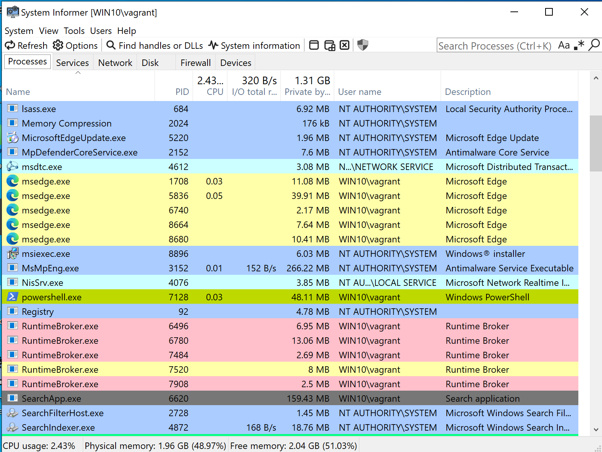
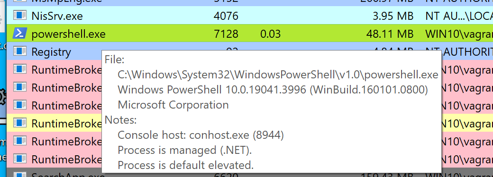
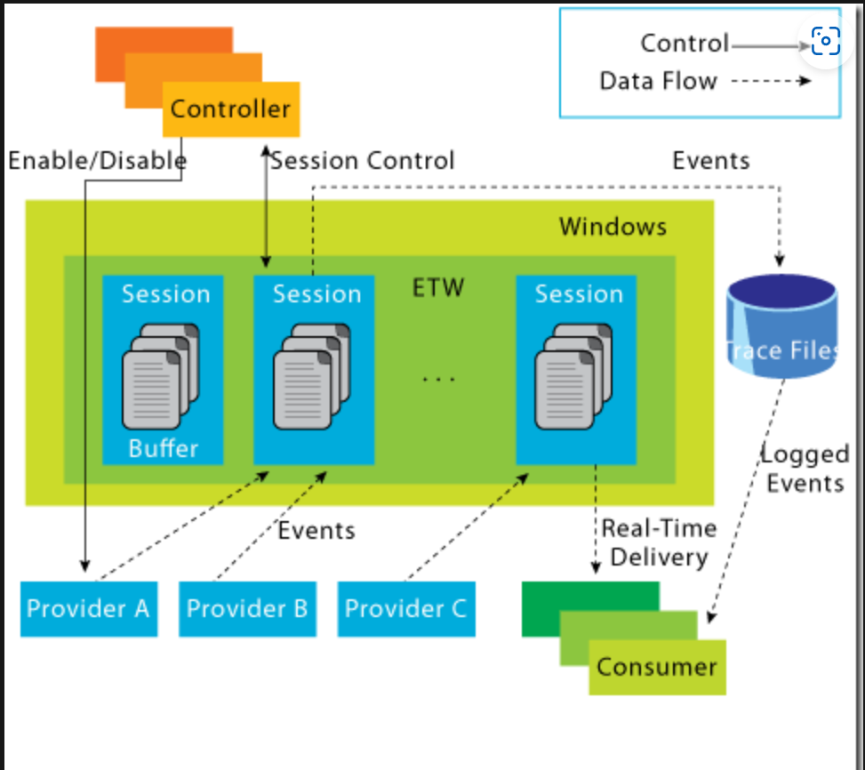

Sure! Here's your full content rewritten in **English**, formatted in **Markdown**, 

# 🪟 Windows Event Logs

## 🧠 Windows Event Logging Basics

Windows Event Logs are an **integral component** of the Windows Operating System. They record activity from various parts of the system, including:

- 🖥️ The system itself  
- 📦 Applications running on the system  
- 📊 ETW (Event Tracing for Windows) providers  
- 🧰 Services  
- 🔧 Other background components  


### 🛡️ Why Are Event Logs Important?

Windows event logging provides **detailed tracking** for:

- ❗ Application errors  
- 🔐 Security events  
- 🧪 Diagnostic information  

As **cybersecurity professionals**, these logs are invaluable for:

- 🕵️ Intrusion detection  
- 🛠️ Security analysis  
- 📈 System forensics  


### 🗃️ Categories of Event Logs

Windows organizes logs into several categories, based on their origin or purpose:


- 📂 **Application** – Events from apps installed on the system  
- ⚙️ **System** – Operating system events and services  
- 🔒 **Security** – Login attempts, access control, privilege use  
- 🧰 **Setup** – System setup and installation activities  
- 🔄 **Forwarded Events** – Logs forwarded from **other machines**


### 🧭 How to Access Event Logs

You can access Windows Event Logs through:

- 🖥️ **Event Viewer** (built-in GUI tool)  
- 💻 **Windows Event Log API** (for programmatic access)

> 🔐 Running **Event Viewer as Administrator** gives you full access to system logs.


### 📦 Default Windows Logs

The default logs available on a typical Windows system include:

| Log Type          | Description                                          |
|-------------------|------------------------------------------------------|
| 📂 **Application** | App-specific events and error logs                   |
| 🔒 **Security**     | Login attempts, object access, policy changes       |
| 🧰 **Setup**        | System installation and setup activities            |
| ⚙️ **System**       | Core OS components, services, and drivers           |
| 🔄 **Forwarded**    | Logs forwarded from other systems (central logging) |

> 📌 **Note**: In our analysis, we focus on logs from **a single machine**.


### 💾 Saved Logs (.evtx)

Event Viewer allows you to **open previously saved logs** in `.evtx` format. These are stored in the **Saved Logs** section for later investigation or auditing.

---


## 🧬 The Anatomy of a Windows Event Log

When reviewing **Application Logs**, we commonly encounter two main event levels:

- ℹ️ **Information** – Provides general usage data, such as when an application starts or stops.  
- ❌ **Error** – Highlights specific issues and often includes detailed diagnostic information.


### 🧱 Structure of an Event Log Entry


Each **Windows Event Log entry** is called an **Event** and contains several key components:

| #️⃣ | Field         | Description |
|-----|---------------|-------------|
| 1️⃣ | 🗂️ **Log Name**     | Name of the log file (e.g., Application, System, Security) |
| 2️⃣ | 🖥️ **Source**       | Software or service that generated the event |
| 3️⃣ | 🆔 **Event ID**     | Unique ID assigned to the event |
| 4️⃣ | 🧩 **Task Category** | Describes the task or action that triggered the event |
| 5️⃣ | 📊 **Level**         | Severity level: `Information`, `Warning`, `Error`, `Critical`, or `Verbose` |
| 6️⃣ | 🏷️ **Keywords**     | Tags that help categorize and filter logs (e.g., "Audit Success", "Audit Failure") |
| 7️⃣ | 👤 **User**          | User account active when the event occurred |
| 8️⃣ | ⚙️ **OpCode**        | Operation code for the reported action |
| 9️⃣ | 🕒 **Logged**        | Date and time the event was recorded |
| 🔟 | 🖥️ **Computer**      | Hostname of the machine where the event occurred |
| 1️⃣1️⃣ | 📄 **XML Data**     | Full event data in XML format, including all fields and extras |


### 🔍 Event Analysis Example

When examining an event, such as one with:

- 🆔 **Event ID** shown in the top-left corner (used for further research via Microsoft Docs)  
- 🖥️ **Source** like `SideBySide`  
- 📋 **Error Description** providing technical context  
- 📄 **Details Tab** for XML and structured views  

You can dig deeper into the event’s context. For example, you might extract the **Process ID** where the error occurred, enhancing forensic analysis.

### 🔒 Security Logs – Focus on Event ID **4624**

One of the most commonly observed events in **Security logs** is:

> 🔐 **Event ID 4624** – [Microsoft Docs - Event 4624](https://docs.microsoft.com/en-us/windows/security/threat-protection/auditing/event-4624)

This event signifies:

- A **logon session** was created on the **destination machine**,  
- Initiated from the **source machine** that accessed it.

#### Key Elements in Event 4624:

- 🆔 **Logon ID** – Helps **correlate multiple related events**  
- 🔑 **Logon Type** – Indicates the **type of login** (e.g., interactive, service)  
  - For instance, if the **SYSTEM** account initiates a logon, it's usually a **Service logon**

> 🧠 To identify the specific service responsible, further correlation with related events sharing the same **Logon ID** is required.

---


## 🛠️ **Leveraging Custom XML Queries for Efficient Log Analysis**

When you need to perform **deep and precise analysis** in Windows Event Viewer, you can use **custom XML queries**. This is a powerful feature that allows you to **filter and search logs more effectively**, compared to the basic filters.

### 🔎 **How to Use XML Queries in Event Viewer:**

1. Open Event Viewer.
2. Select the log you want to filter (e.g., Security).
3. Click **"Filter Current Log…"**.
4. Go to the **"XML"** tab.
5. Check **"Edit query manually"** → You can now write custom XML queries.


### 📌 **Example: Filtering by `SubjectLogonId = "0x3E7"`**


- The value `0x3E7` corresponds to the **SYSTEM account's Logon ID**.
- By using an XML query to find events with this Logon ID, you can trace all activities **performed by system-level processes or services**.
- This helps you **track a sequence of actions**, such as:
  - What services were started?
  - Which processes changed security settings?
  - What account performed suspicious actions?


### ⚙️ **Explaining Event ID 4907 – Audit Policy Change**


- Event ID **4907** indicates that an **audit policy has changed**.
- In the log description, you may find:
  > “This event generates when the SACL of an object (registry key, file...) was changed.”

#### ❓ What is SACL?

- **SACL (System Access Control List)** defines **which access attempts to an object (file, registry key, etc.) will be logged**.
- A SACL contains **ACE (Access Control Entries)**:
  - ACEs specify **which actions should trigger logging** (successful, failed, or both).
  - For example: if a user tries to open "config.sys" and there's a matching ACE → the system logs it.


### 🔍 **Digging Deeper into the Log:**

- The process responsible for the change might be **"SetupHost.exe"**, which is a legitimate Windows setup process.  
  ⚠️ **However, malware can disguise itself with legit names**, so this needs further inspection.
- The affected object might be **“bootmanager”**, a key component in the OS boot process.
- You can examine the **NewSd** and **OldSd** fields to understand what permissions were changed.
- To fully understand these fields, refer to Microsoft documentation on SDDL and ACE strings.

### 🧩 **Further Analysis: Special Logon Event**

- After the setup activity, you may see a normal logon event followed by a **special logon** event.
- Special logon events reveal **privileges granted to the user or process**.
- For example:
  - `SeDebugPrivilege`: indicates the user/process has permission to **interact with or manipulate other processes’ memory**, which is a very powerful and dangerous permission.
- You can refer to Microsoft’s [Privilege Constants documentation](https://learn.microsoft.com/en-us/windows/win32/secauthz/privilege-constants) for a full list of privileges.

---
## ✅ **Useful Windows Event Logs Overview**

Windows logs contain **crucial security, system, and audit information**. Here’s a categorized and summarized list of **important Event IDs** to monitor during threat hunting, incident response, or security analysis.

### 🖥️ **1. System Event Logs**

| **Event ID** | **Meaning** | **Why It's Useful** |
|--------------|-------------|---------------------|
| **1074** | System Shutdown or Restart | Detect unauthorized shutdowns or reboots. May indicate malware or a malicious user. |
| **6005** | Event Log Service Started | Indicates system boot. Use as a starting point for time-based investigations. |
| **6006** | Event Log Service Stopped | Usually appears during shutdown. Unexpected appearance may imply someone trying to hide activity. |
| **6013** | System Uptime | Shows daily uptime. Unusually short uptime may signal unplanned or malicious restarts. |
| **7040** | Service Startup Type Changed | Changing services from manual to automatic can be a persistence technique. |


### 🔐 **2. Security Event Logs**

| **Event ID** | **Description** | **Why Monitor It** |
|--------------|-----------------|--------------------|
| **1102** | Audit Log Cleared | Clearing logs is a red flag – attackers do this to hide tracks. |
| **1116** | Defender Detected Malware | Crucial for spotting infections and attack attempts. |
| **1118** | Defender Started Remediation | Logs when antivirus attempts cleanup. |
| **1119** | Remediation Succeeded | Confirms malware was removed. |
| **1120** | Remediation Failed | Immediate concern – threat still active. |
| **4624** | Successful Logon | Establish baseline behavior, detect logons at odd times/locations. |
| **4625** | Failed Logon | Brute-force attacks often generate many of these. |
| **4648** | Logon With Explicit Credentials | May indicate lateral movement (attacker using stolen creds). |
| **4656** | Handle to an Object Requested | May show attempts to access sensitive files/registry keys. |
| **4672** | Admin Logon (Special Privileges) | Track privileged account usage. Unexpected entries can mean compromise. |
| **4698** | Scheduled Task Created | Attackers often create tasks for persistence. |
| **4700 / 4701** | Task Enabled / Disabled | Changes to tasks may indicate tampering. |
| **4702** | Task Updated | Modification of existing tasks can hide malicious code. |
| **4719** | Audit Policy Changed | Could mean attacker is trying to cover their tracks. |
| **4738** | User Account Changed | Watch for privilege changes, suspicious group additions. |
| **4771** | Kerberos Pre-auth Failed | Indicates failed Kerberos logons – may suggest brute-force attempts. |
| **4776** | Domain Controller Validated Credentials | Failed validations can also suggest password guessing attacks. |


### 🌐 **3. Network & Defender Related Logs**

| **Event ID** | **Description** | **Usefulness** |
|--------------|-----------------|----------------|
| **5001** | Defender Real-Time Protection Changed | May be disabled by malware or a malicious actor. |
| **5140** | Network Share Accessed | Watch for unauthorized access to file shares. |
| **5142** | Network Share Created | Unauthorized shares can be used for exfiltration. |
| **5145** | Share Access Attempted | Frequent access attempts could indicate mapping for lateral movement. |
| **5157** | Connection Blocked by Windows Firewall | Can indicate blocked malicious outbound/inbound traffic. |
| **7045** | New Service Installed | Malware often installs itself as a system service. |

### 💡 **Important Notes:**

- **Know your baseline**: What’s “normal” in one system may be suspicious in another. Always tune your alerts to your specific environment.
- **Centralized Log Management** is key. Use SIEM tools (e.g., Splunk, ELK, Graylog) to collect and correlate these logs.
- **Correlate across logs**: Don’t look at a single event in isolation. Linking Event IDs using fields like **Logon ID**, **Process ID**, or **Account Name** provides better threat visibility.

---

# Analyzing Evil With Sysmon & Event Logs 
In our pursuit of robust cybersecurity, it is crucial to understand how to identify and analyze malicious events effectively. Building upon our previous exploration of benign events, we will now delve into the realm of malicious activities and discover techniques for detection

## 🖥️ **Sysmon Basics**

Sysmon (System Monitor) is a **Windows system service** and **device driver** that logs detailed information about system activity, enhancing the capabilities of standard event logs. It provides deeper insight into **process creation, network connections, file creation times**, and more, which typically don't appear in the native Security Event logs.

### 🛠️ **Sysmon Components:**
1. **Windows Service**: Monitors system activity continuously.
2. **Device Driver**: Assists in capturing data from the system.
3. **Event Log**: Displays captured activity data in the Windows event log.

### 📋 **Sysmon Event Logging**
Sysmon logs events that help monitor and detect suspicious activities on a system. For example:
- **Event ID 1**: Process Creation
- **Event ID 3**: Network Connection

Sysmon also allows for logging specific activity data that is not captured by regular Windows Event Logs, making it especially useful for cybersecurity forensics. The full list of Sysmon event IDs can be found in the [here](https://learn.microsoft.com/en-us/sysinternals/downloads/sysmon).


### 🔧 **Sysmon Configuration File**
Sysmon uses an XML-based configuration file to provide **granular control** over which events to log. You can filter events based on attributes such as **process names** or **IP addresses**.

You can use ready-made Sysmon configuration files from popular repositories:
- [SwiftOnSecurity Sysmon Config](https://github.com/SwiftOnSecurity/sysmon-config) (Recommended for this section)
- [Olaf Hartong Sysmon Modular](https://github.com/olafhartong/sysmon-modular)

### 📥 **Installing Sysmon**
To get started with Sysmon, follow these steps:
1. Download Sysmon from the official Microsoft documentation: [Sysmon Download](https://docs.microsoft.com/en-us/sysinternals/downloads/sysmon).
2. Open an **administrator command prompt** and run the following command to install Sysmon:

    ```bash
    C:\Tools\Sysmon> sysmon.exe -i -accepteula -h md5,sha256,imphash -l -n
    ```


3. To apply a **custom Sysmon configuration** after installation:

    ```bash
    C:\Tools\Sysmon> sysmon.exe -c filename.xml
    ```

### 🐧 **Sysmon for Linux**
Sysmon also exists for Linux, providing similar capabilities for monitoring system activities.

---

## 🚨 **Detection Example 1: Detecting DLL Hijacking with Sysmon**

DLL hijacking is a common attack technique where an attacker places a malicious DLL in a directory that a legitimate application loads. The malicious DLL is executed instead of the intended legitimate DLL, often allowing the attacker to control the application. To detect this, Sysmon provides valuable logging for module loads, specifically **Event ID 7**, which corresponds to DLL loading events.

### 🛠️ **Step-by-Step Guide to Detect DLL Hijacking with Sysmon:**

#### 1. **Configure Sysmon for DLL Hijacking Detection**

To detect DLL hijacking, we must focus on **Event ID 7**, which logs module load events. To achieve this, follow these steps:

- **Download Sysmon Config**: Use the configuration from [SwiftOnSecurity Sysmon Config](https://github.com/SwiftOnSecurity/sysmon-config) for comprehensive coverage. You can also explore the modular approach from [Olaf Hartong's Sysmon Modular](https://github.com/olafhartong/sysmon-modular).
  
- **Install Sysmon**: After downloading Sysmon, open an administrator command prompt and run the following command to install Sysmon:

    ```bash
    C:\Tools\Sysmon> sysmon.exe -i -accepteula -h md5,sha256,imphash -l -n
    ```

- **Apply Sysmon Configuration**: Once installed, use the modified Sysmon configuration (e.g., `sysmonconfig-export.xml`) to monitor module loads:

    ```bash
    C:\Tools\Sysmon> sysmon.exe -c sysmonconfig-export.xml
    ```

#### 2. **Analyze Sysmon Event Logs for DLL Hijacking**
By examining the modified configuration, we can observe that the "include" comment
signifies events that should be included.


In the case of detecting DLL hijacks, we change the "include" to "exclude" to ensure that
nothing is excluded, allowing us to capture the necessary data.


To utilize the updated Sysmon configuration, execute the following.

```bash
C:\Tools\Sysmon> sysmon64.exe -c sysmonconfig-export.xml
```


Once Sysmon is running with the correct configuration, you can start observing image load events. To view these events:

- Open **Event Viewer** and navigate to:
  `Applications and Services -> Microsoft -> Windows -> Sysmon`
  

  
- Look for **Event ID 7**: This event will provide details on DLL loading, including:
  - **Signing status** (e.g., is the DLL signed by Microsoft?)
  - **Parent process** (e.g., which process loaded the DLL?)
  - **Loaded DLL** (e.g., which DLL was loaded?)

#### 3. **Example of a DLL Hijack with calc.exe**

Let's simulate a DLL hijack using `calc.exe` and `WININET.dll` as an example:

- **Step 1: Hijack Process**
  - Rename `reflective_dll.x64.dll` to `WININET.dll`.
  - Move `calc.exe`  from `C:\Windows\System32` to a writable directory (e.g., **Desktop**).
  - Execute `calc.exe` from the writable directory.
  

- **Step 2: Analyze Event Logs**
  - Filter Event Logs for **Event ID 7**.
  - Search for `calc.exe` in the logs to identify any DLL load associated with the hijacked process.


#### 4. **Indicators of Compromise (IOCs)**

After simulating the hijack, review the Sysmon event logs to identify key **IOCs**:

1. **Writability of `calc.exe`**: 
   - `calc.exe` should not exist in a writable directory. If found outside of `System32`, it is a red flag.

2. **DLL Load Location**: 
   - The original `WININET.dll` should only be loaded from `System32`. If `WININET.dll` is loaded from a different directory (e.g., Desktop), it’s an indication of DLL hijacking.

3. **DLL Signature**:
   - The original `WININET.dll` is **Microsoft-signed**, but the hijacked DLL (e.g., `WININET.dll` on the Desktop) is **unsigned**.

These indicators are powerful clues to detecting DLL hijacks. To refine your detection rule, consider:
- Monitoring **calc.exe** for unusual locations.
- Verifying **DLL signature validity** and comparing it with the original version.
  
#### 5. **Create Detection Rules**

Using the above IOCs, you can create detection rules for your SIEM tool to alert you when:
- **calc.exe** is executed from an unauthorized directory.
- **WININET.dll** is loaded from a suspicious directory.
- **Unsigned DLLs** are loaded in place of signed system libraries.

### 🔍 **Final Notes on Detection**

- **Granular Sysmon Configuration**: Make sure you tailor your Sysmon configuration to capture detailed module load events, focusing on those relevant to DLL hijacking.
- **Comprehensive Detection**: While Sysmon and event logs provide significant telemetry, you may need to correlate these logs with other sources, such as antivirus logs or endpoint monitoring tools, for more accurate detection.

This method helps detect a common attack technique and is a critical component of any threat-hunting or incident-response strategy.

## 🚨 **Detection Example 2: Detecting Unmanaged PowerShell/C-Sharp Injection**


This article describes an **example of detecting an attack technique involving unmanaged PowerShell/C# code injection** into a legitimate system process — specifically **`spoolsv.exe`** — and how we can **detect signs of this technique using Process Hacker or Sysmon**.



### 🧠 **1. Basic knowledge: C# is a "managed" language**
- **C#** is a programming language that requires a **runtime environment**, specifically the **Common Language Runtime (CLR)** of .NET, to execute.
- When executed, C# code is **compiled into bytecode (Intermediate Language - IL)** rather than directly into machine code.
- Any process running C# code (e.g., PowerShell) will load .NET-related libraries such as:
  - `clr.dll`
  - `clrjit.dll`

### 🔍 **2. Detecting managed processes using Process Hacker**
- **Process Hacker** is a process monitoring tool that allows you to inspect loaded modules.
- If you observe a process like **`powershell.exe`** highlighted in **green**, that indicates it's a **“.NET managed process”**.
- 


- Right-click `powershell.exe` → Properties → **Modules** tab, and you should see:
  - `clr.dll`: Common Language Runtime
  - `clrjit.dll`: Just-In-Time compiler for .NET

### ⚠️ **3. Detecting suspicious .NET module loading in unusual processes**
- If you observe DLLs such as `clr.dll` or `clrjit.dll` being loaded in a process that normally shouldn’t run .NET code (like `spoolsv.exe`), it’s highly **suspicious**.
- This may indicate:
  - **PowerShell injection**
  - **C# execute-assembly**, where malicious code is injected and run inside another process without creating a new one

---

### 💉 **4. Attack example using PSInject**
- Tool: `Invoke-PSInject` PowerShell module
- Example command:
```powershell
powershell -ep bypass
Import-Module .\Invoke-PSInject.ps1
Invoke-PSInject -ProcId [PID of spoolsv.exe] -PoshCode "V3JpdGUtSG9zdCAiSGVsbG8sIEd1cnU5OSEi"
```
- The string `"V3JpdGUtSG9zdCAiSGVsbG8sIEd1cnU5OSEi"` is Base64 for:  
  `Write-Host "Hello, Guru99!"`

After injection:
- `spoolsv.exe` becomes a **managed process**, loading additional `.NET` DLLs.
- This can be verified using Process Hacker or **Sysmon Event ID 7**, which logs DLL loading events.

# Event Tracing for Windows (ETW)

In the realm of effective threat detection and incident response, we often find ourselves relying on the limited log data at our disposal. However, this approach falls short of fully harnessing the immense wealth of information that can be derived from the powerful resource known as Event Tracing for Windows (ETW) . Unfortunately, this oversight can be attributed to a lack of awareness and appreciation for the comprehensive and intricate insights that ETW can offer.


## 🧠 **What is ETW?**
**Event Tracing for Windows (ETW)** is a **high-speed event logging system** provided by **Windows OS**. It operates in both **user mode** and **kernel mode**, allowing the system to record events from applications, drivers, and system components in **real time**.

### 📈 **How ETW works**
- ETW uses an internal **buffering and logging mechanism** built into the Windows kernel.
- Applications or drivers can **generate events**, which are then collected and stored for monitoring or forensic purposes.


### 🔍 **Why ETW is powerful for detection and response**
- **ETW captures a wide range of system activities**, including:
  - Process creation and termination
  - System calls
  - Network activity
  - File access
  - Registry modifications
- This gives you a **much more detailed view** of what’s happening on the system compared to traditional logging methods.

### 🧩 **Integration with Event Providers**
- **Event Providers** are components that generate specific types of logs/events. These can be:
  - Built-in Windows components
  - Third-party software
  - Or **custom providers** that you can create for specific use cases
- This allows ETW to **cover a wide range of event sources**, from the kernel level up to applications.

### 💡 **ETW Advantages**
| Advantage | Explanation |
|----------|-------------|
| **High performance** | ETW is lightweight and has minimal impact on system performance |
| **Real-time monitoring** | Can be used for continuous detection of abnormal behavior |
| **Highly customizable** | You can enable only the event providers you need |
| **Extensible** | You can create your own providers for tailored monitoring |

### 🛠️ **Tools for Analyzing ETW**
- **Microsoft Message Analyzer** (deprecated but still useful if available)
- **PowerShell’s `Get-WinEvent` cmdlet**: lets you filter, search, and analyze ETW data
- These tools support:
  - Advanced filtering
  - Real-time monitoring
  - Event correlation and analysis

### 🔐 **Use Cases in Cybersecurity**
- **Blue Team (defenders)** can use ETW to:
  - Detect abnormal system behavior
  - Investigate incidents (forensics)
  - Continuously monitor endpoints
- For example, ETW can help detect:
  - A suspicious process accessing the registry
  - Code injection into another process

---

## ETW Architecture & Components

The underlying architecture and the key components of Event Tracing for Windows (ETW) are illustrated in the following diagram from [Microsoft](https://web.archive.org/web/20200725154736/https://docs.microsoft.com/en-us/archive/blogs/ntdebugging/part-1-etw-introduction-and-overview).



### 🧩 **Overview of ETW Architecture**

**Event Tracing for Windows (ETW)** follows a **publish-subscribe** model:

- **Providers** generate events (publishers)
- **Consumers** receive and process events (subscribers)
- **Controllers** manage and control the entire tracing process
- **Channels** help organize and filter events
- **ETL files** store event data for later analysis


### 🧠 **Key Components of ETW Architecture**

#### 1. **Controllers – Manage ETW Sessions**

- Responsible for starting and stopping **trace sessions**
- Enable or disable specific **event providers**
- Determine which events are captured and how
- Example: **`logman.exe`** is a built-in command-line utility that can manage ETW sessions

#### 2. **Providers – Generate Events**

These are components (apps, drivers, etc.) that **generate and write events**. ETW supports 4 main types of providers:

#### 🔹 **MOF Providers**
- Use **Managed Object Format (MOF)** schemas to define events
- Flexible and widely used in enterprise environments

#### 🔹 **WPP Providers** (Windows Software Trace Preprocessor)
- Use macros and annotations in the source code to generate events
- Commonly used in **kernel-mode** tracing and low-level debugging

#### 🔹 **Manifest-based Providers**
- Use **XML manifest files** to define event structures
- Modern, customizable, and easier to manage

#### 🔹 **TraceLogging Providers**
- Introduced in newer Windows versions
- Use the **TraceLogging API** for a lightweight and efficient event generation with minimal code


#### 3. **Consumers – Process Events**

- Subscribe to trace sessions and **consume events**
- By default, events are written to `.etl` (Event Trace Log) files
- Consumers can also access events in real-time using the **Windows API**
- Tools like **Message Analyzer**, **PerfView**, and PowerShell (`Get-WinEvent`) help extract and analyze ETW data


#### 4. **Channels – Organize Events**

- Logical containers that help **classify and filter events** based on type, severity, or usage
- Each channel has a specific **purpose and audience**
- Consumers can subscribe to specific channels for targeted monitoring

> 🔸 *Only events with a defined Channel property can be displayed in Event Viewer.*


#### 5. **ETL Files – Event Storage**

- `.etl` files are **event trace log files** used to store event data on disk
- Useful for **offline analysis, long-term archiving**, and forensic investigations
- Windows supports **automatic rotation** and management of ETL files to optimize storage

### ⚠️ **Important Notes**

- **Both user-mode and kernel-mode providers** are supported
- Some providers can produce **large volumes of data** and are **disabled by default**
- These providers should only be **enabled during specific trace sessions**
- ETW supports the development of **custom event providers** for application-specific monitoring

### ✅ **Quick Summary:**

| Component     | Role |
|---------------|------|
| **Controller** | Starts/stops sessions, manages providers |
| **Provider**   | Generates event data (4 types: MOF, WPP, Manifest, TraceLogging) |
| **Consumer**   | Subscribes and processes events |
| **Channel**    | Organizes and filters events |
| **ETL File**   | Stores events for offline analysis |


## ⚙️ Interacting with ETW 

### Using `logman`

`logman.exe` is a **built-in Windows command-line tool** used to **manage Event Tracing for Windows (ETW)** and trace sessions. It's particularly valuable for:

- Creating and starting ETW sessions
- Stopping and inspecting active sessions
- Investigating system-wide logging activity


#### 🔍 Viewing Existing ETW Sessions

To **list all current ETW sessions**, use:

```bash
logman query -ets
```

> ✅ The `-ets` flag is essential — it ensures the command queries active ETW sessions. Without it, `logman` won’t return session data.

This command returns detailed information about each session:
- **Name** of the session
- **Maximum log size**
- **Log file location**
- **Subscribed providers**

💡 **Example**: You can find sessions like `Sysmon` listed toward the end.

#### 📌 Examining Specific Sessions

To inspect a particular session:

```bash
logman query "EventLog-System" -ets
```

This will display:
- List of **providers** subscribed to the session
- **GUIDs** for each provider
- **Event level** (e.g., critical, warning, info)
- **Keywords Any** (filter for event types)

This information is very useful in **incident response** and **forensics** to determine which providers are logging events relevant to your investigation.

#### 📚 Listing All Available Providers

You can list all providers installed on your system:

```bash
logman query providers
```

Windows 10 comes with **1,000+ built-in providers**, and many third-party applications (especially kernel-mode software) add their own.

Due to the huge number, use `findstr` to filter:

```bash
logman query providers | findstr "Winlogon"
```

🔎 This returns multiple results like:

```
Microsoft-Windows-Winlogon     {DBE9B383-7CF3-4331-91CC-A3CB16A3B538}
```


#### 🔬 Getting Detailed Provider Info

To get detailed information about a specific provider:

```bash
logman query providers Microsoft-Windows-Winlogon
```

This shows:
- **Provider name and GUID**
- Available **keywords** (such as `Operational` or `Diagnostic`)
- Available **event levels**
- **Description** of event categories

This helps determine how the provider logs events and what kind of data you can expect.

### 🖥️ GUI Alternative: Performance Monitor

Windows also provides a **graphical interface** for working with ETW sessions:

#### ➤ **Performance Monitor** (`perfmon.exe`):

1. Open **Performance Monitor**
2. Navigate to **Data Collector Sets → Event Trace Sessions**
3. Double-click on any session to view details:
   - Associated providers
   - Logging settings
   - Trace types

4. You can also:
   - Modify existing sessions (e.g., add/remove providers)
   - Create new trace sessions under the **"User Defined"** category

### ✅ **Summary**

| Task                            | Command or Tool |
|----------------------------------|------------------|
| View active ETW sessions         | `logman query -ets` |
| Inspect a specific session       | `logman query "SessionName" -ets` |
| List all available providers     | `logman query providers` |
| Filter providers by keyword      | `logman query providers | findstr "keyword"` |
| View provider details            | `logman query providers ProviderName` |
| GUI alternative                  | Performance Monitor (`perfmon.exe`) |

## 🔍 **Useful ETW Providers**

These ETW (Event Tracing for Windows) providers are especially valuable for system monitoring, threat detection, and forensic analysis. Below is a breakdown of key providers and what they’re useful for:


### 🧠 **1. Process Monitoring & Threat Detection**

- **`Microsoft-Windows-Kernel-Process`**  
  Monitors process activity at the kernel level.  
  🛡️ *Use case:* Detecting techniques like process injection, process hollowing, or malware spawning suspicious processes.

- **`Microsoft-Windows-DotNETRuntime`**  
  Captures events from .NET applications at runtime.  
  🛡️ *Use case:* Identifying abnormal .NET behavior, dynamic assembly loading, or exploitation of .NET vulnerabilities.

- **`Microsoft-Windows-PowerShell`**  
  Logs PowerShell script execution and commands.  
  🛡️ *Use case:* Detecting malicious scripting, suspicious commands, or script block abuse.

### 📁 **2. File, Registry, and Code Integrity Monitoring**

- **`Microsoft-Windows-Kernel-File`**  
  Tracks file access and modifications.  
  🛡️ *Use case:* Monitoring for ransomware activity, unauthorized file changes, or system file tampering.

- **`Microsoft-Windows-Kernel-Registry`**  
  Logs registry key modifications.  
  🛡️ *Use case:* Detecting persistence mechanisms, malware configuration, or unauthorized registry changes.

- **`Microsoft-Windows-CodeIntegrity`**  
  Checks the integrity of code and drivers.  
  🛡️ *Use case:* Detecting unsigned/malicious driver loading or tampering with trusted code.

### 🌐 **3. Network Activity Monitoring**

- **`Microsoft-Windows-Kernel-Network`**  
  Provides visibility into low-level network operations.  
  🛡️ *Use case:* Detecting C2 traffic, data exfiltration, or suspicious external connections.

- **`Microsoft-Windows-SMBClient` / `SMBServer`**  
  Monitors SMB communication.  
  🛡️ *Use case:* Spotting lateral movement, file sharing abuse, or unauthorized access.

- **`Microsoft-Windows-DNS-Client`**  
  Logs DNS queries from the client side.  
  🛡️ *Use case:* Detecting DNS tunneling, unusual domain lookups, or command & control signaling.

- **`WinRM` (Windows Remote Management)**  
  Monitors remote execution and management activity.  
  🛡️ *Use case:* Detecting unauthorized remote access or lateral movement.

### 🔐 **4. Remote Access & Authentication Monitoring**

- **`OpenSSH`**  
  Logs SSH connection attempts and authentications.  
  🛡️ *Use case:* Detecting brute-force attempts or unauthorized SSH access.

- **`Microsoft-Windows-VPN-Client`**  
  Tracks VPN session activity.  
  🛡️ *Use case:* Monitoring for suspicious or unauthorized VPN connections.

- **`Microsoft-Windows-TerminalServices-LocalSessionManager`**  
  Tracks Remote Desktop and terminal service sessions.  
  🛡️ *Use case:* Spotting RDP brute force attacks or abnormal session creation.

### 🛡️ **5. Security Control Monitoring**

- **`Microsoft-Windows-Security-Mitigations`**  
  Monitors the state and performance of security mitigations.  
  🛡️ *Use case:* Detecting attempts to bypass protections like DEP, ASLR, etc.

- **`Microsoft-Antimalware-Service` / `Microsoft-Antimalware-Protection`**  
  Logs antimalware activity.  
  🛡️ *Use case:* Identifying tampering, evasion, or failures in antivirus protection.

### ✅ **Summary Table**

| Objective | Recommended Providers |
|----------|------------------------|
| Process monitoring | Kernel-Process, DotNETRuntime, PowerShell |
| File/registry changes | Kernel-File, Kernel-Registry |
| Code integrity | CodeIntegrity |
| Network activity | Kernel-Network, SMBClient/Server, DNS-Client |
| Remote access tracking | WinRM, OpenSSH, VPN-Client, TerminalServices |
| AV & mitigation status | Antimalware-Service, Security-Mitigations |


## 🔒 **Restricted ETW Providers**

In Windows, **some ETW (Event Tracing for Windows) providers are classified as "restricted"** due to the **sensitive nature of the telemetry** they collect. These providers offer powerful insights into the system but are **only accessible to highly privileged processes**.

### 🚫 **What Are Restricted Providers?**

- These are **ETW providers that contain sensitive system or security data.**
- Access is **limited to certain trusted or authorized system processes**.
- This restriction helps **protect against attackers trying to spy on or manipulate** critical system events.

### ⚠️ **Example: `Microsoft-Windows-Threat-Intelligence`**

This is a **high-value, restricted ETW provider** often used in **Digital Forensics and Incident Response (DFIR)**.

#### 📊 What it does:
- Provides **detailed telemetry about potential threats**.
- Helps security professionals **track sophisticated attacks** that normal monitoring (e.g., Sysmon) might miss.
- Logs can include **threat origin, actions performed, impacted systems/data**, etc.

#### 🔐 Access Requirements:
To read from this provider, a process must run under a special protection level called **Protected Process Light (PPL)**.


### 🛡️ **What is PPL (Protected Process Light)?**

PPL is a security mechanism in Windows that:
- Restricts which processes can access or interact with others.
- Is used mainly by **anti-malware tools and other critical system services**.

#### 📝 To become a PPL:
- A vendor (e.g., antivirus company) must:
  - Apply to Microsoft
  - Sign legal agreements
  - Implement and test an **ELAM (Early Launch Anti-Malware) driver**
  - Get a **special Authenticode signature** from Microsoft

➡️ **This is a strict, non-trivial process**, so most apps or tools don’t have access to restricted ETW providers.


### 🛠️ **Are There Workarounds?**

Yes, **workarounds exist** to access providers like `Microsoft-Windows-Threat-Intelligence`. However:
- These are **not officially supported**.
- They may involve **privilege escalation or undocumented techniques**.
- Use them cautiously, especially in production environments.

### ✅ **Why It Matters**

Accessing restricted ETW providers like `Microsoft-Windows-Threat-Intelligence` can:
- Enable **real-time monitoring of advanced threats**
- Help conduct **deep forensics** to track sophisticated malware
- **Fill the gaps left by tools like Sysmon**, which may not capture certain low-level or internal events

---

# Tapping into ETW


