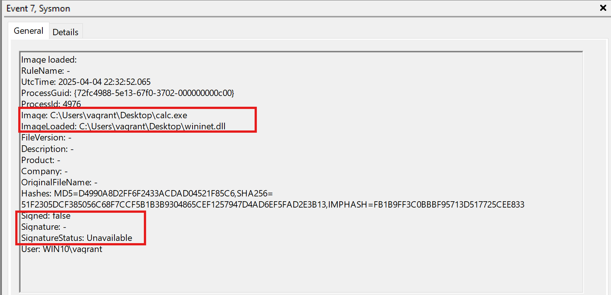

Sure! Here's your full content rewritten in **English**, formatted in **Markdown**, 

# 🪟 Windows Event Logs

## 🧠 Windows Event Logging Basics

Windows Event Logs are an **integral component** of the Windows Operating System. They record activity from various parts of the system, including:

- 🖥️ The system itself  
- 📦 Applications running on the system  
- üìä ETW (Event Tracing for Windows) providers  
- üß∞ Services  
- üîß Other background components  


### 🛡️ Why Are Event Logs Important?

Windows event logging provides **detailed tracking** for:

- ‚ùó Application errors  
- üîê Security events  
- üß™ Diagnostic information  

As **cybersecurity professionals**, these logs are invaluable for:

- 🕵️ Intrusion detection  
- 🛠️ Security analysis  
- üìà System forensics  


### 🗃️ Categories of Event Logs

Windows organizes logs into several categories, based on their origin or purpose:


- 📂 **Application** – Events from apps installed on the system  
- ⚙️ **System** – Operating system events and services  
- 🔒 **Security** – Login attempts, access control, privilege use  
- 🧰 **Setup** – System setup and installation activities  
- 🔄 **Forwarded Events** – Logs forwarded from **other machines**


### üß≠ How to Access Event Logs

You can access Windows Event Logs through:

- 🖥️ **Event Viewer** (built-in GUI tool)  
- 💻 **Windows Event Log API** (for programmatic access)

> üîê Running **Event Viewer as Administrator** gives you full access to system logs.


### 📦 Default Windows Logs

The default logs available on a typical Windows system include:

| Log Type          | Description                                          |
|-------------------|------------------------------------------------------|
| 📂 **Application** | App-specific events and error logs                   |
| üîí **Security**     | Login attempts, object access, policy changes       |
| üß∞ **Setup**        | System installation and setup activities            |
| ⚙️ **System**       | Core OS components, services, and drivers           |
| 🔄 **Forwarded**    | Logs forwarded from other systems (central logging) |

> üìå **Note**: In our analysis, we focus on logs from **a single machine**.


### üíæ Saved Logs (.evtx)

Event Viewer allows you to **open previously saved logs** in `.evtx` format. These are stored in the **Saved Logs** section for later investigation or auditing.

---


## 🧬 The Anatomy of a Windows Event Log

When reviewing **Application Logs**, we commonly encounter two main event levels:

- ℹ️ **Information** – Provides general usage data, such as when an application starts or stops.  
- ❌ **Error** – Highlights specific issues and often includes detailed diagnostic information.


### üß± Structure of an Event Log Entry


Each **Windows Event Log entry** is called an **Event** and contains several key components:

| #️⃣ | Field         | Description |
|-----|---------------|-------------|
| 1️⃣ | 🗂️ **Log Name**     | Name of the log file (e.g., Application, System, Security) |
| 2️⃣ | 🖥️ **Source**       | Software or service that generated the event |
| 3️⃣ | 🆔 **Event ID**     | Unique ID assigned to the event |
| 4️⃣ | 🧩 **Task Category** | Describes the task or action that triggered the event |
| 5️⃣ | 📊 **Level**         | Severity level: `Information`, `Warning`, `Error`, `Critical`, or `Verbose` |
| 6️⃣ | 🏷️ **Keywords**     | Tags that help categorize and filter logs (e.g., "Audit Success", "Audit Failure") |
| 7️⃣ | 👤 **User**          | User account active when the event occurred |
| 8️⃣ | ⚙️ **OpCode**        | Operation code for the reported action |
| 9️⃣ | 🕒 **Logged**        | Date and time the event was recorded |
| 🔟 | 🖥️ **Computer**      | Hostname of the machine where the event occurred |
| 1️⃣1️⃣ | 📄 **XML Data**     | Full event data in XML format, including all fields and extras |


### üîç Event Analysis Example

When examining an event, such as one with:

- 🆔 **Event ID** shown in the top-left corner (used for further research via Microsoft Docs)  
- 🖥️ **Source** like `SideBySide`  
- üìã **Error Description** providing technical context  
- 📄 **Details Tab** for XML and structured views  

You can dig deeper into the event’s context. For example, you might extract the **Process ID** where the error occurred, enhancing forensic analysis.

### 🔒 Security Logs – Focus on Event ID **4624**

One of the most commonly observed events in **Security logs** is:

> 🔐 **Event ID 4624** – [Microsoft Docs - Event 4624](https://docs.microsoft.com/en-us/windows/security/threat-protection/auditing/event-4624)

This event signifies:

- A **logon session** was created on the **destination machine**,  
- Initiated from the **source machine** that accessed it.

#### Key Elements in Event 4624:

- 🆔 **Logon ID** – Helps **correlate multiple related events**  
- 🔑 **Logon Type** – Indicates the **type of login** (e.g., interactive, service)  
  - For instance, if the **SYSTEM** account initiates a logon, it's usually a **Service logon**

> 🧠 To identify the specific service responsible, further correlation with related events sharing the same **Logon ID** is required.

---


## 🛠️ **Leveraging Custom XML Queries for Efficient Log Analysis**

When you need to perform **deep and precise analysis** in Windows Event Viewer, you can use **custom XML queries**. This is a powerful feature that allows you to **filter and search logs more effectively**, compared to the basic filters.

### üîé **How to Use XML Queries in Event Viewer:**

1. Open Event Viewer.
2. Select the log you want to filter (e.g., Security).
3. Click **"Filter Current Log…"**.
4. Go to the **"XML"** tab.
5. Check **"Edit query manually"** ‚Üí You can now write custom XML queries.


### üìå **Example: Filtering by `SubjectLogonId = "0x3E7"`**


- The value `0x3E7` corresponds to the **SYSTEM account's Logon ID**.
- By using an XML query to find events with this Logon ID, you can trace all activities **performed by system-level processes or services**.
- This helps you **track a sequence of actions**, such as:
  - What services were started?
  - Which processes changed security settings?
  - What account performed suspicious actions?


### ⚙️ **Explaining Event ID 4907 – Audit Policy Change**


- Event ID **4907** indicates that an **audit policy has changed**.
- In the log description, you may find:
  > “This event generates when the SACL of an object (registry key, file...) was changed.”

#### ‚ùì What is SACL?

- **SACL (System Access Control List)** defines **which access attempts to an object (file, registry key, etc.) will be logged**.
- A SACL contains **ACE (Access Control Entries)**:
  - ACEs specify **which actions should trigger logging** (successful, failed, or both).
  - For example: if a user tries to open "config.sys" and there's a matching ACE ‚Üí the system logs it.


### üîç **Digging Deeper into the Log:**

- The process responsible for the change might be **"SetupHost.exe"**, which is a legitimate Windows setup process.  
  ⚠️ **However, malware can disguise itself with legit names**, so this needs further inspection.
- The affected object might be **“bootmanager”**, a key component in the OS boot process.
- You can examine the **NewSd** and **OldSd** fields to understand what permissions were changed.
- To fully understand these fields, refer to Microsoft documentation on SDDL and ACE strings.

### üß© **Further Analysis: Special Logon Event**

- After the setup activity, you may see a normal logon event followed by a **special logon** event.
- Special logon events reveal **privileges granted to the user or process**.
- For example:
  - `SeDebugPrivilege`: indicates the user/process has permission to **interact with or manipulate other processes’ memory**, which is a very powerful and dangerous permission.
- You can refer to Microsoft’s [Privilege Constants documentation](https://learn.microsoft.com/en-us/windows/win32/secauthz/privilege-constants) for a full list of privileges.

---
## ‚úÖ **Useful Windows Event Logs Overview**

Windows logs contain **crucial security, system, and audit information**. Here’s a categorized and summarized list of **important Event IDs** to monitor during threat hunting, incident response, or security analysis.

### 🖥️ **1. System Event Logs**

| **Event ID** | **Meaning** | **Why It's Useful** |
|--------------|-------------|---------------------|
| **1074** | System Shutdown or Restart | Detect unauthorized shutdowns or reboots. May indicate malware or a malicious user. |
| **6005** | Event Log Service Started | Indicates system boot. Use as a starting point for time-based investigations. |
| **6006** | Event Log Service Stopped | Usually appears during shutdown. Unexpected appearance may imply someone trying to hide activity. |
| **6013** | System Uptime | Shows daily uptime. Unusually short uptime may signal unplanned or malicious restarts. |
| **7040** | Service Startup Type Changed | Changing services from manual to automatic can be a persistence technique. |


### üîê **2. Security Event Logs**

| **Event ID** | **Description** | **Why Monitor It** |
|--------------|-----------------|--------------------|
| **1102** | Audit Log Cleared | Clearing logs is a red flag – attackers do this to hide tracks. |
| **1116** | Defender Detected Malware | Crucial for spotting infections and attack attempts. |
| **1118** | Defender Started Remediation | Logs when antivirus attempts cleanup. |
| **1119** | Remediation Succeeded | Confirms malware was removed. |
| **1120** | Remediation Failed | Immediate concern – threat still active. |
| **4624** | Successful Logon | Establish baseline behavior, detect logons at odd times/locations. |
| **4625** | Failed Logon | Brute-force attacks often generate many of these. |
| **4648** | Logon With Explicit Credentials | May indicate lateral movement (attacker using stolen creds). |
| **4656** | Handle to an Object Requested | May show attempts to access sensitive files/registry keys. |
| **4672** | Admin Logon (Special Privileges) | Track privileged account usage. Unexpected entries can mean compromise. |
| **4698** | Scheduled Task Created | Attackers often create tasks for persistence. |
| **4700 / 4701** | Task Enabled / Disabled | Changes to tasks may indicate tampering. |
| **4702** | Task Updated | Modification of existing tasks can hide malicious code. |
| **4719** | Audit Policy Changed | Could mean attacker is trying to cover their tracks. |
| **4738** | User Account Changed | Watch for privilege changes, suspicious group additions. |
| **4771** | Kerberos Pre-auth Failed | Indicates failed Kerberos logons – may suggest brute-force attempts. |
| **4776** | Domain Controller Validated Credentials | Failed validations can also suggest password guessing attacks. |


### üåê **3. Network & Defender Related Logs**

| **Event ID** | **Description** | **Usefulness** |
|--------------|-----------------|----------------|
| **5001** | Defender Real-Time Protection Changed | May be disabled by malware or a malicious actor. |
| **5140** | Network Share Accessed | Watch for unauthorized access to file shares. |
| **5142** | Network Share Created | Unauthorized shares can be used for exfiltration. |
| **5145** | Share Access Attempted | Frequent access attempts could indicate mapping for lateral movement. |
| **5157** | Connection Blocked by Windows Firewall | Can indicate blocked malicious outbound/inbound traffic. |
| **7045** | New Service Installed | Malware often installs itself as a system service. |

### üí° **Important Notes:**

- **Know your baseline**: What’s “normal” in one system may be suspicious in another. Always tune your alerts to your specific environment.
- **Centralized Log Management** is key. Use SIEM tools (e.g., Splunk, ELK, Graylog) to collect and correlate these logs.
- **Correlate across logs**: Don’t look at a single event in isolation. Linking Event IDs using fields like **Logon ID**, **Process ID**, or **Account Name** provides better threat visibility.

---

# Analyzing Evil With Sysmon & Event Logs 
In our pursuit of robust cybersecurity, it is crucial to understand how to identify and analyze malicious events effectively. Building upon our previous exploration of benign events, we will now delve into the realm of malicious activities and discover techniques for detection

## 🖥️ **Sysmon Basics**

Sysmon (System Monitor) is a **Windows system service** and **device driver** that logs detailed information about system activity, enhancing the capabilities of standard event logs. It provides deeper insight into **process creation, network connections, file creation times**, and more, which typically don't appear in the native Security Event logs.

### 🛠️ **Sysmon Components:**
1. **Windows Service**: Monitors system activity continuously.
2. **Device Driver**: Assists in capturing data from the system.
3. **Event Log**: Displays captured activity data in the Windows event log.

### üìã **Sysmon Event Logging**
Sysmon logs events that help monitor and detect suspicious activities on a system. For example:
- **Event ID 1**: Process Creation
- **Event ID 3**: Network Connection

Sysmon also allows for logging specific activity data that is not captured by regular Windows Event Logs, making it especially useful for cybersecurity forensics. The full list of Sysmon event IDs can be found in the [here](https://learn.microsoft.com/en-us/sysinternals/downloads/sysmon).


### üîß **Sysmon Configuration File**
Sysmon uses an XML-based configuration file to provide **granular control** over which events to log. You can filter events based on attributes such as **process names** or **IP addresses**.

You can use ready-made Sysmon configuration files from popular repositories:
- [SwiftOnSecurity Sysmon Config](https://github.com/SwiftOnSecurity/sysmon-config) (Recommended for this section)
- [Olaf Hartong Sysmon Modular](https://github.com/olafhartong/sysmon-modular)

### üì• **Installing Sysmon**
To get started with Sysmon, follow these steps:
1. Download Sysmon from the official Microsoft documentation: [Sysmon Download](https://docs.microsoft.com/en-us/sysinternals/downloads/sysmon).
2. Open an **administrator command prompt** and run the following command to install Sysmon:

    ```bash
    C:\Tools\Sysmon> sysmon.exe -i -accepteula -h md5,sha256,imphash -l -n
    ```


3. To apply a **custom Sysmon configuration** after installation:

    ```bash
    C:\Tools\Sysmon> sysmon.exe -c filename.xml
    ```

### üêß **Sysmon for Linux**
Sysmon also exists for Linux, providing similar capabilities for monitoring system activities.

---

## üö® **Detection Example 1: Detecting DLL Hijacking with Sysmon**

DLL hijacking is a common attack technique where an attacker places a malicious DLL in a directory that a legitimate application loads. The malicious DLL is executed instead of the intended legitimate DLL, often allowing the attacker to control the application. To detect this, Sysmon provides valuable logging for module loads, specifically **Event ID 7**, which corresponds to DLL loading events.

### 🛠️ **Step-by-Step Guide to Detect DLL Hijacking with Sysmon:**

#### 1. **Configure Sysmon for DLL Hijacking Detection**

To detect DLL hijacking, we must focus on **Event ID 7**, which logs module load events. To achieve this, follow these steps:

- **Download Sysmon Config**: Use the configuration from [SwiftOnSecurity Sysmon Config](https://github.com/SwiftOnSecurity/sysmon-config) for comprehensive coverage. You can also explore the modular approach from [Olaf Hartong's Sysmon Modular](https://github.com/olafhartong/sysmon-modular).
  
- **Install Sysmon**: After downloading Sysmon, open an administrator command prompt and run the following command to install Sysmon:

    ```bash
    C:\Tools\Sysmon> sysmon.exe -i -accepteula -h md5,sha256,imphash -l -n
    ```

- **Apply Sysmon Configuration**: Once installed, use the modified Sysmon configuration (e.g., `sysmonconfig-export.xml`) to monitor module loads:

    ```bash
    C:\Tools\Sysmon> sysmon.exe -c sysmonconfig-export.xml
    ```

#### 2. **Analyze Sysmon Event Logs for DLL Hijacking**
By examining the modified configuration, we can observe that the "include" comment
signifies events that should be included.


In the case of detecting DLL hijacks, we change the "include" to "exclude" to ensure that
nothing is excluded, allowing us to capture the necessary data.


To utilize the updated Sysmon configuration, execute the following.

```bash
C:\Tools\Sysmon> sysmon64.exe -c sysmonconfig-export.xml
```


Once Sysmon is running with the correct configuration, you can start observing image load events. To view these events:

- Open **Event Viewer** and navigate to:
  `Applications and Services -> Microsoft -> Windows -> Sysmon`
  

  
- Look for **Event ID 7**: This event will provide details on DLL loading, including:
  - **Signing status** (e.g., is the DLL signed by Microsoft?)
  - **Parent process** (e.g., which process loaded the DLL?)
  - **Loaded DLL** (e.g., which DLL was loaded?)

#### 3. **Example of a DLL Hijack with calc.exe**

Let's simulate a DLL hijack using `calc.exe` and `WININET.dll` as an example:

- **Step 1: Hijack Process**
  - Rename `reflective_dll.x64.dll` to `WININET.dll`.
  - Move `calc.exe`  from `C:\Windows\System32` to a writable directory (e.g., **Desktop**).
  - Execute `calc.exe` from the writable directory.
  

- **Step 2: Analyze Event Logs**
  - Filter Event Logs for **Event ID 7**.
  - Search for `calc.exe` in the logs to identify any DLL load associated with the hijacked process.



#### 4. **Indicators of Compromise (IOCs)**

After simulating the hijack, review the Sysmon event logs to identify key **IOCs**:

1. **Writability of `calc.exe`**: 
   - `calc.exe` should not exist in a writable directory. If found outside of `System32`, it is a red flag.

2. **DLL Load Location**: 
   - The original `WININET.dll` should only be loaded from `System32`. If `WININET.dll` is loaded from a different directory (e.g., Desktop), it’s an indication of DLL hijacking.

3. **DLL Signature**:
   - The original `WININET.dll` is **Microsoft-signed**, but the hijacked DLL (e.g., `WININET.dll` on the Desktop) is **unsigned**.

These indicators are powerful clues to detecting DLL hijacks. To refine your detection rule, consider:
- Monitoring **calc.exe** for unusual locations.
- Verifying **DLL signature validity** and comparing it with the original version.
  
#### 5. **Create Detection Rules**

Using the above IOCs, you can create detection rules for your SIEM tool to alert you when:
- **calc.exe** is executed from an unauthorized directory.
- **WININET.dll** is loaded from a suspicious directory.
- **Unsigned DLLs** are loaded in place of signed system libraries.

### üîç **Final Notes on Detection**

- **Granular Sysmon Configuration**: Make sure you tailor your Sysmon configuration to capture detailed module load events, focusing on those relevant to DLL hijacking.
- **Comprehensive Detection**: While Sysmon and event logs provide significant telemetry, you may need to correlate these logs with other sources, such as antivirus logs or endpoint monitoring tools, for more accurate detection.

This method helps detect a common attack technique and is a critical component of any threat-hunting or incident-response strategy.