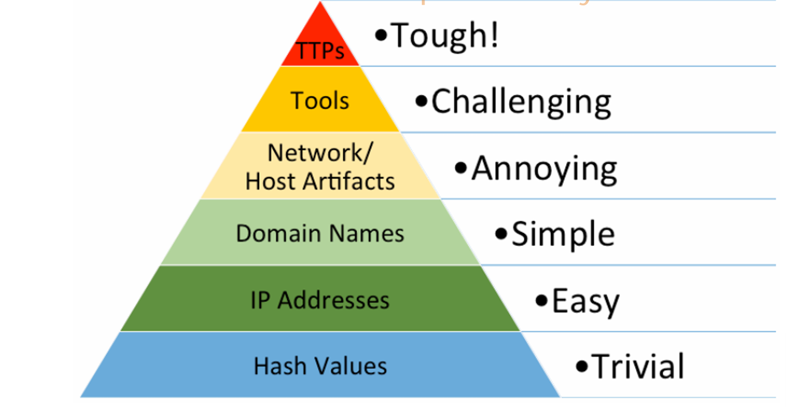

# Threat Hunting Fundamentals

## Threat Hunting Definition

### 🕵️‍♂️ **What is Threat Hunting?**

**Threat Hunting** is a **proactive, human-driven approach** to cybersecurity. It involves actively searching through systems and network data to identify threats that may have bypassed automated security tools.

Rather than waiting for alerts or system compromises, threat hunters go on the offensive — seeking out signs of malicious activity **before** damage is done.

### 🕰️ **What is Dwell Time?**

- **Dwell time** refers to the **duration between the initial compromise of a system and the time the breach is detected**.
- This time often stretches over **several weeks or even months**, giving attackers plenty of time to move within the network undetected.

### ⚠️ **Why is Threat Hunting Important?**

- Traditional, reactive security methods are **no longer sufficient**.
- Threat Hunting provides a **strategic shift** from defense to offense — focusing on identifying threats early in the **cyber kill chain** (the stages of a cyber attack).
- The goal is to **reduce dwell time**, detect hidden threats early, and **prevent deeper infiltration**.

### 🔁 **The Threat Hunting Process Includes:**

1. **Identifying assets** that are valuable and likely targets.
2. **Studying attacker TTPs** (Tactics, Techniques, and Procedures) based on threat intelligence.
3. **Searching for artifacts** and anomalies that deviate from normal system behavior.
4. **Using threat intelligence** to support hypothesis creation, hunting strategies, and preventive actions.

### 🔑 **Key Elements of Effective Threat Hunting:**

- **Offensive, proactive mindset**: anticipating threats before they strike.
- **Empathy with attackers**: understanding their behavior and mindset.
- **Deep understanding of your environment**: including network topology, digital assets, and baseline behavior.
- **Use of advanced tools and high-fidelity data** to analyze and detect anomalies.
- **Combination of hypothesis-based and evidence-based investigations**:
  - Hypothesis-driven: based on attacker behavior and threat intel.
  - Reactive search: triggered by confirmed incidents or indicators of compromise.

### 💡 Summary:
Threat Hunting is more than just detection — it's about **thinking like the adversary**, proactively searching for threats, and **preventing attacks before they succeed**. As cyber threats evolve, so must our defense strategies — and threat hunting is at the forefront of that evolution.

--- 

## 🔄 The Relationship Between **Incident Handling** & **Threat Hunting**

Threat hunting and incident handling are closely connected — each supports and enhances the other at different stages of the **incident response lifecycle**. Let’s break it down phase by phase:

### 🧰 **1. Preparation Phase**
- In this **initial phase** of incident handling, the threat hunting team needs to **define clear protocols and rules of engagement**.
- These include:
  - When to step in
  - How to act during specific scenarios
  - Who is responsible for what
- Organizations can either:
  - Integrate threat hunting into existing **incident response policies**, or
  - Create separate procedures for threat hunting.

✅ **Key idea:** Hunters need a well-defined role before an incident even begins.

### 🔍 **2. Detection & Analysis Phase**
- In this critical phase, **threat hunters play a major role**:
  - They help confirm whether **Indicators of Compromise (IoCs)** are real signs of an incident.
  - Their adversarial mindset allows them to **find hidden or overlooked threats**.
  - They **enhance investigations** and provide deeper insights beyond what automated tools may detect.

✅ **Key idea:** Threat hunters improve the accuracy and depth of incident detection.

### 🛡️ **3. Containment, Eradication & Recovery Phase**
- In some organizations, hunters are involved in:
  - **Containing** the threat
  - **Eradicating** malware or backdoors
  - **Recovering** affected systems
- However, this is **not a universal practice**. Each organization defines whether and how hunters participate in these phases through **internal policies and documentation**.

✅ **Key idea:** Hunters *may* assist with containment and recovery, but it depends on the org’s policy.

### 📈 **4. Post-Incident Activity Phase**
- After an incident is resolved, hunters can:
  - Analyze how the attack occurred
  - Suggest **improvements** to reduce future risk
  - Contribute their **broad IT and security knowledge** to strengthen defenses

✅ **Key idea:** Hunters help build long-term resilience through post-incident insights.

### 🤝 **Summary: A Symbiotic Relationship**
- **Threat hunting and incident handling** are **complementary** processes.
- Organizations can choose to:
  - **Integrate** threat hunting into the incident response lifecycle, or
  - Keep it as a **separate, specialized function**
- This decision depends on factors like:
  - The organization’s **risk level**
  - **Threat landscape**
  - Available **resources and expertise**

---
Sure! Here's the **English version** of the explanation for **A Threat Hunting Team's Structure**:

---

## 🧩 **A Threat Hunting Team's Structure**

Building a successful threat hunting team is a **strategic process** that requires **a wide range of skills and collaboration**. Each team member brings **a unique expertise** to create a **comprehensive defense and detection approach** against advanced cyber threats.

Below are the key roles typically found in a professional threat hunting team:

### 🎯 **1. Threat Hunter**

- The **core role** in the team.
- Has deep knowledge of:
  - The current threat landscape
  - Adversary TTPs (Tactics, Techniques, and Procedures)
- Skilled at:
  - Identifying **Indicators of Compromise (IoCs)**
  - Using various hunting tools like Splunk, ELK, Velociraptor, Sigma, etc.

### 🧠 **2. Threat Intelligence Analyst**

- Gathers and analyzes data from:
  - Open-source intelligence (OSINT)
  - Dark web monitoring
  - Commercial threat feeds and industry reports
- Provides hunters with **valuable insights and predictions** about emerging threats.

### 🔍 **3. Incident Responder**

- Steps in when threats are identified.
- Responsible for:
  - Investigating incidents
  - Executing **containment, eradication, and recovery**
- Ensures that the organization **returns to normal operations safely and quickly**.

### 🧬 **4. Forensics Expert**

- Specializes in **deep technical investigation**:
  - Analyzing malware
  - Reverse engineering attacks
  - Reviewing logs, memory, and system artifacts
- Provides detailed reports to support incident response and learning.

### 📊 **5. Data Analyst / Data Scientist**

- Works with **large-scale datasets** like logs and telemetry.
- Applies:
  - Statistics
  - Machine Learning
  - Data mining techniques
- Helps identify **patterns and anomalies** that may indicate hidden threats.

### 🏗️ **6. Security Engineer / Architect**

- Designs and maintains the **organization's security infrastructure**.
- Works with threat hunters to:
  - Deploy effective tools and logging systems
  - Build **proactive defenses** based on threat models and the kill chain.

### 🌐 **7. Network Security Analyst**

- Monitors **network traffic and behavior**.
- Understands what “normal” looks like and **detects suspicious activity** like lateral movement or data exfiltration.

### 🧭 **8. SOC Manager (Security Operations Center Manager)**

- Oversees all operations within the threat hunting team.
- Ensures:
  - **Coordination among members**
  - Clear communication with other departments
  - Policy compliance and reporting

### 🔚 **Conclusion**

A well-structured threat hunting team functions like a **cyber special forces unit** – each role is essential, and their collaboration helps the organization **detect, respond, and stay ahead of evolving threats**.

--- 

## 🕵️‍♂️ **When Should Threat Hunting Be Conducted?**

Threat hunting shouldn't be a once-in-a-while or emergency-only action — it's most effective when treated as a **continuous and proactive** part of your cybersecurity strategy. However, there are **key moments** when launching a hunting operation becomes absolutely **critical**:

### 1️⃣ **When New Threat or Vulnerability Information is Discovered**
- New intelligence about a **cyber adversary** or **system vulnerability** (e.g., in widely used software) may emerge.
- If your organization uses an affected application or is in a targeted industry, **immediate threat hunting** is needed.
- Goal: Understand the **attacker’s behavior** and check your network for signs of **exploitation**.

📌 *Example: A new zero-day vulnerability is found in a tool your company uses daily — you should start hunting immediately.*

### 2️⃣ **When New Indicators of Compromise (IoCs) Are Published**
- Security sources (like threat intel platforms) may release new IoCs linked to known adversaries.
- If the adversary has **targeted your industry** or **your company before**, you need to search for those IoCs in your systems.
- Goal: Detect and block any stealthy activity **before it escalates**.

📌 *Example: A known APT group starts using new malware — check your logs for any matching signs right away.*

### 3️⃣ **When Multiple Network Anomalies Are Detected**
- One anomaly might be harmless, but **multiple anomalies** could signal an attack.
- These might include strange traffic, unexpected login attempts, or systems behaving oddly.
- Goal: Find the root cause and **expose hidden threats**.

📌 *Example: Several users suddenly show login attempts from unusual locations — time to investigate with threat hunting.*

### 4️⃣ **During an Ongoing Incident Response (IR)**
- While your **IR team** handles containment and recovery, **threat hunters** should actively look for:
  - Related compromised systems
  - Lateral movement
  - Persistence mechanisms
- Goal: Fully understand the scope of the breach and stop further damage.

📌 *Example: Malware is found on one machine — threat hunters check the entire network for other infected systems.*

### 5️⃣ **Regular, Proactive Threat Hunting**
- You shouldn't wait for a warning sign.
- **Regular hunting routines** help uncover **dormant threats** that bypassed automatic detection systems.
- Goal: Build a **strong security posture** by being consistently alert and prepared.

📌 *Example: Weekly hunts focused on critical assets or newly trending TTPs.*

## 🔑 Summary:  
> ✅ The **best time to threat hunt is always now**.  
> A **proactive mindset** ensures threats are caught **before they cause real damage.**

---

Here’s the **English explanation** of the **relationship between Risk Assessment and Threat Hunting**:

---

## 🔗 The Relationship Between **Risk Assessment** and **Threat Hunting**

In cybersecurity, **risk assessment** is a foundational activity that helps organizations understand their **vulnerabilities**, **threat vectors**, and **potential impact** of attacks. It plays a critical role in **guiding and prioritizing threat hunting** activities to ensure resources are focused on the **most valuable and high-risk areas**.

---

### 💡 What is Risk Assessment?
Risk assessment is a structured process that includes:
1. **Asset Identification**: Identifying critical assets like sensitive data, applications, or infrastructure.
2. **Threat Identification**: Determining potential threat actors such as hackers, malware, insiders, etc.
3. **Vulnerability Identification**: Pinpointing weaknesses like software bugs or misconfigurations.
4. **Risk Determination**: Estimating the likelihood and impact if a vulnerability is exploited.
5. **Risk Mitigation Planning**: Creating strategies to reduce or eliminate risks.

---

## 🕵️‍♂️ How Risk Assessment Supports Threat Hunting:

### ✅ 1. **Prioritizing Hunting Efforts**
- Risk assessment identifies **crown jewels** – the most critical systems or data.
- Threat hunting focuses on these high-risk areas first to **detect threats before damage occurs**.

🧠 *Example: If customer data storage is identified as high-risk, hunting will focus on detecting attacks targeting that system.*

### 🌍 2. **Understanding the Threat Landscape**
- The threat identification phase provides insights into:
  - Likely attackers
  - Their **Tactics, Techniques, and Procedures (TTPs)**
- These insights help hunters develop **more accurate hunting hypotheses**.

### ⚠️ 3. **Highlighting Exploitable Vulnerabilities**
- If a system is known to have a privilege escalation flaw, threat hunters can look for:
  - Suspicious user behavior
  - Signs of abnormal privilege levels

### 🧠 4. **Informing Threat Intelligence Usage**
- Threat intelligence becomes more actionable when risk assessment helps identify:
  - The most relevant adversaries
  - The attack methods most applicable to your environment

### 🧯 5. **Refining Incident Response (IR) Plans**
- Understanding the highest risks allows security teams to:
  - Prepare response playbooks
  - Anticipate attacker behavior
  - Respond more efficiently to breaches

### 🛡️ 6. **Enhancing Security Controls**
- Mitigation strategies from risk assessment often lead to:
  - Stronger security architecture
  - Better detection and response capabilities
  - Tools and processes that support threat hunting

### ⚙️ 7. **Integrating with Modern Tools**
Tools used to support both risk assessment and threat hunting include:
- **SIEM (Security Information and Event Management)**: aggregates logs and detects anomalies
- **Vulnerability Scanners**: identify weaknesses across systems
- **Threat Intelligence Platforms**: provide data about attacker groups and TTPs

## ✅ **Conclusion**
> **Risk Assessment and Threat Hunting** are deeply connected.  
> A strong risk assessment process allows:
- Better **focus and prioritization** in threat hunting  
- **Faster detection** and reduced attacker dwell time  
- **Lower damage** from potential incidents  
- A more **resilient cybersecurity posture**

---

# 🔍 Threat Hunting Proceses
Below is a **clear and detailed explanation** of the **Threat Hunting process** in the field of cybersecurity, with step-by-step guidance and easy-to-understand examples:

---

## 🔍 **Threat Hunting Process**

Threat hunting is not just about detecting threats after an attack has occurred — it's a **proactive process to find signs of intrusion** in the system before they can cause serious damage.

### 1️⃣ **Setting the Stage**

> Goal: Plan, define targets, prepare tools and environment.

- Analyze the current threat landscape
- Identify critical assets that need protection
- Enable comprehensive logging across systems
- Configure tools like SIEM, EDR, IDS
- Monitor threat intelligence, understand hacker profiles

📌 *Example*: The threat hunting team reviews the latest threat intelligence reports, analyzes industry vulnerabilities, identifies critical assets (web servers, databases...), enables detailed logging, and sets up threat hunting tools.

### 2️⃣ **Formulating Hypotheses**

> Goal: Develop hypotheses about how attackers might infiltrate.

- Based on threat intel, IDS alerts, or expert intuition
- Hypotheses should be clear and testable

📌 *Example*: "An APT group is exploiting a vulnerability in the web server to establish a C2 channel." This hypothesis is based on IDS alerts and threat intelligence reports.

### 3️⃣ **Designing the Hunt**

> Goal: Build an action plan to test the hypothesis.

- Identify necessary data sources (system logs, DNS logs, network traffic...)
- Create search queries, analysis scripts
- Identify Indicators of Compromise (IoCs), analysis techniques

📌 *Example*: The team uses server logs, analyzes suspicious DNS connections, runs SIEM queries to filter relevant data, and searches for signs linked to a suspected threat actor group.

### 4️⃣ **Data Gathering and Examination**

> Goal: Collect data, check for signs of attack, validate the hypothesis.

- Use tools like log analyzers, packet sniffers (Wireshark), sandboxes
- Apply behavioral, statistical, or signature-based analysis

📌 *Example*: The team reviews web access logs, detects unusual access patterns, monitors network traffic to unknown IPs, and inspects endpoint logs for user behavior anomalies.

### 5️⃣ **Evaluating Findings**

> Goal: Confirm or reject the hypothesis, understand attack behavior and impact.

- Identify affected systems, attack types, and potential damage

📌 *Example*: Discovery of brute-force login attempts from a known APT group IP, or detection of outbound connections to malicious domains — validating the initial hypothesis.

### 6️⃣ **Mitigating Threats**

> Goal: Neutralize the threat and prevent further damage.

- Isolate compromised systems
- Remove malware
- Patch vulnerabilities
- Adjust security configurations

📌 *Example*: A compromised machine connecting to a C2 server is isolated from the network, malware is removed, forensic investigation is conducted, and system vulnerabilities are patched.

### 7️⃣ **After the Hunt**

> Goal: Document the entire process, share knowledge, and update defenses.

- Update threat intelligence platforms with new IoCs
- Improve SIEM detection rules
- Enhance incident response playbooks
- Adjust security policies

📌 *Example*: After completion, the team updates detection rules, shares IoCs internally or with the community, and improves incident response documentation.

### 8️⃣ **Continuous Learning**

> Goal: Continuously learn and improve with every hunt.

- Review hypotheses, methods, and tools
- Apply AI/ML or behavioral analytics to improve detection
- Join conferences, share experiences with the community

📌 *Example*: After each hunt, the team improves techniques based on behavior analytics and learns new methods from security conferences.

### ✅ **Conclusion**

Threat Hunting is a blend of analytical skills, creativity, and a deep understanding of both internal systems and the external threat landscape. The most effective threat hunting teams are those that continuously learn and improve from each hunt.

--- 

## 🔍 **The Threat Hunting Process vs. Emotet Malware**

Let’s walk through each stage of the threat hunting process, using **Emotet malware** as the specific target.

### 1️⃣ **Setting the Stage – Preparation**

**Goal**: Understand Emotet and prepare the environment.

- The threat hunting team researches Emotet’s behavior, including:
  - How it spreads (e.g., phishing emails, malicious attachments, or links).
  - Exploits used (e.g., software or OS vulnerabilities).
  - Typical targets (e.g., email servers, admin-level endpoints).
- Tools like threat intelligence feeds, malware analysis, and campaign reports are used to gather insights.
- Critical systems are identified, and full logging is enabled (email, endpoints, network traffic).
- Security tools like SIEM, EDR, IDS are properly configured.

📌 *Example*: The team finds Emotet often uses Word documents with macros in emails and prepares to look for such patterns.

### 2️⃣ **Formulating Hypotheses**

**Goal**: Make educated guesses about how Emotet might be active in the system.

- Hypotheses are based on Emotet’s known Indicators of Compromise (IoCs) or recent threat intel.
- Example hypothesis:  
  “Emotet is using compromised email accounts to distribute malicious Word docs with macros.”
- These hypotheses are specific and testable.

📌 *Example*: Alerts from the email system show a pattern of suspicious attachments, which aligns with known Emotet tactics.

### 3️⃣ **Designing the Hunt**

**Goal**: Plan the data collection and analysis process.

- Identify data sources like:
  - Email server logs
  - Endpoint telemetry
  - Network traffic logs
  - Sandboxed malware samples
- Define search filters:
  - Email subject patterns
  - File types (e.g., `.docm`, `.zip`)
  - Known C2 (command-and-control) domains or IPs
- Use threat intel to match Emotet IoCs.

📌 *Example*: Search for emails with Word attachments, coming from unusual senders, and filter for macros or outbound traffic to known malicious IPs.

### 4️⃣ **Data Gathering and Examination**

**Goal**: Collect and analyze data to find signs of Emotet.

- Use tools such as:
  - Email forensic tools to inspect email headers
  - Wireshark or packet analyzers to track suspicious network connections
  - Sandbox environments to detonate files safely
- Detect behavioral signs or signature matches related to Emotet.

📌 *Example*: Discover emails with fake invoices containing macro malware, and detect traffic to Emotet’s C2 infrastructure.

### 5️⃣ **Evaluating Findings and Testing Hypotheses**

**Goal**: Decide whether the hypothesis is valid based on evidence.

- If logs show multiple phishing emails with similar patterns and macro-loaded attachments → hypothesis is confirmed.
- If endpoints are communicating with known Emotet servers → active infection confirmed.
- The team assesses:
  - Scope of infection
  - How it spread
  - What was affected

📌 *Example*: Logs confirm multiple workstations sent similar phishing emails internally — pointing to lateral spread.

### 6️⃣ **Mitigating Threats**

**Goal**: Contain and remove the malware.

- Immediate steps:
  - Isolate infected devices
  - Remove malware using endpoint protection tools
  - Reset compromised credentials
  - Patch exploited vulnerabilities
- Block C2 communications by updating firewall/IDS rules.

📌 *Example*: Compromised email accounts are locked, endpoints cleaned, and firewall blocks are updated for known Emotet domains.

### 7️⃣ **After the Hunt**

**Goal**: Document everything and improve security posture.

- Share Emotet IoCs with internal and external stakeholders.
- Update SIEM detection rules based on the observed attack pattern.
- Improve the incident response playbook.
- Integrate lessons learned into staff training and security policy.

📌 *Example*: Emotet detection rules are refined, and the IR team is trained on identifying macro-based phishing attacks.

### 8️⃣ **Continuous Learning and Enhancement**

**Goal**: Continuously improve threat hunting capabilities.

- Review what worked and what didn’t.
- Apply ML or behavior-based techniques to better detect Emotet’s evolution.
- Stay up to date with Emotet's changing tactics through:
  - Conferences
  - Training sessions
  - Threat hunting communities

📌 *Example*: New detection logic based on behavior (e.g., Word opening PowerShell unexpectedly) is tested and added to the hunt toolkit.

### ✅ **Summary**

The Emotet threat hunt illustrates how **structured, proactive hunting** can catch and eliminate stealthy malware **before it causes widespread damage**. Each step builds on the last, forming a feedback loop that enhances organizational security over time.

---

# Threat Hunting Glossary

Within the domain of cybersecurity and threat hunting, several crucial terms and concepts play a pivotal role. Here's an enriched understanding of these:

### 🔹 **Adversary**
An **adversary** refers to any individual or group that targets your organization for various purposes such as:
- **Financial gain**
- **Insider information**
- **Intellectual property theft**

🧠 Adversaries can be categorized as:
- **Cyber criminals**
- **Hacktivists** (political or social motivations)
- **Insider threats**
- **State-sponsored attackers**

### 🔹 **Advanced Persistent Threat (APT)**
An **APT** refers to highly organized, persistent attacks, often backed by nation-states targeting:
- **High-value targets** like governments, healthcare, defense systems.

🔍 "Advanced" doesn't necessarily mean the attackers use the latest technologies, but rather that they have sophisticated strategic planning.  
🔍 "Persistent" refers to their prolonged efforts to achieve their objectives with substantial resources.

### 🔹 **TTPs (Tactics, Techniques, and Procedures)**
TTPs describe the **distinct behavior patterns** of an adversary:
- **Tactics**: The **why** behind the adversary’s actions (strategic goals).
- **Techniques**: The **how**—methods used to achieve their goals (e.g., phishing, exploiting vulnerabilities).
- **Procedures**: The **exact steps** or “recipe” used to execute a technique.

🧠 Analyzing TTPs helps build **Indicators of Compromise (IOCs)** and strengthens threat detection.

### 🔹 **Indicator**
An **indicator** is a **technical signal** that provides a **contextual understanding** of a potential attack. Examples include:
- Malicious IP addresses, file hashes, suspicious URLs, or domain names.

🔍 A technical indicator without context has limited value. Context allows for effective analysis and response.

### 🔹 **Threat**
A **threat** consists of three key elements:
- **Intent**: The **reason** behind the attack (e.g., espionage, financial gain).
- **Capability**: The **tools and resources** available to the attacker (e.g., malware, expertise).
- **Opportunity**: The **circumstances** that allow an attack to occur (e.g., vulnerabilities, weak credentials).

### 🔹 **Campaign**
A **campaign** refers to a collection of related attack events that share similar **TTPs** and are typically motivated by the same goals or objectives. These attacks require detailed analysis to uncover and address.

### 🔹 **Indicators of Compromise (IOCs)**
**IOCs** are digital traces left by an adversary during or after an intrusion. These may include:
- File hashes, IP addresses, domain names, and malicious scripts.

🔍 Tracking IOCs is crucial for identifying and mitigating attacks early.

### 🔹 **Pyramid of Pain**
The **Pyramid of Pain** is a hierarchical model that categorizes the **difficulty of detecting indicators** and the **impact on adversaries**:
- **Low-level Indicators** (e.g., hashes, IPs) are easy to alter by attackers.
- **High-level Indicators** (e.g., TTPs) are hard to change and significantly disrupt attackers.

🔍 As you move up the Pyramid, the **cost to adversaries** increases.

### 🔹 **Hash Values**
A **hash value** is a **unique digital fingerprint** of a file, generated using algorithms like MD5, SHA-1, or SHA-256.  
🔍 Hashes can easily change if the file is modified, making them less reliable for detection over time.

### 🔹 **IP Addresses / Domain Names**
- **IP addresses** identify devices on a network and can be used to track attacks. However, attackers may use VPNs, proxies, or TOR to hide their true IP addresses.
- **Domain names** link to IP addresses but can be obfuscated by attackers using **Domain Generation Algorithms (DGAs)** or dynamic DNS services to avoid detection.

### 🔹 **Network Artifacts / Host Artifacts**
- **Network artifacts**: Traces left in **network traffic logs**, **DNS requests**, or ** packet captures**. They are harder to modify without affecting the attack's success.
- **Host artifacts**: Residual traces on **compromised systems**, such as unusual **registry keys**, **processes**, or **file paths**. These can provide crucial insights into the attack.

🔍 Both are hard for attackers to alter without revealing their presence.

### 🔹 **Tools**
**Tools** are the **software or scripts** used by adversaries during attacks. This may include malware, exploits, and command and control (C2) frameworks.  
🔍 Identifying the tools used helps understand the capabilities and intent of the adversary.

### 🔹 **Diamond Model**
The **Diamond Model** is a conceptual framework for analyzing cyber intrusions, based on four components:

1. **Adversary**: The individual, group, or organization behind the attack.
2. **Capability**: The tools and techniques used by the adversary.
3. **Infrastructure**: The resources (servers, domains, IPs) used to support the attack.
4. **Victim**: The target of the attack.

🔍 This model emphasizes the **dynamic relationships** between these components, helping to create robust strategies for detection and mitigation.

### 🔹 **Comparing with Cyber Kill Chain**
The **Cyber Kill Chain** focuses on **stages of an attack** (e.g., reconnaissance, exploitation), while the **Diamond Model** offers a **broader view** of the components and their interactions during an intrusion.  
Both models provide complementary insights for cybersecurity professionals.

---

# Threat Intelligence Fundamentals

