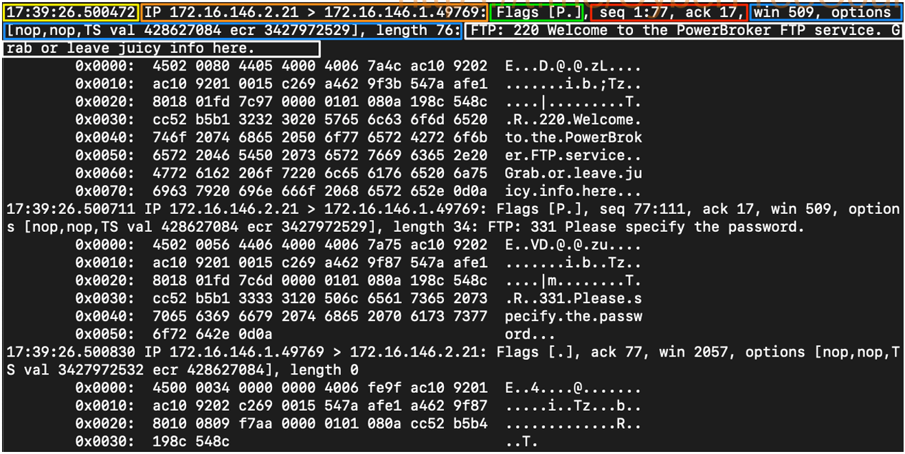

## 🌐 **Network Traffic Analysis (NTA)**

### 🧠 **What Is It?**  
**Network Traffic Analysis** is the process of **monitoring, collecting, and analyzing** traffic flowing through your network to:
- Detect threats 🛡️  
- Identify anomalies 🔍  
- Understand normal behavior 📊  
- Investigate incidents 🔦  

### 🎯 **Main Purposes of NTA**  

1. **👁️ Monitor Network in Real-Time**  
   - Watch how systems communicate  
   - Detect signs of malicious activity as it happens

2. **📏 Set Baselines**  
   - Learn what "normal" looks like  
   - Helps spot unusual or suspicious behavior quickly

3. **🚩 Spot Anomalies and Misconfigurations**  
   - Suspicious IPs 🕵️‍♂️  
   - Unusual ports and protocols (e.g., HTTP errors, TCP issues)  
   - Misconfigured or unauthorized network services

4. **🧬 Detect Malware "On the Wire"**  
   - Catch ransomware, exploits, and backdoor tools by observing communication patterns

5. **🔙 Support Threat Hunting & Incident Response**  
   - Analyze historical data to investigate attacks  
   - Trace the attack path or lateral movement

### 💣 **Why It Matters?**  
Attackers **must communicate** with your network to:
- Deliver payloads 🎯  
- Move laterally ↔️  
- Exfiltrate data 📤

By analyzing traffic, you can **spot**:
- 👾 Port scanning (e.g., many SYN packets on unused ports)  
- 🧪 Exploits or suspicious traffic  
- 🧍‍♂️ Internal abuse or privilege misuse  
- 🕳️ Backdoors left open for command & control

### ⚙️ **Typical NTA Workflow**  

1. 📡 **Collect** network traffic (e.g., via SPAN port, TAPs, or agents)  
2. 🧠 **Analyze** data using tools like Wireshark, Zeek, Suricata, or commercial NDR systems  
3. ⚠️ **Alert** on known threats or anomalies  
4. 🔍 **Investigate** and respond if malicious behavior is detected

### ✅ **Key Skills Needed**  
- Understand common protocols (HTTP, DNS, SMB, etc.)  
- Know normal traffic patterns in your network  
- Interpret packet data and identify red flags  
- Use packet analysis tools efficiently

---

## 🛠️ **Required Skills & Knowledge for NTA**

> 🔑 *You don’t need to memorize everything—just know what to look for and where.*  
> These skills are essential not just for NTA, but for cybersecurity as a whole.

### 🌐 1. **TCP/IP Stack & OSI Model**
📦 Understand how data travels from application to network and back.  
🧩 Helps connect how apps ↔️ networks work together.

- **OSI Model (7 layers)** = 📡 Physical → 💾 Application  
- **TCP/IP Model (4 layers)** = 🌐 Network Interface → 📬 Application

> 🧠 *Helps interpret where an issue occurs and what layer to investigate.*

### 🛜 2. **Basic Network Concepts**
🔄 Switching vs Routing  
🏢 Office traffic ≠ Backbone traffic

- Switch = Local traffic ↔️  
- Router = Internet/Network gateways 🌍

> 📍 *Know where you’re tapping into the network—context matters!*

### 📊 3. **Common Ports & Protocols**
🎯 Recognize standard ports like:
- 80 (HTTP) 🌐  
- 443 (HTTPS) 🔐  
- 53 (DNS) 🔍  
- 445 (SMB) 📁  

> 🧠 *Quick ID of protocols helps detect suspicious or unexpected behavior.*

### 📦 4. **IP Packets & Sublayers**
🧩 Know how TCP & UDP differ:

- **TCP** = Reliable, ordered, connection-based 🔁  
  → Great for tracking conversations between hosts  
- **UDP** = Fast, connectionless, no guarantee 🚀  
  → Harder to reconstruct full sessions

> 🔎 *Understand packet structure = better detection of weird or malformed data.*

### 🔐 5. **Protocol Transport Encapsulation**
🧱 Each layer wraps the data of the previous (like nesting dolls 🪆):

- Ethernet (frame) → IP (packet) → TCP (segment) → App Data

> 🧠 *Spotting when headers change can reveal tunneling, misbehavior, or attacks.*

### 🎓 Final Tip:
You don’t need to **master** everything at once — but building **familiarity** with these areas will level up your network threat detection skills significantly.


### 🌐 **Environment and Equipment for Network Traffic Analysis**

To perform **Network Traffic Analysis (NTA)** effectively, there are various tools and equipment that help capture, inspect, and analyze network traffic. Each tool serves a different purpose — some are designed to **capture live traffic**, others to **analyze saved data**, and some can even **reassemble streams or visualize large datasets**.

> ⚠️ **Note**: These tools are not just for administrators. Attackers can also misuse them for malicious purposes.

### 🧰 **Common Traffic Analysis Tools**

| 🛠️ **Tool** | 🔍 **Description** |
|-------------|--------------------|
| **tcpdump** | A command-line tool that captures and interprets network traffic using **LibPcap**. Lightweight and commonly used on Linux. |
| **TShark** | The command-line version of Wireshark. It can capture live traffic or read from a file and **decode packets**. Similar to tcpdump but more detailed. |
| **Wireshark** | A powerful **graphical network traffic analyzer**. It decodes packets and displays detailed protocol information using multiple dissectors. |
| **NGrep** | Works like the `grep` command but for network traffic. Supports **regular expressions** and **BPF syntax** to find patterns in HTTP, FTP, and other protocols. |
| **tcpick** | A command-line sniffer specialized in **tracking and reassembling TCP streams**. It can reconstruct files from TCP connections. |
| **Network Taps** | Hardware devices (e.g., Gigamon, Niagara Taps) that **copy network traffic** and send it elsewhere for analysis. Can be inline or passive. |
| **SPAN Ports** | A feature on switches/routers that **mirrors traffic** to a specific port for monitoring or logging purposes. Often used to collect traffic for external analysis. |
| **Elastic Stack** | A collection of tools (Elasticsearch, Logstash, Kibana) that **ingests, stores, and visualizes** large amounts of data, including network logs. |
| **SIEMs (e.g., Splunk)** | Central platforms for **analyzing, visualizing, alerting**, and performing **forensic investigations** based on network and system data. |


## 🧪 **Performing Network Traffic Analysis (NTA)**

### 📡 **What is it?**
Performing NTA can be as simple as watching live network traffic scroll through your terminal, or as complex as capturing traffic using a network tap and analyzing it through tools like a **SIEM** (Security Information and Event Management).

### ⚙️ **Basic Requirements**
To **passively capture traffic**, you must be:
- 📍 **Connected to the right network segment** (especially important in switched networks using VLANs).
- 🧷 Use tools like **network taps**, **SPAN ports**, or **port mirroring** to get copies of traffic across network links — even if your capture device isn’t the final destination.

### 🔄 **NTA Workflow (Step-by-Step)**

Although Network Traffic Analysis is not always a straightforward or linear process, here’s a typical workflow to follow:


### **1. Ingest Traffic** 🧲  
Start by **capturing the traffic** on your target network segment.  
- Use **filters** (like BPF filters in Wireshark or tcpdump) if you're looking for something specific (e.g., traffic on a certain port or from a certain host).

### **2. Reduce Noise by Filtering** 🔇  
Network traffic can be very **noisy**, especially in large or production environments.  
- Filter out unnecessary data like **broadcast** or **multicast** packets to focus on what matters.
- This step makes the analysis more efficient and readable.

### **3. Analyze and Explore** 🔍  
Now start digging into the **relevant data**. Ask questions like:
- 🟡 **Is the traffic encrypted or plaintext?** (e.g., HTTP vs HTTPS)
- 🟠 **Are users accessing resources they shouldn’t?**
- 🔵 **Are unusual host-to-host communications happening?**
- ⚠️ **Check protocol flags** (like TCP SYN, ACK) to detect scans or unusual behavior.

### **4. Detect and Alert** 🚨  
- ❗ Look for **errors or communication failures** (e.g., a server not responding).
- 🛑 Decide if the traffic is **normal or suspicious/malicious**.
- 🔐 Use tools like **IDS/IPS** (e.g., Snort, Suricata) to automatically inspect traffic for known signatures and anomalies.

### **5. Fix and Monitor** 🔧👀  
- After resolving a detected issue (e.g., patching a system, blocking a port), you must **keep monitoring** the affected area to confirm:
  - ✅ The problem is truly fixed
  - 🚫 No further abnormal behavior occurs

---

#  Networking Primer - Layers 1-4


### 📍 **Purpose of This Section**
This section is a **quick refresher** to help you understand the **basic networking concepts** you'll encounter when analyzing network traffic. Without understanding protocols, ports, and packet structures, it's impossible to properly interpret what you capture in tools like Wireshark or tcpdump.


## 🧱 **OSI vs. TCP/IP Models**


### 🧩 **What Are They?**

These models describe how **data travels** from one computer to another across a network. They're **frameworks** that break down communication into **layers**, each handling a specific part of the process.

### 🔍 **Comparison Table**

| Trait         | OSI Model                    | TCP/IP Model                     |
|--------------|------------------------------|----------------------------------|
| **Layers**    | 7 Layers                     | 4 Layers                         |
| **Flexibility** | Strict structure             | More flexible                    |
| **Design**     | Protocol-independent, conceptual | Built from real-world protocols |

### 🗂️ **Layer Mapping**

- **OSI Layers (7):**  
  1. Physical  
  2. Data Link  
  3. Network  
  4. Transport  
  5. Session  
  6. Presentation  
  7. Application  

- **TCP/IP Layers (4):**  
  1. Link  
  2. Internet  
  3. Transport  
  4. Application

> 🧠 Think of the **OSI model** as a **theoretical model** (used for understanding concepts), while the **TCP/IP model** is more **practical**, based on how real networks function.

## 📦 **What Is a PDU (Protocol Data Unit)?**

A **PDU** is a **packet of data** that includes:
- **Control information** (headers, flags, etc.)
- **Encapsulated data** from higher layers

Each layer of the model **adds its own header** to the packet as it moves **down the stack**. This process is called **encapsulation**.

### 🧊 **Encapsulation Example**

- At the **Application Layer**, your message might just be: "GET /index.html"
- At the **Transport Layer**, it adds a **TCP header** with source and destination **ports**
- At the **Network Layer**, it adds an **IP header** with source/destination **IP addresses**
- At the **Link Layer**, it adds **MAC addresses** and maybe **frame checksums**

Each layer **wraps** the previous data like layers of an onion.
### 🧪 **Viewing PDUs in Wireshark**

In Wireshark:
- PDUs are shown **in reverse** order — because you’re viewing how the data is **unwrapped** during analysis.
- You’ll see:  
  Ethernet ➝ IP ➝ TCP ➝ HTTP ➝ Payload

This unwrapping is called **decapsulation**.
### ✅ **Why This Is Important**
Understanding the structure of PDUs and how protocols work helps you:
- Recognize malicious behavior or anomalies in captured traffic
- Interpret logs and alerts more accurately
- Debug network issues more efficiently

Here's a **clear explanation in English** of the "Addressing Mechanisms" section, focusing on **MAC addressing** and how it works in a network:

---

## 📬 **Addressing Mechanisms in Networking**

To ensure data reaches the correct device on a network, we use **addressing mechanisms**. These are identifiers used to deliver data across different network layers. One of the most foundational mechanisms is the **MAC address**.

### 🧾 **What Is a MAC Address?**

A **MAC (Media Access Control) address** is a **unique identifier** assigned to a network interface (like a network card or Wi-Fi adapter). It is:

- **48 bits long**
- Usually displayed as **6 groups** of **2 hexadecimal digits**, like:  
  `00:1A:2B:3C:4D:5E`
- Set by the **manufacturer** of the device (also known as a **burned-in address**)

### 🌐 **Where Is the MAC Address Used?**

- The MAC address operates at **Layer 2** of the OSI model (the **Data Link Layer**)
- It's used for **host-to-host communication** **within the same local network** (also known as a **broadcast domain**)
- Devices use MAC addresses to **send frames** to each other within a LAN

### 📦 **MAC Address in Action**

Let’s walk through an example:

1. **Your computer** wants to send data to another device on the same network.
2. It uses the **MAC address** of that destination device to send the frame.
3. If the destination is **outside the local network**, it sends the data to the **default gateway** (usually a router).
4. The router:
   - Strips off the original Layer 2 information.
   - Adds **new MAC address information** for the **next hop**.
   - Forwards the data based on **IP addresses** at Layer 3.

> 🧠 In short, MAC addresses are used **within the same network**, while IP addresses are used to **navigate between networks**.

### 🔁 **How MAC Addresses Help in Routing**

When a packet needs to leave the local network:
- The device sends it to the router using the **router’s MAC address**.
- The router then:
  - Reads the **Layer 3 (IP)** destination address,
  - Decides where to send it,
  - **Replaces** the Layer 2 MAC address with the one for the **next destination**.

This process continues until the packet reaches its final destination.

### ✅ **Why This Is Important**

Understanding MAC addressing is essential for:
- **Troubleshooting** network issues (e.g., ARP problems, duplicate MACs)
- **Network security** (e.g., MAC filtering, identifying spoofed addresses)
- **Traffic analysis** (MAC addresses are visible in packet captures)

--- 
Here’s a **clear explanation in English** of the "IP Addressing" section, broken down for easy understanding:

---

## 🌍 **IP Addressing**

To send data across different networks (not just within a local network), we need a global system to identify devices. That’s where **IP (Internet Protocol)** comes in. It helps **route data between networks** by using **IP addresses**.

### 📡 **What Is IP?**

- IP is a **connectionless protocol** that:
  - Routes packets from source to destination across networks.
  - Splits and reassembles large data into smaller chunks (datagrams).
  - Works with other protocols like **TCP** to guarantee delivery (since IP itself doesn’t).
- Operates at:
  - **Layer 3 (Network)** of the OSI model.
  - **Internet layer** of the TCP/IP model.

### 🔢 **IPv4 (Internet Protocol version 4)**


- **Most commonly used version** of IP today.
- Address length: **32-bit** → shown as **four numbers (octets)** separated by dots (e.g., `192.168.1.1`)
- Each number ranges from **0 to 255**.
- Example: `192.168.86.243`
- IPv4 is essential for **routing data across different networks**.

### ⚠️ **Why IPv4 Isn’t Enough Anymore**

- IPv4 allows for **about 4.3 billion unique addresses**, which seemed a lot—but we ran out quickly due to:
  - Growth of the internet.
  - Reserved/private address spaces.
  - Devices needing unique addresses.
- **Solutions attempted:**
  - **VLSM (Variable Length Subnet Masking)** and **CIDR (Classless Inter-Domain Routing)** to use addresses more efficiently.
  - But even those weren’t enough.

### 🧮 **IPv6 (Internet Protocol version 6)**

- Created to **replace IPv4** and solve the address exhaustion problem.
- Address length: **128-bit** → shown as **eight groups of four hexadecimal digits** (e.g., `2001:0db8:85a3:0000:0000:8a2e:0370:7334`)
- Can support **~340 undecillion addresses** — enough for every grain of sand on Earth to have its own IP!

### 🚀 **Benefits of IPv6**

- **Larger address space** for future growth.
- **Built-in security features** like **IPSec**.
- **Simplified packet headers** make processing faster.
- **Supports multicasting** better than IPv4.
- **Each device can have a global address**—no need for NAT (Network Address Translation).

### 📬 **IPv6 Address Types**

| **Type**   | **Description**                                                                 |
|------------|----------------------------------------------------------------------------------|
| **Unicast**   | One-to-one: sent from one device to one specific device.                        |
| **Anycast**   | One-to-many (but only one responds): good for **load balancing**.               |
| **Multicast** | One-to-many: all devices in the group receive the same packet.                 |
| **Broadcast** | Doesn’t exist in IPv6 (unlike IPv4); replaced by multicast instead.            |

### 📉 **Adoption of IPv6**

- Even though IPv6 is technically superior, adoption has been **slow**.
- As of now, only about **40% of internet traffic globally** uses IPv6 (according to Google).

### ✅ **Quick Summary**

| **Feature**      | **IPv4**                          | **IPv6**                                 |
|------------------|-----------------------------------|------------------------------------------|
| Address Length   | 32-bit                            | 128-bit                                  |
| Format           | Decimal (e.g., 192.168.1.1)       | Hexadecimal (e.g., 2001:db8::1)          |
| Total Addresses  | ~4.3 billion                      | ~340 undecillion                        |
| Broadcast        | Yes                               | No (uses multicast instead)              |
| Built-in Security| No                                | Yes (via IPSec)                          |
| Adoption Rate    | Still dominant                    | Growing (~40% globally)                  |

---
## 🚦 **TCP / UDP, Transport Mechanisms**

The **Transport Layer** is like the **traffic controller** of your data—it decides **how** the data moves between devices and makes sure it gets to the right place in the right order (or not, depending on the protocol used).

There are **two main transport protocols**:
1. **TCP (Transmission Control Protocol)** – reliable, slower
2. **UDP (User Datagram Protocol)** – fast, but unreliable

### 🔁 **TCP – Reliable and Connection-Oriented**

- **Connection-based:** TCP sets up a connection using a **three-way handshake** (like saying: “Hello? You there? Yes? Okay, let's talk!”).
- **Reliable:** Every packet sent is **acknowledged**. If a packet is lost, TCP will **retransmit** it.
- **Ordered:** Packets are **numbered** so they can be reassembled in the correct order.
- **Slower**, but **safer**—great when **data accuracy matters**.

#### ✅ Example use cases:
- **SSH (Secure Shell):** You wouldn’t want to lose parts of a command like `sudo passwd user`!
- **Web browsing (HTTP/HTTPS):** You want to see the full webpage, not pieces missing.

### 🚀 **UDP – Fast and Connectionless**

- **Connectionless:** No handshake. Just sends the packet and forgets—**"fire and forget"** style.
- **No acknowledgments or retransmissions**—UDP doesn't care if the packet got there or not.
- **Much faster**, but with **no guarantee** it got delivered or in order.
  
#### ⚡ Example use cases:
- **Video streaming (e.g., YouTube):** It’s okay if a few pixels drop—you want smooth playback, not perfect frames.
- **DNS (Domain Name System):** A fast query—if it fails, just ask again.

### 🧠 **Quick Comparison: TCP vs UDP**

| **Feature**                | **TCP**                              | **UDP**                             |
|---------------------------|---------------------------------------|-------------------------------------|
| **Connection**            | Connection-oriented (3-way handshake) | Connectionless                      |
| **Reliability**           | Reliable (acknowledges packets)       | Unreliable (no acknowledgment)      |
| **Speed**                 | Slower (more overhead)                | Faster (less overhead)              |
| **Use Case**              | SSH, HTTP, file transfers             | Streaming, gaming, DNS              |
| **Error Handling**        | Yes                                   | No                                  |
| **Packet Order**          | Maintains order                       | May arrive out of order or not at all |

### 🎯 When to Use What?

- **Use TCP** when:
  - You **need all the data**, intact and in order.
  - Examples: **Web, remote login, email, file transfers**.

- **Use UDP** when:
  - You **don’t need perfect delivery**, just **speed**.
  - Examples: **Video calls, live streams, online gaming, DNS**.

### 🧩 Real-World Analogy

| TCP                              | UDP                              |
|----------------------------------|----------------------------------|
| Like sending a **registered letter** (signature needed) | Like tossing a **postcard** in the mail |
| Slower, but you know it got there | Fast, but no guarantee            |
---
## 🔁 **TCP Three-Way Handshake** – *How a Connection is Established*

Think of this like **starting a polite conversation** between two people (a client and a server). You don’t just start talking—you say hello first, they respond, then you both agree to talk. In networking, this is how TCP ensures a **reliable connection** is made before sending data.

### 📦 **Step-by-step: How the 3-Way Handshake Works**

1. **Client ➡️ Server: SYN (Synchronize)**
   - The **client** wants to start a session, so it sends a packet with the `SYN` flag.
   - It includes a **sequence number** (like a label for the conversation).
   - Also negotiates things like window size and maximum segment size (how much data can be sent at once).

2. **Server ➡️ Client: SYN-ACK (Synchronize + Acknowledge)**
   - The **server** receives the SYN, agrees to start the session.
   - It sends back a **SYN** (for its own sequence number) and an **ACK** (to acknowledge the client’s SYN).

3. **Client ➡️ Server: ACK (Acknowledge)**
   - The **client** acknowledges the server’s response.
   - Now the session is established, and both sides can start sending actual data!

### 💡 Real-World Analogy


Imagine two people trying to start a phone call:

- 📞 **Person A (Client)**: "Hey, can we talk?" (`SYN`)
- 📞 **Person B (Server)**: "Sure, I hear you. Let's talk!" (`SYN-ACK`)
- 📞 **Person A**: "Cool, we're connected!" (`ACK`)

Now they can talk normally (exchange data).

### 🌐 Example in Networking

- Port `57678`: Random high port on client
- Port `80`: HTTP port on the server
- Packets:
  - Line 1: Client → Server (`SYN`)
  - Line 2: Server → Client (`SYN-ACK`)
  - Line 3: Client → Server (`ACK`)
  - Line 4: Real data starts flowing (e.g., an HTTP request for a web page)

## 📴 **TCP Session Teardown** – *How a Connection is Gracefully Closed*

Just like you **don’t hang up the phone without saying goodbye**, TCP also politely ends conversations using the **FIN** (Finish) and **ACK** flags.


### 🔚 **Steps for Closing a TCP Connection**

1. **FIN, ACK** – One side says, “I’m done sending data.”
2. **FIN, ACK** – The other side replies, “Got it, and I’m done too.”
3. **ACK** – Final acknowledgment. The session is now closed.

### 💡 Analogy for Teardown

Like ending a phone call:

- 📞 Person A: “Okay, I'm done talking.” (`FIN`)
- 📞 Person B: “Got it, me too.” (`FIN`)
- 📞 Person A: “Cool, bye!” (`ACK`)

## ✅ Summary Table

| **Step**               | **Flag(s)**       | **Meaning**                            |
|------------------------|-------------------|----------------------------------------|
| Connection Start #1    | SYN               | Client says: “Let’s start talking.”    |
| Connection Start #2    | SYN + ACK         | Server says: “Sure, I hear you!”       |
| Connection Start #3    | ACK               | Client: “Great, let’s talk.”           |
| Data Transfer          | ---               | Actual data flows (e.g., web pages)    |
| Connection End #1      | FIN + ACK         | One side says: “I’m done.”             |
| Connection End #2      | FIN + ACK         | Other side says: “I’m also done.”      |
| Connection End #3      | ACK               | Final acknowledgment and goodbye       |

---
# 📶 **Networking Primer – Layers 5 to 7 (Application Layer Overview)**

In networking, the **lower layers** (like Layers 1-4) handle the **physical transmission**, routing, and delivery of data packets. However, the **upper layers**, specifically **Layers 5-7**, focus on **end-user applications**, **data formatting**, **encryption**, and **session management**. These layers ensure that **data is presented properly to users** and that **communication between applications is reliable and secure**.


## 🌐 **HTTP (Hypertext Transfer Protocol)**

- **Layer**: Application Layer (Layer 7)
- **Port**: TCP port 80 (or 8000 by default)
- **Purpose**: Transfers hypertext/media between client and server in plaintext.
- **State**: Stateless – each request is independent.

**How it works**:  
The client (browser) sends an HTTP request to the server for a resource like an HTML page, image, or video. The server responds with the requested content over a **TCP connection**.

### 🔄 Common HTTP Methods:
| Method   | Description |
|----------|-------------|
| **HEAD** | Same as GET but without the body; used to check resource availability or server info. |
| **GET**  | Requests data from the server. Example: `GET http://example.com/index.html`. |
| **POST** | Sends data to the server (e.g., form submissions, login details). |
| **PUT**  | Uploads/replaces a resource at a specific URI. |
| **DELETE** | Deletes the specified resource on the server. |
| **OPTIONS** | Queries the server for supported methods and features. |
| **TRACE** | Echoes back the received request for testing/debugging. |
| **CONNECT** | Tunnels traffic through a proxy (commonly used with HTTPS). |

📌 **Note**: Only **GET** and **HEAD** are required by HTTP standards. Others are optional and depend on server configuration.

🔗 **Reference**: [RFC 2616](https://datatracker.ietf.org/doc/html/rfc2616)
## 🔐 **HTTPS (HTTP Secure)**

- **Layer**: Application Layer (Layer 7)
- **Port**: TCP port 443 (or 8443)
- **Purpose**: Encrypts HTTP communication using **TLS/SSL**.
- **Security**: Protects against eavesdropping, MITM (Man-in-the-Middle) attacks.

### 💡 How HTTPS works:
HTTPS uses **TLS (Transport Layer Security)** to encrypt HTTP messages. The process begins with a **TLS handshake**, which includes:

1. **ClientHello**: Client proposes TLS version, cipher suites, and random value.
2. **ServerHello**: Server responds with chosen cipher and its certificate.
3. **Key Exchange**: Client and server derive a **shared secret** (the master key).
4. **Authentication**: Using X.509 certificates.
5. **Secure Communication**: Encrypted data transfer begins via the established secure channel.

🔗 **Reference**: [RFC 2246](https://datatracker.ietf.org/doc/html/rfc2246)

## 📁 **FTP (File Transfer Protocol)**

- **Layer**: Application Layer (Layer 7)
- **Ports**: TCP port **21** (commands) and **20** (data transfer)
- **Purpose**: Transfer files between client and server.
- **Security**: Unsecured by default; passwords sent in plaintext.

**Modes of Operation**:
1. **Active Mode**: Server connects back to the client using port 20 after receiving PORT command.
2. **Passive Mode (PASV)**: Client initiates both control and data connections (commonly used behind NAT/firewalls).

### 💬 Common FTP Commands:
| Command | Description |
|---------|-------------|
| `USER`  | Username for authentication. |
| `PASS`  | Password for authentication. |
| `PORT`  | Sets up data connection in active mode. |
| `PASV`  | Requests passive mode from server. |
| `LIST`  | Lists files in the current directory. |
| `CWD`   | Changes working directory. |
| `PWD`   | Displays current directory path. |
| `SIZE`  | Returns file size. |
| `RETR`  | Downloads a file. |
| `QUIT`  | Ends the FTP session. |

📌 Most modern systems prefer **SFTP (Secure FTP)** or **FTPS** due to the security concerns with FTP.

🔗 **Reference**: [RFC 959](https://datatracker.ietf.org/doc/html/rfc959)

## 🖥️ **SMB (Server Message Block)**

- **Layer**: Application Layer (Layer 7)
- **Port**: TCP port 445 (modern), also NetBIOS ports 137-139 (legacy)
- **Purpose**: File and resource sharing (printers, files, authentication) primarily in Windows environments.
- **Security**: Requires authentication; supports signing and encryption in newer versions.

**How it works**:
- SMB establishes sessions using TCP (3-way handshake).
- Then, clients can authenticate and access shared resources like folders or printers.
- Uses **NTLM** or **Kerberos** for authentication.

### ⚠️ Security Considerations:
- SMB is often targeted by attackers for **lateral movement** and **credential theft**.
- Monitoring SMB traffic (especially failed logins or unusual file access) is critical in network defense.

## ✅ Summary

| Protocol | Purpose | Port(s) | Secure Version |
|----------|---------|--------|----------------|
| HTTP     | Web browsing / data transfer | 80 / 8000 | HTTPS |
| HTTPS    | Encrypted web browsing | 443 / 8443 | Yes (TLS/SSL) |
| FTP      | File transfers | 20 (data), 21 (commands) | SFTP / FTPS |
| SMB      | File/printer/resource sharing | 445 | Yes (modern SMBv3+) |

---

Sure! Here's a clear and easy-to-understand **explanation** of the text you provided about **Network Traffic Analysis (NTA)**:

---

# 🔍 **The Analysis Process**

**Network Traffic Analysis** is the process of carefully studying the data moving through a network. This data includes all the communications between computers, servers, and other devices. The goal is to understand what’s happening, detect anything unusual, and respond to potential threats or problems quickly.

## 🔁 **Why Is It a Process?**

NTA is not a one-size-fits-all process. It depends on:
- The **tools** you have (like Wireshark, Splunk, ELK Stack, etc.).
- The **permissions** given by your organization (e.g., access to logs or internal devices).
- How much **visibility** you have into the network (can you see just one system, or the whole environment?).

Even though these things may change, the goal is to create a **repeatable, reliable process** for analyzing traffic each time.
## 🧠 **What Does Analysis Involve?**

When doing traffic analysis, you:
1. **Break down data into understandable parts** (like protocols, ports, IPs).
2. **Look for anything strange**, such as:
   - Unusual traffic patterns.
   - Connections from unknown or external IPs.
   - Unauthorized access (e.g., using RDP, SSH, or Telnet).
   - Spikes in traffic before a crash or system slowdown.

3. **Compare with a baseline** — the usual, healthy traffic behavior in your network. This helps you detect when something’s off.

## 🛡️ **Why Is It Important for Defense?**

Without NTA, you’re basically **flying blind**. You wouldn’t know:
- Which devices are talking the most (top talkers).
- Whether internal systems are communicating normally.
- If an attack is happening right now or already happened.

Traffic visibility lets you:
- Spot threats **before** they cause damage.
- **Fix problems fast**.
- Understand your network deeply.

## ⚙️ **Using Other Tools with NTA**

NTA gets even stronger when used with other tools, like:
- **IDS/IPS** (Intrusion Detection/Prevention Systems).
- **Firewalls**.
- **System logs** (from hosts or network devices).
- **SIEMs** like **Splunk** or **ELK Stack**.

These tools can alert you to known threats, based on **signatures** of known attacks or suspicious behavior.

## ⚠️ **What About Day-to-Day Operations?**

NTA is not only for detecting attacks. It also helps with:
- **Troubleshooting** (e.g., why can’t this machine connect?).
- **Monitoring protocol behavior** (e.g., is DNS working correctly?).
- **Diagnosing performance issues** (e.g., high latency or packet loss).

If you can see the traffic, you can **see where things go wrong**.

## 👁️ **Don’t Rely Only on Automation**

Tools are helpful, but they’re not perfect. Attackers are constantly learning how to bypass automated systems.

That’s why:
- You should **use tools**, but also
- **Check things manually**, using your own eyes and judgment.

The **human analyst** is still the most powerful tool in cybersecurity.

## ✅ **Summary**

- NTA helps us understand what's happening on the network.
- It helps identify both security threats and operational issues.
- It works best when combined with other tools and human analysis.
- Don’t rely only on automation — your skills and eyes are key to catching sophisticated threats.

---

# 🧠 **Understanding Analysis Dependencies**

Traffic analysis can be done in **two main ways**: **Passive** and **Active**.  
Each method has its own **requirements (or dependencies)** depending on how traffic is captured and analyzed.

### 🔹 **Passive Traffic Capture**
- You're **listening** to traffic without interfering.
- You **copy** data that is already flowing.
- No change to the network is needed.
- Often uses **mirrored ports** or **wireless sniffing** to see data.

### 🔹 **Active Traffic Capture**
- You place your tool **in-line**, like a checkpoint on a highway.
- You **intercept** traffic as it flows between devices.
- Requires **topology changes** (e.g., adding a tap or device in the network path).
- Provides more **real-time insight**, but more complex and risky.

## 📋 **Table of Traffic Capture Dependencies**

| Dependency | Passive | Active | Explanation |
|------------|---------|--------|-------------|
| **Permission** | ✅ | ✅ | No matter which method, you must always get **written permission** from someone with authority. This is especially important in **sensitive industries** like healthcare or finance, where unauthorized traffic capture can be **illegal**. |
| **Mirrored Port** | ✅ | ❌ | Needed for passive mode. A **mirrored port** copies traffic from one port to another so your capture tool can read it. In wireless, you must connect to the **correct SSID** to see meaningful traffic. |
| **Capture Tools** | ✅ | ✅ | Tools like **Wireshark, TCPDump** help collect and analyze traffic. Be aware that **PCAP files grow fast** and may slow down your machine when filtered repeatedly. |
| **In-line Placement** | ❌ | ✅ | Required for active mode. You **insert** your tool into the path of network traffic like a "middle hop", so packets flow through it. Devices won’t notice it, but the network topology does. |
| **Network Tap or Dual NICs** | ❌ | ✅ | A **network tap** or a machine with **two NICs (network cards)** is needed to forward traffic while capturing. Best used on a **Layer 3 link** between network segments. |
| **Storage & Processing Power** | ✅ | ✅ | Both methods need **adequate disk space and CPU power**. Active mode may handle much more data, like trying to catch water from a firehose versus a sink faucet (passive). |

## 🧭 **Why a Traffic Baseline Matters**

Even though not a strict "dependency", knowing what **normal traffic** looks like helps **speed up and improve analysis**.

Without a baseline, you have to:
- Inspect **every connection**
- Guess what’s normal vs suspicious
- Spend **hours filtering out noise**

With a baseline, you can:
- Instantly **ignore known-good** communication
- Focus only on **anomalies**
- React **faster** to threats

## 🧪 **Real-World Example**

You’re a network admin at a big company. Suddenly:
- Some users report **slow networks**
- Strange **files appear** on desktops

You:
1. Connect to the affected network segment.
2. Start capturing traffic.
3. Stop after a few minutes and begin analyzing.

**Without a baseline:**
- You’re overwhelmed by the volume of data.
- You have to **check every single host and port** manually.
- You don’t know what’s normal for this segment.

**With a baseline:**
- You quickly **filter out regular traffic**.
- You notice:
  - **Unusual traffic on ports 445 and 8080** between **user PCs**.
  - Normally, these ports are used between a user and a **server**, not peer-to-peer.
- This is suspicious and could mean **malware** or **lateral movement**.

Now, you can open a **trouble ticket** or escalate the incident **faster**, possibly preventing more damage.

## ⚡ Final Thoughts

- **Faster visibility = Less damage**
- Understand your **network flow** and **protocol behavior**
- Choose the **right capture method** based on your environment
- Build a **baseline** to detect threats faster and more accurately

---
Here's a **clear and structured explanation in English** of the content you provided, with helpful **emojis/icons** for better readability and engagement. This breakdown is ideal for learning, documentation, or training use.

---

## 🔎 **Analysis in Practice**

In network security, traffic analysis is not a precise formulaic science—it's a dynamic, context-driven process. The goal of this workflow is to guide analysts through various steps to detect, understand, and respond to network incidents, using a layered approach.
## 📘 **Analysis Workflow Overview**

The workflow can be broken down into **four key types of analysis**:

### 1. 📊 Descriptive Analysis
**Goal:** Understand what is happening in the network.

- ❓ **What’s the issue?**  
  Example: A suspected data breach or strange traffic activity.

- 🎯 **Define the scope & objective**  
  - **Target:** Hosts possibly downloading from `bad.example.com`  
  - **Timeframe:** Last 48 hours + 2 hours  
  - **Indicators:** Files like `superbad.exe`, `new-crypto-miner.exe`

- 🌐 **Define the target network/protocols**  
  - Subnet: `192.168.100.0/24`  
  - Protocols: HTTP and FTP

This stage answers the basic **who, what, when, and where** of the problem.

### 2. 🛠️ Diagnostic Analysis  
**Goal:** Understand **why** something happened.

- 🎧 **Capture network traffic**  
  Use a tool like Wireshark or tcpdump on the affected subnet. Retrieve historical PCAP or NetFlow data from SIEM if available.

- 🚫 **Filter irrelevant data**  
  Remove noise—focus on HTTP, FTP, or GET requests for the suspicious files.

- 🔍 **Analyze traffic details**  
  - Look for file transfers using filters like `ftp-data`.  
  - HTTP: `http.request.method == "GET"`  
  - Identify which hosts downloaded malicious files.

This step **isolates causes** and helps **validate suspicions**.

### 3. 🔮 Predictive Analysis  
**Goal:** Forecast potential outcomes and prepare.

- 📝 **Take notes & create mind maps**  
  Record:
  - Timeframes of captures
  - Suspicious host IPs
  - Packet/frame IDs of interest

- 🧾 **Summarize findings**  
  Present a concise explanation of what was discovered so decision-makers can act (e.g., quarantine infected machines).

This step prepares the analyst to **anticipate future incidents** or identify patterns of behavior.

### 4. 🧪 Prescriptive Analysis  
**Goal:** Recommend actions based on data insights.

- 🛡️ **Decide and act**  
  Example: Isolate hosts, patch vulnerabilities, monitor affected ports.

- 📚 **Document lessons learned**  
  - What worked?
  - What failed?
  - What needs improvement?

This step strengthens **incident response** capabilities and reduces risk in future events.

## 🧩 **Key Components of Effective Analysis**

### 1. 🗺️ Know Your Environment  
Keep **network maps** and **asset inventories** updated. Knowing what "normal" looks like is critical to identifying anomalies.

### 2. 📍 Sensor Placement  
Place traffic capture tools **near the issue source**. For example:
- Suspected internal attack → monitor local subnet
- Internet-based attack → monitor border gateway

### 3. 🔁 Persistence  
Don’t give up if you don’t see the problem immediately. Some attacks (e.g., C2 callbacks) occur sporadically (e.g., every 12 hours).

## 🧠 **Smart Analysis Tips**

- 🔌 Start with **common protocols**: HTTP/S, FTP, DNS, Email
- 🔁 Analyze **host-to-host traffic**: Rare in most networks unless justified
- 🕵️ Spot **patterns**: Daily connections to external IPs can signal C2 activity
- 🧬 Look for **anomalies**:  
  - Rare ports in use  
  - Changes in User-Agent  
  - Sudden traffic spikes  
- 🙋‍♂️ Ask for help when needed: Another analyst might catch something you missed.

## 🧠 Summary

Traffic analysis is **a cyclical, evolving process**—not a one-time job. Mastery involves:
- Knowing your network
- Efficient data filtering
- Strategic packet inspection
- Using tools like Wireshark, tcpdump, SIEM, and IDS (e.g., Snort, Suricata)

🛡️ Stay vigilant, keep improving, and make analysis **a habit, not just a reaction.**

---

# 📡 **Tcpdump Primer**

## 🧠 **What is Tcpdump?**

**Tcpdump** is a command-line tool used for **packet sniffing** (capturing network packets). It allows you to:
- Capture packets directly from a **network interface** or from a **pcap file**.
- Work **without a GUI**, so it can be used via **terminal** or **SSH**.
- It's **very popular** on Unix-like operating systems such as Linux, BSD, macOS, etc.

> 💡 **Note:** On Windows, a similar tool called **WinDump** used to exist, but it's no longer maintained. You can install Linux on Windows using WSL to run tcpdump.


## 📦 **Installing and Checking Tcpdump**

### 🔍 Check if it's installed:
```bash
which tcpdump
```
Usually found at `/usr/sbin/tcpdump`

### 📥 Install tcpdump:
```bash
sudo apt install tcpdump
```

### ✅ Check the version:
```bash
sudo tcpdump --version
```

## 📡 **Common Tcpdump Options**

| Option | Description |
|--------|-------------|
| `-D` | Show available network interfaces |
| `-i eth0` | Capture on a specific interface |
| `-n` | Do not resolve hostnames |
| `-nn` | Do not resolve hostnames or ports |
| `-e` | Show Ethernet header info |
| `-X` | Show packet contents in **hex + ASCII** |
| `-XX` | Like `-X` but includes Ethernet header |
| `-v`, `-vv`, `-vvv` | Increase verbosity level |
| `-c <number>` | Capture a specific number of packets then exit |
| `-s <size>` | Set snapshot length (packet size to capture) |
| `-S` | Display absolute TCP sequence numbers |
| `-q` | Quiet output (less detail) |
| `-w file.pcap` | Write packets to file |
| `-r file.pcap` | Read packets from file |

## 📌 **Practical Examples**

### 🖥️ Show available interfaces:
```bash
sudo tcpdump -D
```

### 🌐 Capture on eth0 interface:
```bash
sudo tcpdump -i eth0
```

### ❌ Disable DNS and port resolution:
```bash
sudo tcpdump -i eth0 -nn
```

### 📜 Show Ethernet header:
```bash
sudo tcpdump -i eth0 -e
```

### 🔍 Show packet contents in **hex and ASCII**:
```bash
sudo tcpdump -i eth0 -X
```
## 📚 **More Resources**
- View detailed manual:
```bash
man tcpdump
```

Sure! Here's a **clear explanation in English** of the `tcpdump` output section from your document, broken down for easy understanding:

---

## 📊 **Understanding Tcpdump Output**

When you run `tcpdump`, the output can look confusing at first. But each line is structured, and with some practice, you'll be able to quickly understand what it’s telling you. Here's a breakdown of the key parts of each output line and what they mean.

### 🧱 Tcpdump Output Line Structure



Each line in `tcpdump` output typically contains the following fields:

| **Field**                    | **Color (in image)** | **Explanation** |
|-----------------------------|----------------------|-----------------|
| **Timestamp**               | 🟡 Yellow            | Shows the **exact time** the packet was captured. You can configure this format. |
| **Protocol**                | 🟠 Orange            | Tells you which **upper-layer protocol** is used. Example: `IP`, `ARP`, etc. |
| **Source & Destination IP.Port** | 🟠 Orange        | Shows **who sent** the packet and **who received it**, including port numbers. Example: `172.16.146.2.21` |
| **Flags**                   | 🟢 Green             | Displays **TCP flags** like SYN, ACK, FIN, etc. Useful for understanding TCP session states. |
| **Sequence & Acknowledgement Numbers** | 🔴 Red | TCP uses these numbers to **track data segments** and ensure reliability. Relative numbers are shown by default. |
| **Protocol Options**        | 🔵 Blue              | Any **negotiated TCP options** like window size, timestamps, or SACK (Selective Acknowledgment). |
| **Notes / Next Header**     | ⚪ White             | Additional information from `tcpdump` dissector, like detecting **application protocols** (e.g., FTP). |

> The **more verbose** you make your `tcpdump` command (using `-v`, `-vv`, or `-vvv`), the **more detailed** these fields become.

## 📁 **File Input/Output with Tcpdump**

### 📝 Save a capture to file:
```bash
sudo tcpdump -i eth0 -w ~/output.pcap
```

This command:
- Captures packets on `eth0`
- **Writes them directly to a file** (`output.pcap`)
- Does **not show anything on the terminal** during capture

Sample output:
```
tcpdump: listening on eth0, link-type EN10MB (Ethernet), snapshot length 262144 bytes
10 packets captured
131 packets received by filter
0 packets dropped by kernel
```

This tells you:
- 10 packets matched your capture filter and were saved
- 131 total packets passed through the interface
- 0 packets were dropped by the OS

### 📖 Read packets from a saved file:
```bash
sudo tcpdump -r ~/output.pcap
```

This command reads and displays the capture from `output.pcap`.

Example output:
```
11:15:40.321509 IP 172.16.146.2.57236 > ec2-99-80-22-207.eu-west-1.compute.amazonaws.com.https: Flags [P.], seq 2751910362:2751910399, ack 946558143, win 501, options [...], length 37
```

Let’s break this line down:
- `11:15:40.321509`: Timestamp of the packet
- `IP`: Protocol
- `172.16.146.2.57236`: Source IP and port
- `>`: Indicates the direction (from source to destination)
- `ec2-99-80-22-207.eu-west-1.compute.amazonaws.com.https`: Destination (domain + port)
- `Flags [P.]`: TCP flags (PUSH + ACK in this case)
- `seq ... ack ...`: TCP sequence and acknowledgment numbers
- `win 501`: TCP window size
- `options [...]`: TCP options like timestamps
- `length 37`: Payload size in bytes

> You can reapply filters and verbosity options (like `-nn`, `-X`, `-v`) **when reading pcap files** to get more details.

## 🛡️ Bonus: Tcpdump as a Mini IDS

You can use tcpdump creatively:
- Write a **Bash script** that reads packets from `tcpdump`
- Search for **specific patterns** (e.g., many ICMP echo requests)
- Take action like **banning an IP** if it looks suspicious

This is a **lightweight approach to IDS/IPS** (Intrusion Detection/Prevention System).

Example script snippet:
```bash
if [ $(tcpdump 'icmp' -c 100 | wc -l) -gt 50 ]; then
   sudo iptables -A INPUT -s <ip> -j DROP
fi
```
This script checks for **more than 50 ICMP packets** and blocks the source IP if it exceeds that threshold.
