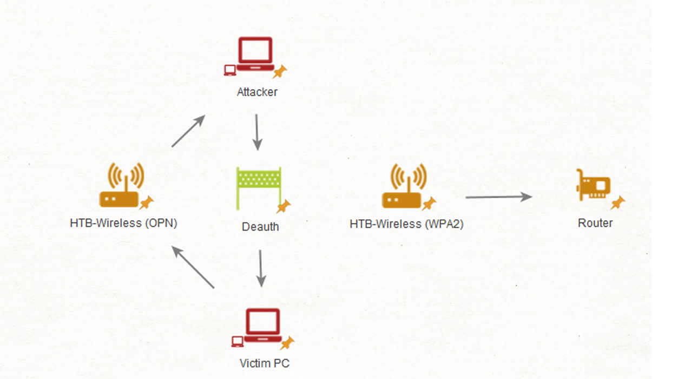
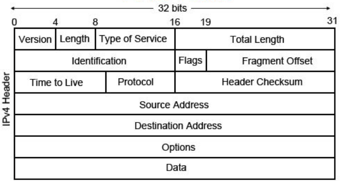

## Table of Contents
- [Intermediate Network Traffic Analysis Overview](#intermediate-network-traffic-analysis-overview)
- [Overview of ARP and Why](#overview-of-arp-and-why)
- [ARP Scanning & DoS Attacks](#arp-scanning--dos-attacks)
- [802.11 Deauthentication DoS Attack](#80211-deauthentication-dos-attack)
- [Rogue Access Points & Evil Twin Attacks](#rogue-access-points--evil-twin-attacks)
- [What is a Fragmentation Attack?](#what-is-a-fragmentation-attack)

## **Intermediate Network Traffic Analysis Overview**

#### 💡 **The Importance of Network Traffic Analysis Skills**
In today’s ever-evolving, complex, and high-speed network environments, mastering **network traffic analysis** is absolutely essential. With a massive volume of traffic constantly flowing through network infrastructures, it’s easy to feel overwhelmed or unprepared — but overcoming that challenge is key to effectively protecting systems.

### 📌 **What This Module Covers**
In this module, you will:

#### 🔍 **Analyze a wide range of attacks across different network layers**:
- **Link Layer**: e.g., ARP Spoofing, ARP Poisoning.
- **IP Layer**: e.g., ICMP attacks, TTL manipulation.
- **Transport & Network Layers**: such as TCP/UDP scans, DoS attacks, Nmap reconnaissance.
- **Application Layer**: such as HTTP header manipulation, DNS tunneling, fuzzing, etc.

→ The goal is to **identify patterns and trends** in these attacks, which will help you **detect and respond to threats more efficiently**.

### 🔧 **Additional Skills You’ll Learn**
Beyond packet analysis, this module also introduces:

- **Anomaly Detection Techniques**: to spot abnormal or suspicious behaviors.
- **Log Analysis**: correlating logs with network events for better context.
- **Indicators of Compromise (IOCs)**: signs that a system has been attacked or compromised.

→ This strengthens your ability to **proactively detect threats** and **respond quickly and accurately**.

### 💾 **Practice Resources**
To complete the hands-on exercises, you need to download the **`pcap_files.zip`** archive:

#### ⚙️ Command to download and extract it in Pwnbox:
```bash
wget -O file.zip 'https://academy.hackthebox.com/storage/resources/pcap_files.zip' \
&& mkdir tempdir \
&& unzip file.zip -d tempdir \
&& mkdir -p pcaps \
&& mv tempdir/Intermediate_Network_Traffic_Analysis/* pcaps/ \
&& rm -r tempdir file.zip
```
#### 📁 Some included `.pcap` files:
- `ARP_Poison.pcapng`, `ARP_Scan.pcapng`, `ARP_Spoof.pcapng`: Link layer attacks.
- `icmp_tunneling.pcapng`, `ICMP_smurf.pcapng`: IP layer attacks.
- `nmap_fin_scan.pcapng`, `nmap_frag_fw_bypass.pcapng`: Scanning and reconnaissance.
- `dns_tunneling.pcapng`, `CRLF_and_host_header_manipulation.pcapng`: Application layer exploits.


---

## **Overview of ARP and Why**

**ARP (Address Resolution Protocol)** is used to map IP addresses to MAC (physical) addresses in a local network. This is necessary because devices need to know the MAC address of the destination to send data over Ethernet.

However, ARP has **no authentication mechanism**, which makes it vulnerable. Attackers often exploit ARP to perform:
- **Man-in-the-Middle (MitM)** attacks: intercept and monitor traffic.
- **Denial-of-Service (DoS)** attacks: disrupt communication by corrupting address mappings.

### 🛠️ **How ARP Normally Works**


Let’s take two computers: **Host A** and **Host B**. Here’s how ARP works in a standard situation:

1. **Host A** wants to send data to **Host B** and needs its MAC address.
2. Host A checks its **ARP cache** to see if it already knows the mapping.
3. If not, Host A broadcasts an **ARP Request**: “Who has IP x.x.x.x?”
4. **Host B** replies: “I have that IP. My MAC address is aa:aa:aa:aa:aa:aa.”
5. Host A updates its ARP cache with this mapping.
6. If Host B gets a new IP or MAC (e.g., after reboot), the cache needs to be updated, which can lead to confusion in analysis or be used for attacks.

### 🧨 **What is ARP Spoofing/Poisoning?**

Attackers abuse the lack of authentication in ARP to **send fake ARP replies** that mislead devices on the network. Here's how it works:


#### 🔁 ARP Spoofing Process:

1. There are 3 devices: a victim machine, the router, and the attacker.
2. The attacker sends **fake ARP replies** to both:
   - To the victim: “The router’s IP is at my (attacker's) MAC.”
   - To the router: “The victim’s IP is at my (attacker's) MAC.”
3. Both devices **update their ARP caches** with incorrect info.
4. As a result, all traffic between the victim and router is sent through the **attacker’s machine**.
5. If the attacker enables **IP forwarding**, they can:
   - Relay packets (MitM).
   - Drop, modify, or analyze packets (DoS or sniffing).
6. The attacker may combine this with:
   - **DNS spoofing**: redirect websites to fake domains.
   - **SSL stripping**: downgrade HTTPS to HTTP to intercept sensitive data.

### 🧪 **How to Detect ARP Spoofing**

Using tools like **Wireshark**, you can analyze the `ARP_Spoof.pcapng` file. Here's how:

#### 🔍 Filters in Wireshark:
- `arp.opcode == 1`: shows **ARP Requests**.
- `arp.opcode == 2`: shows **ARP Replies**.
- `arp.duplicate-address-detected`: flags IPs with conflicting MACs.
- `eth.addr == <attacker's MAC>`: view suspicious traffic from known malicious MAC.

#### 🔍 Signs of ARP Spoofing:
- An **IP address is mapped to multiple MAC addresses**.
- A **single MAC address maps to multiple IPs**.
- One host **sending excessive ARP requests/replies**.
- Frequent **connection drops** or traffic routed through unknown MACs.

### 🛡️ **How to Prevent ARP Spoofing**

1. **Static ARP Entries**:
   - Manually assign IP-to-MAC mappings.
   - Prevents unauthorized changes.
   - However, it’s **difficult to manage on large networks**.

2. **Port Security on Switches/Routers**:
   - Limit the number of allowed MAC addresses per port.
   - Prevent unauthorized devices from connecting.

Sure! Here's the **English explanation** for the section on installing and using **TCPDump** and detecting **ARP Spoofing** using `tcpdump` and **Wireshark**:

### 🛠️ **Installing & Using TCPDump**

In environments without network monitoring tools, we can use **`tcpdump`** (on Linux) or **Wireshark** (on Windows/Linux) to capture network traffic.

#### ✅ Installing TCPDump (Linux):
Use the following command in the terminal:
```bash
sudo apt install tcpdump -y
```

After installing, `tcpdump` is usually located at `/usr/sbin/tcpdump`.

#### 🎯 **Capturing Network Traffic with TCPDump**

To start capturing traffic on a network interface (e.g., `eth0`) and save it to a file:
```bash
sudo tcpdump -i eth0 -w filename.pcapng
```

- `-i eth0`: specifies the network interface.
- `-w filename.pcapng`: saves the output to a `.pcapng` file for analysis later (e.g., in Wireshark).

#### 🧠 **Detecting ARP Spoofing with Wireshark**

Once you’ve captured the traffic or downloaded the file `ARP_Spoof.pcapng`, open it in Wireshark:
```bash
wireshark ARP_Spoof.pcapng
```

#### 🔍 Apply Filters to Focus on ARP Traffic:
- `arp.opcode == 1`: Shows **ARP Requests**
- `arp.opcode == 2`: Shows **ARP Replies**

If one machine is **constantly sending ARP requests/replies**, it might be a sign of ARP Spoofing.

#### 🚩 **Suspicious Behavior Example**

You may notice suspicious behavior from a MAC address like:
```
08:00:27:53:0C:BA
```

To analyze interactions involving this MAC address:
```wireshark
(arp.opcode) && ((eth.src == 08:00:27:53:0c:ba) || (eth.dst == 08:00:27:53:0c:ba))
```

You may find this MAC was first tied to `192.168.10.5`, then later to `192.168.10.4`, which is suspicious.


### 📋 **Verifying on Linux (ARP Cache Check)**

You can check the ARP cache using:
```bash
arp -a | grep 50:eb:f6:ec:0e:7f
arp -a | grep 08:00:27:53:0c:ba
```

This may reveal that the **same IP** (`192.168.10.4`) is mapped to **two different MAC addresses** — a strong indicator of spoofing.

#### Wireshark Filter to Find Such Duplicates:
```wireshark
arp.duplicate-address-detected && arp.opcode == 2
```

### 🧾 **Analyzing the Attacker’s Behavior**

To identify the original IP of each MAC:
```wireshark
(arp.opcode) && ((eth.src == 08:00:27:53:0c:ba) || (eth.dst == 08:00:27:53:0c:ba))
```

This will show that:
- `08:00:27:53:0c:ba` originally had IP `192.168.10.5`
- Then spoofed IP `192.168.10.4`

#### Filter to Inspect Traffic Between Suspicious MACs:
```wireshark
eth.addr == 50:eb:f6:ec:0e:7f or eth.addr == 08:00:27:53:0c:ba
```
#### 🧪 Interpreting the Results:
- **TCP connections frequently dropping?**
  → The attacker is likely **not forwarding** packets, causing a **DoS attack**.

- **If traffic is forwarded (MitM)?**
  → You’ll see almost **identical traffic** from victim → attacker and attacker → router.

---

## **ARP Scanning & DoS Attacks**

When analyzing ARP packets in a capture file (e.g., `.pcapng`), we might observe abnormal behaviors. ARP is not only used in **spoofing** and **man-in-the-middle (MITM)** attacks, but it can also be exploited for **network reconnaissance**.

#### 🧭 **Signs of ARP Scanning**

In the file `ARP_Scan.pcapng`, you may notice the following red flags:

1. **Broadcast ARP requests targeting sequential IP addresses** (e.g., `.1`, `.2`, `.3`,...).
2. **Broadcast ARP requests sent to non-existent hosts**.
3. **A large volume of ARP traffic originating from a suspicious or compromised machine**.

👉 These are common behaviors of network scanning tools like **Nmap**, which use ARP requests to identify live hosts.

#### 📌 **Detecting ARP Scanning in Wireshark**


- Open the file `ARP_Scan.pcapng` in **Wireshark**.
- Apply the display filter:
  ```wireshark
  arp.opcode == 1
  ```
- You may see a single device sending ARP Requests to a range of IP addresses in order. This is a **typical pattern of ARP scanning**.

Live devices will respond with ARP Replies, which confirms the attacker is collecting MAC and IP information of active hosts.

### 💥 **Detecting ARP-based Denial-of-Service Attacks**

**File used**: `ARP_Poison.pcapng`

After scanning, the attacker might shift tactics to **perform a Denial-of-Service (DoS)** by:

1. **Poisoning the ARP caches** of as many devices in the subnet as possible.
2. **Sending spoofed ARP replies claiming the same IP (e.g., `192.168.10.1`) belongs to a different MAC address**, corrupting the router’s and clients’ ARP tables → this causes communication failure.

This can also be used to **position the attacker as a MITM**.

### 🛡️ **Responding to ARP Attacks**

Once any of the above anomalies are detected, we can take the following actions:

#### 1. **Trace & Identify the Attacker**
- The attacker is a physical machine in the network.
- If you can **identify its MAC or IP**, you may be able to **locate and shut it down**.
- Sometimes, the attacking machine is **compromised and controlled remotely**.

#### 2. **Contain the Threat**
- Disconnect or isolate the affected network segment at the switch or router level.
- This can **immediately stop the DoS or MITM attack** from spreading.


### 🔐 **Conclusion**

Link-layer attacks like ARP spoofing often go unnoticed, but:

- **They are critical to detect**, as they can lead to severe upper-layer data leaks.
- Regular **monitoring of ARP traffic** using tools like Wireshark is essential for a secure network.


---

Here is a **clear and simplified explanation in English** of the topic: **802.11 Denial of Service (Deauthentication Attack)**, based on the `.cap` file `deauthandbadauth.cap`.

---

## **802.11 Deauthentication DoS Attack**

### 🧩 What is it?

In Wi-Fi networks (802.11), attackers can exploit vulnerabilities at the **link layer** to cause **denial of service (DoS)**. One common method is a **deauthentication attack** — where the attacker **forces devices to disconnect from the Wi-Fi** network.

### 📡 How is Wi-Fi traffic captured?

To monitor Wi-Fi traffic like this, you need a **wireless interface in monitor mode**, which allows you to capture **raw 802.11 frames**, including management frames like deauthentication packets.

You can enable monitor mode using tools like:

```bash
sudo airmon-ng start wlan0
# OR using manual commands:
sudo ifconfig wlan0 down
sudo iwconfig wlan0 mode monitor
sudo ifconfig wlan0 up
```

### 🔧 What does a Deauthentication Attack Do?

- The attacker **pretends to be the access point (AP)** and sends **forged deauthentication frames** to clients.
- The victim’s device **disconnects** from the AP thinking it’s a legit command.
- The user may reconnect, during which the attacker can:
  - **Capture the WPA handshake** (for cracking the Wi-Fi password).
  - **Disrupt access** (basic DoS).
  - **Force connection to a malicious AP**.

These fake deauthentication frames are **sent using spoofed MAC addresses** and are often **unprotected**, unless your network uses **802.11w (Management Frame Protection)**.

### 🔍 How to Detect Deauthentication Attacks in Wireshark

Open the file:  
```bash
sudo wireshark deauthandbadauth.cap
```

Then use this Wireshark display filter to show only **deauthentication frames** from your AP (replace `xx:xx:xx:xx:xx:xx` with the real MAC):

```wireshark
(wlan.bssid == xx:xx:xx:xx:xx:xx) and (wlan.fc.type == 00) and (wlan.fc.type_subtype == 12)
```

You’ll likely see **a large number of deauthentication packets** — that’s a big red flag 🚩.

### 🧠 Reason Codes

Each deauth frame includes a **reason code** (explains why the device was kicked).  
For example:

- **Reason Code 7** = "Class 3 frame received from nonassociated STA"  
This is commonly used in attacks via `aireplay-ng`, `mdk4`.

Use this filter to find deauth frames with **reason code 7**:

```wireshark
(wlan.bssid == F8:14:FE:4D:E6:F1) and (wlan.fc.type == 00) and (wlan.fc.type_subtype == 12) and (wlan.fixed.reason_code == 7)
```

Advanced attackers might rotate reason codes (1, 2, 3,...) to avoid detection. You can use filters with `reason_code == 1`, `2`, `3`, etc., to detect that.

### 🛡️ How to Prevent These Attacks

1. **Enable 802.11w (Management Frame Protection)** – helps validate management frames.
2. **Use WPA3-SAE** – resistant to dictionary attacks and better security overall.
3. **Configure Wireless Intrusion Detection Systems (WIDS/WIPS)** – to detect and block these attacks.

### ❗ Bonus: Detecting Failed Authentication Attempts

If someone is trying to brute force Wi-Fi login or connect repeatedly, use this Wireshark filter:

```wireshark
(wlan.bssid == F8:14:FE:4D:E6:F1) and (wlan.fc.type == 00) and 
(wlan.fc.type_subtype == 0 or wlan.fc.type_subtype == 1 or wlan.fc.type_subtype == 11)
```
This helps spot **authentication or association floods** from a specific device.

### ✅ Summary

- **Deauthentication attacks are easy to execute**, but effective.
- **Wireshark + Monitor mode** = powerful combo for detecting this.
- Always **monitor your wireless networks** and enable **modern protections** like 802.11w.


---


## **Rogue Access Points & Evil Twin Attacks**

### 🧨 **Rogue Access Points**


A **rogue access point (Rogue AP)** is a **wireless access point physically connected to an internal network** without authorization. Its main purposes include:

- **Bypassing perimeter defenses**, such as firewalls and network segmentation.
- **Providing unauthorized access** to the internal network.
- Often used in environments where attackers have some physical or remote access.

➡️ *Example:* An attacker connects a small Wi-Fi router to a company's LAN port. It broadcasts a wireless signal, allowing external users to connect directly into the internal network.

### 👿 **What is an Evil Twin Attack?**



An **evil twin** is a **fake access point** created to **impersonate a legitimate Wi-Fi network**. Key characteristics:

- Usually **not connected to the real internal network**.
- Used to perform **man-in-the-middle (MitM) attacks**.
- May host a **malicious web portal** to collect user credentials (hostile portal attack).
- Often uses the **same SSID** (Wi-Fi name) as the real access point.

➡️ *Example:* The attacker creates a Wi-Fi network named "HTB-Wireless" with no password. Victims might connect to it, then be redirected to a fake login page that captures their username and password.

### 🛠️ **Detecting Evil Twin with Airodump-ng**

You can use the `--essid` filter with `airodump-ng` to monitor specific SSIDs:

```bash
sudo airodump-ng -c 4 --essid HTB-Wireless wlan0 -w raw
```

If you notice **two access points** with the same SSID:

- One uses **WPA2 encryption** (likely the legitimate one).
- The other is **open (no encryption)** → potential **evil twin**.

### 🔍 **Analyzing the PCAP File (rogueap.cap)**

Use Wireshark to filter **beacon frames**:

```bash
(wlan.fc.type == 00) and (wlan.fc.type_subtype == 8)
```

Beacon frames carry information about access points. Pay attention to:

- **RSN (Robust Security Network) information**: This shows if the AP supports WPA2, AES, TKIP, etc.
- Fake APs may **lack RSN data** or use weak/default configurations.
- Also examine **vendor-specific tags** — legitimate APs usually have more complete metadata.

### 🧑‍💻 **Identifying a Victim Device Connected to an Evil Twin**

To filter traffic coming from the suspicious AP:

```bash
(wlan.bssid == F8:14:FE:4D:E6:F2)
```

If you see **ARP requests** or other traffic from a client, it's likely that the client has connected to the rogue access point. You should log:

1. **Client’s MAC address**
2. **Host name** (if visible)

Then, take proper response actions like:

- Forcing a password reset.
- Notifying the user.
- Performing further incident analysis.

### 🕵️ **Detecting Rogue Access Points**

Rogue APs are **physically connected to your internal network**, so you can:

- Check your DHCP or network device lists.
- Use tools like `nmap` or `arp-scan` to find unknown devices.
- Be cautious of **Wi-Fi signals with strong strength**, **unknown names**, or **open networks** that appear within your premises — these could be unauthorized hotspots or tethered devices.

### 📌 Summary Table

| Type           | Connected to internal network? | Goal                   | Method                                    |
|----------------|-------------------------------|------------------------|-------------------------------------------|
| **Rogue AP**   | Yes                           | Bypass network controls | Plugs into network physically             |
| **Evil Twin**  | No                            | Credential theft       | Fake Wi-Fi with same SSID, used for MitM  |

---

## **What is a Fragmentation Attack**

**Fragmentation** is a legitimate process where large packets are split into smaller ones to pass through networks that have size limits (MTU – Maximum Transmission Unit). These fragments are later **reassembled** at the destination.

However, attackers can **abuse IP fragmentation** to:

- **Bypass detection systems** (IDS/IPS/firewalls).
- **Exhaust resources** of network devices.
- **Evade scanning detection**.

### 🔍 **Key IP Header Fields Related to Fragmentation**

When analyzing packet fragmentation in tools like **Wireshark**, these fields are important:

1. **IP Header Length**: Size of the IP header.
2. **Total Length**: Full size of the IP packet (header + payload).
3. **Fragment Offset**: Specifies the order in which fragments should be reassembled.
4. **Source/Destination IP**: The sender and receiver addresses.



### 💥 **How Attackers Abuse Fragmentation**

#### 1. **IDS/IPS Evasion**
- If a detection system does **not reassemble** fragmented packets, attackers can split malicious payloads across fragments.
- For example, using `nmap -f` will fragment scan packets.
- The firewall/IDS may miss the scan, but the **target system will reassemble** it and respond.

#### 2. **Firewall Evasion**
- Similar idea: If the firewall doesn't inspect reassembled packets, the attacker can bypass rules and send malicious traffic fragmented.

#### 3. **Resource Exhaustion**
- If attackers use **very small fragment sizes** (e.g., MTU of 10 or 15 bytes), the system must work hard to reassemble many tiny packets.
- This can **overload firewalls/IDS**, causing delays or failures.

#### 4. **Denial of Service (DoS)**
- Some older systems can be **crashed** by oversized or malformed fragmented packets.
- For example, sending IP fragments that reassemble into a packet **over 65535 bytes** may cause buffer overflows or crashes.

### 🧪 **Analyzing Fragmentation in PCAP (nmap_frag_fw_bypass.pcapng)**


1. Open the file in **Wireshark**.
2. Look for:
   - **ICMP Echo Requests**: This may be part of the host discovery phase of Nmap.
   - **Fragmented IP Packets**: With small lengths, repeated from the same source.
   - **Fragment Offset values**: Non-zero offset means it's part of a fragmented sequence.

3. A command like this can generate such packets:

```bash
nmap -f -mtu 10 <target-ip>
```

4. **Pattern to spot**:
   - One source IP sends packets to **many destination ports**.
   - The target replies with **RST flags** (meaning ports are closed).
   - The pattern is repeated, but all requests are **fragmented**.

### ⚙️ **Wireshark Tip – Reassemble IP Fragments**

If Wireshark doesn’t automatically reassemble IP fragments:

- Go to **Preferences → Protocols → IPv4**
- Enable: `Reassemble fragmented IP datagrams`

This allows Wireshark to reconstruct full packets before analysis.

### 📌 **Summary**

| Technique                        | Goal                             | Detection Hint                                   |
|----------------------------------|----------------------------------|--------------------------------------------------|
| Fragmented Nmap Scan             | Bypass IDS/Firewall              | Lots of tiny fragments from one host             |
| Small MTU Fragments              | Resource Exhaustion              | Many fragments with very small MTU (e.g., 10)    |
| Oversized IP Fragments           | DoS on old systems               | Packet size over 65535 bytes                     |
| Fragmented Payload Delivery      | IDS/Firewall Evasion             | No signature matches due to incomplete inspection|

---

##  **IP Source & Destination Spoofing Attacks**

### 📌 **What is IP Spoofing?**

**IP Spoofing** is a technique where an attacker forges the source or destination IP address in a packet. This is done to hide their real identity, bypass security mechanisms like firewalls and intrusion detection systems (IDS), or launch further attacks such as DoS/DDoS.

### 🧪 **Key Things to Check During Traffic Analysis (IPv4/IPv6)**

1. **For Incoming Traffic**:
   - The **source IP address should not appear to be from your internal subnet**.
   - If it does, it might indicate **packet crafting or spoofing**.

2. **For Outgoing Traffic**:
   - The **source IP should belong to your local subnet**.
   - If not, it could suggest **malicious traffic originating from inside the network**.

### 💥 **Types of IP Spoofing Attacks**

#### 1. **Decoy Scanning**
- Purpose: **To bypass firewalls/IDS** by hiding the attacker’s true source.
- Method: The attacker spoofs the source IP to match a legitimate internal host.
- Detection signs:
  - Initial fragments from fake IP addresses.
  - Some TCP traffic from the **real attacker IP**.
  - Multiple RST flags in replies when scanning closed ports.

#### 2. **Random Source DDoS Attack**
- Goal: **Exhaust resources** of the target host or network controls.
- The attacker sends large volumes of traffic to a specific port using **random fake source IPs**.
- Indicators:
  - High volume of traffic to **one destination port** from many IPs.
  - **Incremental source ports** (low randomness).
  - **Same packet lengths** across different requests.
  - Legitimate traffic (e.g., web requests) usually varies in these characteristics.

#### 3. **LAND Attack**
- The attacker sets the **source IP equal to the destination IP**.
- The target system responds to itself, potentially causing **resource exhaustion or crashes**.
- Goal: Block real connections by **occupying all base ports** with fake ones.

#### 4. **SMURF Attack**
- The attacker sends **ICMP Echo Requests** (ping) to many live hosts with the **spoofed source IP of the victim**.
- All hosts reply to the spoofed source, i.e., the victim → **amplified ICMP flood**.
- Signs of SMURF attack:
  - Excessive ICMP Echo Replies sent **to a single host** from multiple sources.
  - Use of fragmentation or large data payloads to increase traffic volume.

#### 5. **Initialization Vector Generation (WEP Attack)**
- In outdated WEP wireless networks, attackers may:
  - Capture and decrypt packets.
  - Re-inject them with spoofed IPs.
  - This generates many **Initialization Vectors (IVs)** used for statistical cracking of WEP keys.
- Indicators: **Repeated identical packets** between the same source and destination IPs.

### ⚠️ **IP Spoofing vs ARP Spoofing**

These IP spoofing attacks occur at **Layer 3 (IP layer)**. Unlike **ARP poisoning** (Layer 2), these are not dependent on MAC address manipulation but can be used **in combination** for advanced attacks.

### 🛡️ **How to Detect & Prevent These Attacks**

#### 🔍 **Detecting Decoy Scans**
- Use PCAP files like `decoy_scanning_nmap.pcapng` and Wireshark.
- Watch for:
  - Initial packet fragments from suspicious IPs.
  - TCP traffic from the attacker's **real IP**.
  - Multiple RST packets indicating closed port scans.

#### 🔍 **Detecting Random Source Attacks**
- Analyze files like `ICMP_rand_source.pcapng`, `TCP_rand_source_attacks.pcapng`.
- Key indicators:
  - Single destination port being accessed from **many spoofed IPs**.
  - Predictable source ports.
  - Identical packet lengths.

#### 🔍 **Detecting SMURF Attacks**
- Signs:
  - One host receives a large number of **ICMP Echo Replies**.
  - Many different hosts replying to the same victim.
  - Large or fragmented ICMP requests.

#### 🔍 **Detecting LAND Attacks**
- Use PCAP file `LAND-DoS.pcapng`.
- Look for:
  - Packets where **source and destination IPs are the same**.
  - High traffic volume with port reuse.
  - Connection failures or system crashes on the target.


### ✅ **Prevention Techniques**

1. **Configure your IDS/IPS/firewall to behave like the destination host**:
   - Reassemble fragments and inspect full sessions.
   - Detect spoofed or malformed packets.

2. **Monitor abnormal session handoffs**:
   - For example, one host sends a SYN, and another replies with ACK — that’s suspicious.

3. **Block inbound traffic with spoofed internal IPs**.

---

 ## IP Time-to-Live Attacks

### 🧠 **What is IP TTL (Time To Live)?**
- **TTL (Time to Live)** is a field in the IP header that determines the number of **"hops"** (routers or network devices) a packet can pass through before being discarded.
- Every time a packet passes through a router, the TTL value is **decreased by 1**. When TTL reaches **0**, the packet is **dropped**, and the router sends back an **ICMP Time Exceeded** message to the source IP.

### 🔥 **What is a TTL Attack?**
A **TTL attack** is a technique used by attackers to **evade detection** from systems like **firewalls**, **Intrusion Detection Systems (IDS)**, and **Intrusion Prevention Systems (IPS)**.


#### 📌 **How TTL Attacks Work:**
1. The attacker crafts IP packets with a **very low TTL value** (e.g., 1, 2, 3).
2. As the packet traverses each network device, its TTL is decremented by 1.
3. The goal is to **get the packet dropped before it reaches** a firewall or IDS/IPS — which means it **avoids being analyzed or blocked**.
4. When the packet expires (TTL = 0), routers send back an **ICMP Time Exceeded** message to the attacker.

### 👀 **How to Detect TTL Attacks:**

- Open the `ip_ttl.pcapng` file in **Wireshark** to analyze the traffic.


- Look for packets with **unusually low TTL values** (e.g., 1, 2, 3).

- Attackers often use TTL manipulation in **port scanning attempts**.
- You may also notice a returned **SYN-ACK** from a legitimate service, indicating that a crafted packet **successfully bypassed** a firewall.

### 🛡️ **How to Defend Against TTL Attacks:**

- Set up **rules** in your firewall or IDS to **discard or flag packets** with **low TTL values**.
  - For example, drop packets from external sources if TTL < 5.
- Some systems also compare the average TTL of normal traffic (usually 64, 128, or 255) to identify suspicious deviations.

---

## TCP Handshake Abnormalities

### 🔗 **Normal TCP 3-Way Handshake**

A normal TCP connection starts with a **3-way handshake**:

1. **SYN** – The client sends a SYN packet to initiate a connection.
2. **SYN-ACK** – The server responds with a SYN-ACK if the port is open.
3. **ACK** – The client sends an ACK to complete the handshake.

This is how legitimate TCP connections are established.

### 🚩 **TCP Flags Overview**

Here are the common TCP flags and what they do:

| **Flag** | **Meaning** |
|----------|-------------|
| **SYN** | Start of a connection |
| **ACK** | Acknowledges received data |
| **FIN** | Gracefully ends a connection |
| **RST** | Abruptly resets a connection |
| **PSH** | Pushes data to the application immediately |
| **URG** | Marks data as urgent |
| **ECN** | Used to indicate network congestion |

### 🚨 **Abnormal Behaviors in Traffic Analysis**

Attackers often manipulate TCP flags to:
- Scan for open ports
- Bypass firewalls or IDS/IPS systems
- Evade detection

You might observe the following anomalies:

#### 1. **Too Many of a Specific Flag**
- Example: Repeated SYNs, ACKs, or FINs.
- This often points to scanning or probing activities.

#### 2. **Unusual Flag Combinations**
- Strange or non-standard combinations can suggest:
  - RST hijacking
  - Evasion techniques
  - Xmas scans (all flags set)

#### 3. **Single Host Targeting Many Ports or Many Hosts**
- Common in horizontal (across hosts) or vertical (across ports) scanning.
- Also seen in decoy scans or spoofed-source scans.

### 🔍 **Common TCP Scan Types and How to Detect Them**

#### 🔹 **SYN Scan**  
**PCAP File:** `nmap_syn_scan.pcapng`  
- Sends SYN packets to multiple ports.
- Open ports reply with SYN-ACK.
- Attacker then sends RST to **avoid completing the handshake** (stealthier).
  
#### 🔹 **SYN Stealth Scan**  
- Only partially completes the handshake.
- Aimed at **avoiding firewall or IDS logging**.

#### 🔹 **NULL Scan**  
**PCAP File:** `nmap_null_scan.pcapng`  
- Sends TCP packets with **no flags set**.
- **Open port:** No response.
- **Closed port:** Responds with RST.
- Can bypass some older firewalls.

#### 🔹 **ACK Scan**  
**PCAP File:** `nmap_ack_scan.pcapng`  
- Sends TCP packets with **only the ACK flag**.
- Used to **detect firewall rules**.
- Responses:
  - Open port: No reply or RST
  - Closed port: RST

#### 🔹 **FIN Scan**  
**PCAP File:** `nmap_fin_scan.pcapng`  
- Sends packets with **only the FIN flag**.
- Open port: No response
- Closed port: RST

#### 🔹 **Xmas Tree Scan**  
**PCAP File:** `nmap_xmas_scan.pcapng`  
- Sends packets with **all flags set** (URG, PSH, FIN, etc.)
- Responses:
  - Open port: No response (or rarely RST)
  - Closed port: RST
- Easy to detect due to abnormal flag combinations.

### 🛡️ **What You Should Look for in Traffic Analysis**

- Packets with **unusual combinations of TCP flags**
- **Excessive SYNs** from one IP to many ports or hosts
- **NULL**, **ACK**, **FIN**, or **Xmas** scans
- Incomplete TCP handshakes (e.g., SYN without follow-up ACK)
- **RSTs following SYN-ACKs** (a sign the attacker aborted the handshake)

---

## 🎯 What is ICMP Tunneling?


**ICMP Tunneling** is a technique used by attackers to **hide and exfiltrate data** (such as credentials or sensitive information) inside ICMP packets—usually within **ICMP Echo Request/Reply** messages (commonly known as "ping").

👉 Because ICMP is a widely-used and often-trusted protocol, many systems **don’t inspect its payloads closely**, making it a good channel for covert data transmission.

### 🕵️‍♂️ Detecting ICMP Tunneling

An attacker adds hidden data into the **“Data” field** of an ICMP packet. Here’s how you can detect this in **Wireshark**:

#### 🔎 Step 1: Filter ICMP Packets

Use the filter:
```
icmp
```
This will display only ICMP Echo Requests and Replies.

#### 📏 Step 2: Check ICMP Packet Length

- A **normal ICMP packet** typically carries about **48 bytes of data**.
- If you see an ICMP packet with a **very large data size** (e.g., **38,000 bytes**) → it's highly suspicious and likely used for tunneling.


#### 🧠 Step 3: Inspect the Data Field

- If the payload contains **plain text data** like usernames or passwords → it's clearly ICMP tunneling.
- If the payload is **encoded or encrypted**, such as **Base64**, you can decode it like this:

```bash
echo 'VGhpcyBpcyBhIHNlY3VyZSBrZXk6IEtleTEyMzQ1Njc4OQo=' | base64 -d
```

If the decoded result reveals sensitive content, you've confirmed the tunneling attempt.

### 🛡️ Preventing ICMP Tunneling

To defend against ICMP tunneling, you can:

#### 1. **Block ICMP (if unnecessary)**  
Use a firewall or IDS/IPS to block ICMP Echo Requests and Replies.

#### 2. **Inspect ICMP Payloads**  
- Monitor the **length and contents** of ICMP packets.
- Flag or drop packets with **large or unusual payloads**, or those containing encoded/obfuscated data.

---

## 🔍 HTTP/HTTPS Service Enumeration & Directory Fuzzing

### 🧠 What’s Happening?

When analyzing strange traffic to a web server, one common activity attackers perform is **directory fuzzing**—a method used to **discover hidden files, directories, and pages** on a website.

Attackers often send **large volumes of HTTP/HTTPS requests** to a web server in an attempt to:
- Enumerate directories or files.
- Identify vulnerabilities.
- Launch further attacks.

They may use tools like **Dirbuster**, **FFUF**, or **Gobuster** to automate these requests.


### 🕵️‍♂️ How to Detect It?

You can detect HTTP fuzzing activity in several ways:

#### ✅ In Wireshark
1. **Apply this filter** to only view HTTP traffic:
   ```
   http
   ```
2. If you want to see only the HTTP requests (not responses), use:
   ```
   http.request
   ```
3. Look for:
   - A **large number of HTTP requests** coming from a single IP address.
   - Repeated **404 Not Found** responses (indicating guessing of non-existent files).
   - Very fast and automated request patterns.

#### ✅ In Web Server Access Logs (e.g., Apache)
You’ll see many requests like this from the same IP:

```bash
192.168.10.5 - - [18/Jul/2023:12:58:07 -0600] "GET /randomfile1 HTTP/1.1" 404
192.168.10.5 - - [18/Jul/2023:12:58:07 -0600] "GET /.bash_history HTTP/1.1" 404
192.168.10.5 - - [18/Jul/2023:12:58:07 -0600] "GET /.config HTTP/1.1" 404
...
```

These requests are typically:
- Trying to access **sensitive or hidden files** (`/.bash_history`, `/.git/HEAD`, etc.).
- Sent in **rapid succession** from a **single host**.

#### 🔧 Using Terminal to Filter Logs:
With `grep`:
```bash
cat access.log | grep "192.168.10.5"
```

With `awk`:
```bash
cat access.log | awk '$1 == "192.168.10.5"'
```

### 🧪 Other Fuzzing Techniques

Attackers might also:
- Fuzz **dynamic/static parameters** in URLs (e.g., `id=1` → `id=2`, `id=3`, etc.).
- Try **IDOR (Insecure Direct Object Reference)** by manipulating fields like `return=max` → `return=min`.

#### In Wireshark:
To filter traffic from/to a specific suspect IP:
```bash
http.request and ((ip.src_host == <attacker_IP>) or (ip.dst_host == <attacker_IP>))
```

Also, you can right-click a packet → **"Follow HTTP stream"** to see the full conversation.

### 🧨 Advanced Evasion by Attackers

Attackers might try to avoid detection by:
1. **Slowing down** their requests to avoid rate-based alerts.
2. **Using multiple source IPs** to spread the traffic.


### 🛡️ How to Prevent Fuzzing Attacks

1. **Configure your web server correctly**  
   - Use proper HTTP status codes (403 Forbidden, 404 Not Found) to prevent giving useful information.

2. **Use a Web Application Firewall (WAF)**  
   - Block or rate-limit suspicious IPs.
   - Detect and stop high-rate or malformed requests.

3. **Monitor logs regularly**  
   - Detect spikes in traffic or patterns in 404 errors.

### ✅ Summary Table

| Indicator                         | Meaning                                |
|----------------------------------|----------------------------------------|
| Lots of HTTP/HTTPS requests      | Possible enumeration or fuzzing        |
| Many 404 responses               | Directory guessing or brute-force      |
| Rapid request rate               | Automated tool usage                   |
| Requests to hidden/system files  | Looking for sensitive data             |

---

Sure! Here's the explanation in English:

---

## 🔍 **Strange HTTP Headers – Suspicious or Manipulated Headers**

### 📌 **Overview**  
When analyzing a web server’s HTTP/HTTPS traffic, we might not immediately see obvious attacks like fuzzing. However, this doesn't mean everything is safe. Sometimes, attackers use stealthy techniques that can be revealed by **analyzing strange behavior in HTTP requests**, such as:

- Suspicious or malformed `Host:` headers  
- Unusual or rarely used HTTP verbs  
- Abnormal or spoofed `User-Agent` values  

### 🧪 **Detecting Strange Host Headers**

Attackers often modify the `Host:` header to trick the web server or bypass security policies such as VirtualHost rules.

🛠 **Wireshark filter to detect unusual `Host:` headers** (excluding the server’s real IP):

```bash
http.request and (!(http.host == "192.168.10.7"))
```

➡️ This helps us find HTTP requests with unexpected `Host:` values like:

- `127.0.0.1`
- `admin`
- `malicious.site`  
- Custom domains or IPs not associated with the legitimate service

📌 **Why this matters**:  
Attackers might use tools like **Burp Suite** to modify requests and attempt privilege escalation or access internal services.

### 🛡 **How to Prevent Host Header Attacks**:
1. Ensure your **VirtualHost or access rules** are properly configured  
2. Keep your **web server updated** with the latest patches  

### ⚠️ **3. Analyzing HTTP 400 Errors and Request Smuggling**

#### 📌 **HTTP 400 – Bad Request**
These responses can signal malformed or malicious requests. It's a good place to start identifying anomalies.

🛠 **Wireshark filter**:

```bash
http.response.code == 400
```

### 💣 **HTTP Request Smuggling / CRLF Injection**

This is a technique where an attacker **injects multiple HTTP requests into a single one** using improperly handled newline characters (`CR` = `\r`, `LF` = `\n` = `%0d%0a`).

🔍 **Example of a crafted (URL-encoded) smuggled request**:

```
GET%20%2flogin.php%3fid%3d1%20HTTP%2f1.1%0d%0aHost%3a%20192.168.10.5%0d%0a%0d%0a
GET%20%2fuploads%2fcmd2.php%20HTTP%2f1.1%0d%0aHost%3a%20127.0.0.1%3a8080%0d%0a%0d%0a
```

🔓 **Decoded on the server as**:

```
GET /login.php?id=1 HTTP/1.1
Host: 192.168.10.5

GET /uploads/cmd2.php HTTP/1.1
Host: 127.0.0.1:8080

HTTP/1.1
Host: 192.168.10.5
```

#### 🎯 **Objective**:
The attacker tries to:
- Send **multiple requests in a single payload**  
- Reach **internal services (localhost)**  
- Bypass authentication or access control  

### 💥 **Why It Works**:
Misconfigured reverse proxy or web server may process both requests as valid. For example:

```apache
<VirtualHost *:80>
  RewriteEngine on
  RewriteRule "^/categories/(.*)" "http://192.168.10.100:8080/categories.php?id=$1" [P]
  ProxyPassReverse "/categories/" "http://192.168.10.100:8080/"
</VirtualHost>
```

⚠️ Vulnerable to **CVE-2023-25690**, which allows request smuggling via improper CRLF handling.

### ✅ **Summary – Detection and Prevention**

#### 📌 Indicators of Attack:
- Requests with suspicious `Host:` headers  
- Numerous HTTP 400 responses  
- Requests containing `%0d%0a` (CRLF)  
- Follow-up requests receiving **HTTP 200 (Success)**, indicating the smuggling worked

#### 🛡 Defense Measures:
- Securely configure your **VirtualHosts and reverse proxies**
- Use a **WAF** (Web Application Firewall) to filter abnormal requests
- Monitor logs and look for frequent 400 errors
- Analyze PCAPs with Wireshark for encoded injection attempts
